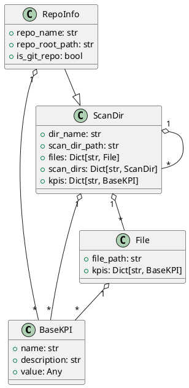

## 📚 Ordlista (Glossary)

**Temporal Coupling:**
Mäter hur ofta två eller flera filer förändras tillsammans i samma commit. Hög temporal koppling kan indikera dold beroendeproblematik eller bristande modulär design. *(Ej implementerad)*

**Change Coupling:**
Liknar temporal coupling men på funktionsnivå: vilka funktioner förändras ofta tillsammans? *(Ej implementerad)*

**Author Churn / Knowledge Map:**
Mäter hur många olika utvecklare som har ändrat en fil eller modul. Filer med många olika författare kan vara svårare att underhålla och ha högre risk för buggar. *(Ej implementerad)*

**Code Ownership:**
Andel av koden som skrivits av respektive utvecklare. Låg ägarskap kan indikera risk för kunskapsspridning eller underhållsproblem. *(Ej implementerad)*

**Defect Density:**
Antal buggar eller felrapporter kopplade till en fil eller modul, ofta i relation till churn eller komplexitet. *(Ej implementerad)*

**Hotspot Evolution:**
Hur förändras hotspots över tid? Växer de, minskar de, eller förblir de stabila? *(Ej implementerad)*

**Complexity Trend:**
Spårar om komplexiteten i en fil eller modul ökar eller minskar över tid. *(Ej implementerad)*

**Code Age:**
Hur gammal är koden i en fil eller modul? Nyare kod kan vara mer instabil. *(Ej implementerad)*

**Test Coverage:**
Andel av koden som täcks av automatiska tester, gärna i relation till hotspots och churn. *(Ej implementerad)*

**Logical Coupling:**
Filer eller moduler som ofta förändras tillsammans, även om de inte är direkt beroende av varandra i koden. *(Ej implementerad)*

**KPI (Key Performance Indicator):**
En mätbar indikator som används för att utvärdera kodens kvalitet, underhållbarhet och risk. Exempel: cyklomatisk komplexitet, code churn, hotspots. (Se "Your Code as a Crime Scene" för definitioner och användning.)

**Cyklomatisk komplexitet (Cyclomatic Complexity):**
Ett mått på den logiska komplexiteten i en funktion/metod, baserat på antalet oberoende vägar genom koden. Hög komplexitet indikerar ökad underhållskostnad och testbarhetsrisk. (Crime Scene: Kapitel 2)

**Code Churn:**
Antalet förändringar (commits) som påverkat en fil eller funktion över tid. Hög churn kan indikera instabil eller riskfylld kod. (Crime Scene: Kapitel 3)

**Hotspot:**
Ett kodavsnitt (fil eller funktion) som kombinerar hög komplexitet och hög churn, vilket gör det till en prioriterad kandidat för refaktorisering. (Crime Scene: Kapitel 4)

**ScanDir:**
En nod i katalogträdet som representerar en katalog och dess innehåll, inklusive aggregerade KPI:er. (Crime Scene: Kapitel 5)

**RepoInfo:**
Rotnoden i analysen, representerar ett helt repository inklusive metadata och KPI:er på repo-nivå. (Crime Scene: Kapitel 5)

**File:**
En enskild fil i analysen, med tillhörande KPI:er och analysdata. (Crime Scene: Kapitel 5)

**Hotspot Score:**
Ett sammansatt mått som beräknas som cyklomatisk komplexitet × churn, för att identifiera riskzoner i koden. (Crime Scene: Kapitel 4)

**LOC (Lines of Code):**
Antal rader kod i en fil eller funktion. Används som grund för flera KPI:er. (Crime Scene: Kapitel 2)

**Parser:**
En komponent som tolkar källkod för att extrahera metrikdata, t.ex. komplexitet eller funktioner. (Crime Scene: Kapitel 2)

**Dashboard:**
En visuell översikt av KPI-resultat, ofta med diagram och färgkodning för att snabbt identifiera risker. (Crime Scene: Kapitel 6)

**Crime Scene-principer:**
Metodiken och analysmodellerna från boken "Your Code as a Crime Scene" av Adam Tornhill, som ligger till grund för definitioner och tolkningar av KPI:er i detta projekt.

## Kravspec med datamodell

### Kravspec (Requirements)
- **KPI:er som objekt:** KPI:er ska vara egna objekt för att kunna bära metadata (t.ex. enhet, beskrivning).
- **Beräkningslogik i KPI-klasser:** Varje KPI-klass ska implementera sin egen metod för att beräkna sitt värde.
- **Resultat i KPI-objekt:** KPI-objekten ska innehålla sitt beräknade resultat och eventuella delvärden som användes för beräkningen.
- **Ignorera dolda filer/mappar:** Filer och mappar vars namn börjar med en punkt (`.`) ska ignoreras under skanningen.
- # 📐 Kravställning: Cyklomatisk komplexitet

## 🎯 Syfte
Mätning av cyklomatisk komplexitet ska ge en kvantitativ indikator på hur logiskt komplex en funktion eller metod är. Målet är att identifiera kodavsnitt med hög underhållskostnad, testbarhetsrisk eller refaktoreringsbehov.

---

## ✅ Funktionella krav Cyklomatisk komplexitet

| ID     | Krav                                                                 | Beskrivning                                                                 |
|--------|----------------------------------------------------------------------|------------------------------------------------------------------------------|
| CC-01  | **Beräkna cyklomatisk komplexitet per funktion/metod**              | Systemet ska analysera varje funktion och beräkna dess komplexitet enligt McCabe’s definition: `M = E - N + 2P` |
| CC-02  | **Stöd för flera språk**                                            | Beräkningen ska fungera för språken i enlighet src/languages/config.py och parserklasserna i src/languages/parsers|
        |
| CC-03  | **Exportera komplexitet till rapport**                              | Värdet ska inkluderas i både CLI-rapport och JSON-export som `cyclomatic_complexity` |
| CC-04  | **Markera höga värden**                                             | Funktioner med komplexitet > 10 ska flaggas som potentiella hotspots        |
| CC-05  | **Koppla till churn och LOC**                                       | Komplexitet ska kombineras med churn och lines-of-code för att beräkna `hotspot_score` |
| CC-06  | **Använd befintlig struktur**                                       | Komplexitet ska utöka basklassen BaseKPI och ha ett dataobjekt som passar in i den definierade datastrukturen |

---

## 📊 Icke-funktionella krav Cyklomatisk komplexitet

| ID      | Krav              | Beskrivning                                                                 |
|---------|-------------------|------------------------------------------------------------------------------|
| CC-N01  | **Prestanda**     | Analysen ska kunna köras på ett repo med 1000+ filer under 60 sekunder       |
| CC-N02  | **Noggrannhet**   | Beräkningen ska vara konsekvent med etablerade verktyg som Radon eller ESLint Complexity |
| CC-N03  | **Utbyggbarhet**  | Det ska vara enkelt att lägga till stöd för fler språk via parser-moduler   |

---

# 🔁 Kravställning: Code Churn

## 🎯 Syfte
Code churn mäter hur ofta en fil eller funktion förändras över tid. Målet är att identifiera instabil kod, refaktoreringskandidater och potentiella riskområden kopplat till frekventa ändringar.

---

## ✅ Funktionella krav Code Churn

| ID     | Krav                                                   | Beskrivning                                                                 |
|--------|--------------------------------------------------------|------------------------------------------------------------------------------|
| CH-01  | **Beräkna churn per fil och funktion**                 | Systemet ska räkna antalet commits som påverkat varje fil och funktion      |
| CH-02  | **Stöd för Git-baserad analys**                        | Churn ska beräknas utifrån Git-loggen, inte bara senaste diff               |
| CH-03  | **Exportera churn till rapport**                       | Värdet ska inkluderas i CLI-rapport och JSON-export som `churn`             |
| CH-04  | **Koppla till komplexitet och LOC**                    | Churn ska kombineras med `cyclomatic_complexity` och `lines_of_code` för att beräkna `hotspot_score` |
| CH-05  | **Visa churn över tid (valfritt)**                     | Systemet ska kunna visa churn per vecka/månad för trendanalys *(valfritt)*  |
| CH-06  | **Använd befintlig struktur**                                       | Churn ska utöka basklassen BaseKPI och ha ett dataobjekt som passar in i den definierade datastrukturen |
---

## 📊 Icke-funktionella krav Code Churn

| ID      | Krav              | Beskrivning                                                                 |
|---------|-------------------|------------------------------------------------------------------------------|
| CH-N01  | **Prestanda**     | Churn-analysen ska kunna köras på ett repo med 1000+ filer under 60 sekunder |
| CH-N02  | **Noggrannhet**   | Churn ska spegla verkliga commit-historiken och ignorera merge commits       |
| CH-N03  | **Utbyggbarhet**  | Det ska vara enkelt att lägga till stöd för churn per funktion via AST eller parser |

---

# 🔥 Kravställning: Hotspotanalys

## 🎯 Syfte
Hotspotanalys ska identifiera kodavsnitt med hög teknisk risk baserat på kombinationen av komplexitet och förändringsfrekvens. Målet är att prioritera refaktoreringsinsatser och förbättra kodens underhållbarhet.

---

## ✅ Funktionella krav Hotspotanalys

| ID     | Krav                                                   | Beskrivning                                                                 |
|--------|--------------------------------------------------------|------------------------------------------------------------------------------|
| HS-01  | **Beräkna hotspot-score per funktion eller fil**       | Hotspot-score ska beräknas som: `hotspot_score = cyclomatic_complexity × churn` |
| HS-02  | **Exportera hotspot-score till rapporter**             | Värdet ska inkluderas i CLI-rapport och JSON-export som `hotspot_score`     |
| HS-03  | **Flagga högriskkod**                                  | Funktioner med `hotspot_score > 300` ska markeras som refaktoreringskandidater |
| HS-04  | **Stöd för sortering och filtrering**                  | CLI och JSON ska stödja sortering och filtrering på `hotspot_score`         |
| HS-05  | **Visualisera hotspots i dashboard**                   | Hotspot-score ska kunna aggregeras och visualiseras per komponent, team eller repo |
| HS-06  | **Använd befintlig struktur**                                       | Komplexitet ska utöka basklassen BaseKPI och ha ett dataobjekt som passar in i den definierade datastrukturen |

---

## 📊 Icke-funktionella krav Hotspotanalys

| ID      | Krav              | Beskrivning                                                                 |
|---------|-------------------|------------------------------------------------------------------------------|
| HS-N01  | **Prestanda**     | Hotspotanalysen ska kunna köras på ett repo med 1000+ filer under 60 sekunder |
| HS-N02  | **Noggrannhet**   | Beräkningen ska vara konsekvent och validerad mot etablerade metrikverktyg   |
| HS-N03  | **Utbyggbarhet**  | Det ska vara enkelt att justera tröskelvärden och beräkningsformel via konfiguration |

---


# 📦 Kravställning: JSON-format för filanalys

## 🎯 Syfte
JSON-formatet ska representera analysresultat för en hel fil, inklusive dess funktioner, metrikvärden och metadata. Formatet ska vara maskinläsbart, konsistent och kompatibelt med externa system som OpenSearch och dashboards.

---

## ✅ Strukturkrav

### 📁 Filnivå
Varje JSON-objekt ska representera en fil och innehålla följande fält:

| Fält                | Typ       | Beskrivning                                      |
|---------------------|-----------|--------------------------------------------------|
| `filename`          | `string`  | Full sökväg till filen i repot                   |
| `repo_name`         | `string`  | Namn på repository (via CLI-flagga)              |
| `component`         | `string`  | Logisk komponent (via CLI-flagga)                |
| `team`              | `string`  | Ansvarigt team (via CLI-flagga)                  |
| `timestamp`         | `string`  | ISO 8601-tidpunkt för analys                     |
| `lines_of_code`     | `integer` | Totalt antal rader i filen                       |
| `churn`             | `integer` | Antal commits som påverkat filen                 |
| `functions`         | `array`   | Lista med analyserade funktioner/metoder         |

---

### 🔧 Funktionsnivå (`functions[]`)
Varje funktion i `functions`-arrayen ska innehålla:

| Fält                    | Typ       | Beskrivning                                      |
|-------------------------|-----------|--------------------------------------------------|
| `function_name`         | `string`  | Namn på funktionen/metoden                       |
| `cyclomatic_complexity` | `integer` | Beräknad komplexitet enligt McCabe               |
| `lines_of_code`         | `integer` | Antal rader i funktionen                         |
| `churn`                 | `integer` | Antal commits som påverkat funktionen            |
| `hotspot_score`         | `integer` | Beräknat som `complexity × churn`                |

---

## 📊 Icke-funktionella krav

| ID      | Krav              | Beskrivning                                                                 |
|---------|-------------------|------------------------------------------------------------------------------|
| JF-N01  | **Validitet**     | JSON ska följa korrekt syntax och valideras mot schema                      |
| JF-N02  | **Konsistens**    | Alla fält ska finnas även om värdet är `null` eller `0`                     |
| JF-N03  | **Utbyggbarhet**  | Formatet ska kunna utökas med Git- och Jira-KPI:er utan att bryta struktur  |

---

## 🧪 Exempel på JSON-export

```json
{
  "filename": "src/core/engine.py",
  "repo_name": "MetricMancer",
  "component": "core",
  "team": "Platform",
  "timestamp": "2025-09-13T18:45:00Z",
  "lines_of_code": 120,
  "churn": 17,
  "functions": [
    {
      "function_name": "run_analysis",
      "cyclomatic_complexity": 9,
      "lines_of_code": 35,
      "churn": 12,
      "hotspot_score": 108
    },
    {
      "function_name": "export_results",
      "cyclomatic_complexity": 4,
      "lines_of_code": 20,
      "churn": 5,
      "hotspot_score": 20
    }
  ]
}


# 📄 Kravställning: HTML-rapport för KPI-analys

## 🎯 Syfte
HTML-rapporten ska ge en överskådlig, interaktiv och navigerbar presentation av KPI-resultat från MetricMancer. Rapporten ska bestå av en sammanfattande `index.html` samt en separat HTML-sida per analyserat repository. Varje sida ska innehålla flikar för olika perspektiv och ha tydlig länkning mellan rapportdelarna.

---

## ✅ Strukturkrav

### 📁 Filstruktur html-rapport

report/ 
├── index.html 
├── repo-1.html 
├── repo-2.html 
├── repo-N.html 
└── assets/
    └── css, js, fonts, icons


---

### 📄 index.html

| Element             | Beskrivning                                                                 |
|---------------------|------------------------------------------------------------------------------|
| Titel               | "MetricMancer Software KPI Report – Overview"                               |
| Innehåll            | Lista över alla analyserade repositories med länkar till respektive rapport |
| Navigering          | Länkar till alla repo-sidor och till KPI Description                        |
| Layout              | Tydlig tabell eller kortvy med repo-namn, team, komponent, analysdatum      |
| **Analysöversikt**  | För varje repo ska en sammanfattning av `src/`-katalogens KPI-resultat visas: |
|                     | - Totalt antal funktioner analyserade                                       |
|                     | - Genomsnittlig cyklomatisk komplexitet                                     |
|                     | - Genomsnittlig churn                                                       |
|                     | - Antal identifierade hotspots                                              |
|                     | - Länk till repo-rapporten                                                  |
| Visualisering       | *(valfritt)* Diagram eller färgkodning för att indikera risknivå per repo   |

---

### 📄 repo-X.html

| Flik                | Beskrivning                                                                 |
|---------------------|------------------------------------------------------------------------------|
| **Software KPI Report** | Visar analysresultat för det specifika repot: komplexitet, churn, hotspots, KPI-grafer |
| **All Reports**     | Lista med hyperlänkar till alla andra repo-sidor (inkl. tillbaka till index) |
| **KPI Description** | Beskriver alla tillgängliga KPI:er enligt principerna från *Your Code as a Crime Scene* |
| **Navigering**      | Alla flikar ska ha en länk tillbaka till `index.html`                       |

---

### 🧩 Funktionella krav HTML-rapport

| ID     | Krav                                                   | Beskrivning                                                                 |
|--------|--------------------------------------------------------|------------------------------------------------------------------------------|
| HTML-01 | **Generera index.html automatiskt**                   | Indexsidan ska skapas dynamiskt utifrån vilka repos som analyserats         |
| HTML-02 | **Skapa en HTML-sida per repo**                       | Varje repo ska ha en egen rapportfil med flikstruktur                       |
| HTML-03 | **Flikarna ska vara interaktiva**                     | Använd t.ex. JavaScript eller CSS för att växla mellan flikar utan omladdning |
| HTML-04 | **Hyperlänka mellan rapporter**                        | Fliken "All Reports" ska innehålla länkar till alla andra repo-sidor        |
| HTML-05 | **Beskriv KPI:er enligt Crime Scene-principer**       | Fliken "KPI Description" ska förklara varje KPI: syfte, beräkning, riskindikator |
| HTML-06 | **Länk tillbaka till index.html från alla flikar**    | Varje flik ska ha en tydlig "Back to Overview" eller liknande länk          |

---

### 📊 Icke-funktionella krav html-rapport

| ID      | Krav              | Beskrivning                                                                 |
|---------|-------------------|------------------------------------------------------------------------------|
| HTML-N01 | **Responsiv design** | Rapporten ska fungera på både desktop och mobil                            |
| HTML-N02 | **Laddningstid**     | Varje sida ska laddas under 2 sekunder lokalt                             |
| HTML-N03 | **Tillgänglighet**   | Rapporten ska vara läsbar utan JavaScript (grundläggande fallback)        |
| HTML-N04 | **Utbyggbarhet**     | Nya KPI:er ska kunna läggas till utan att bryta layout eller navigation    |

---

## 📦 Exempel på flikstruktur (repo-X.html)

│ Software KPI Report │ All Reports │ KPI Description │
 ⬅ Back to Overview │


# 🖥️ Kravställning: CLI-rapport med tabell- och trädvy

## 🎯 Syfte
CLI-rapporten ska ge en överskådlig och lättläst sammanställning av analysresultatet direkt i terminalen. Användaren ska kunna välja mellan en **tabellvy** för detaljerad jämförelse och en **trädvy** för strukturell översikt av kodbasen.

---

## ✅ Funktionella krav

| ID     | Krav                                                   | Beskrivning                                                                 |
|--------|--------------------------------------------------------|------------------------------------------------------------------------------|
| CLI-01 | **Standardrapport ska vara tabellvy**                  | Utan flaggor ska CLI visa en formaterad tabell med filnamn, funktion, komplexitet, churn, hotspot-score |
| CLI-02 | **Stöd för `--view tree`**                             | Flaggan ska visa analysresultatet i trädstruktur, likt `tree`, där varje fil är en nod och funktioner är underliggande blad |
| CLI-03 | **Stöd för `--view table`**                            | Flaggan ska explicit välja tabellvy, även om det är default, för tydlighet i skript |
| CLI-04 | **Stöd för `--output-format json`**                    | Flaggan ska generera en strukturerad JSON-rapport för integration med externa system |
| CLI-05 | **Stöd för `--output-format machine`**                 | Flaggan ska generera en minimal, radbaserad rapport för shell-script och CI-pipelines |
| CLI-06 | **Stöd för metadata-flaggor**                          | CLI ska kunna ta emot `--repo-name`, `--component`, `--team` och inkludera dessa i rapporten |
| CLI-07 | **Stöd för färgkodning (valfritt)**                    | Tabell- och trädvy kan färgkoda höga värden för snabb visuell identifiering *(valfritt)* |

---

## 📊 Icke-funktionella krav

| ID      | Krav              | Beskrivning                                                                 |
|---------|-------------------|------------------------------------------------------------------------------|
| CLI-N01 | **Prestanda**     | Rapporten ska genereras under 2 sekunder för 1000+ funktioner                |
| CLI-N02 | **Konsistens**    | Alla vyer ska innehålla samma datainnehåll                                  |
| CLI-N03 | **Utbyggbarhet**  | Nya fält (t.ex. Git- eller Jira-KPI:er) ska kunna läggas till utan att bryta rapportformaten |
| CLI-N04 | **Tillgänglighet**| Rapporten ska vara läsbar i både färgade och ofärgade terminaler             |

---

## 📦 Exempel på tabellvy

┌────────────────────────────┬────────────────────┬────────┬─────────┬──────────┬────────────┬────────────────────┐ 
│ Reponame                   │                    │ avg. CC│ avg. LOC│ avg. Func│ avg. Churn │ avg. Hotspot Score │ ├────────────────────────────┼────────────────────┼────────┼─────────┼──────────┼────────────┼────────────────────┤
│ myrepo                     │                    │ 7      │ 9       │ 2        │ 64         │ 526                │ 
├────────────────────────────┼────────────────────┼────────┼─────────┼──────────┼-───────────┼────────────────────┤ 
│ Filename                   │ Function           │ CC     │ LOC     │ LOC      │ Churn      │ Hotspot Score      │ 
├────────────────────────────┼────────────────────┼────────┼─────────┼──────────┼-───────────┼────────────────────┤ 
│ src/core/engine.py         │ run_analysis       │ 9      │ 12      │ 12       │ 108        │ 972                │ 
| src/core/engine.py         │ export_results     │ 4      │ 5       │ 5        │ 20         │ 80                 │   
└────────────────────────────┴────────────────────┴────────┴─────────┴──────────┴────────────┴────────────────────┘ 


---

## 📦 Exempel på trädvy (`--view tree`)

src/ 
└── core/ 
    └── engine.py [Func: 2, CC: 25, Churn: 17, Score: 120]
    |   ├── run_analysis [CC: 9, Churn: 12, Score: 108] 
    |   └── export_results [CC: 4, Churn: 5, Score: 20]


## Datamodell

### ScanDir
Klass: ScanDir
Syfte
ScanDir ska representera en katalog inom ett repository som har analyserats. Den ska fungera som en rekursiv nod i katalogträdet och innehålla information om filer, underkataloger och aggregerade KPI:er.

Funktionella krav
Ska innehålla katalogens namn (dir_name) och dess relativa sökväg från repository-roten (scan_dir_path)

Ska kunna lagra en uppsättning filer i form av File-objekt, indexerade per filnamn

Ska kunna lagra underkataloger som egna ScanDir-instanser, indexerade per katalognamn

Ska kunna innehålla KPI:er på katalognivå, t.ex.. genomsnittlig komplexitet eller total churn

Ska stödja rekursiv traversering av katalogstrukturen för rapportering och visualisering

Fält
python
dir_name: str
scan_dir_path: str
files: Dict[str, File]
scan_dirs: Dict[str, ScanDir]
kpis: Dict[str, BaseKPI]

### File
Klass: File
Syfte
File ska representera en enskild fil inom en katalog som har analyserats. Den ska innehålla filens relativa sökväg och dess tillhörande KPI:er.

Funktionella krav
Ska innehålla filens relativa sökväg från katalogen (file_path)

Ska kunna lagra en uppsättning KPI:er som gäller för filen, t.ex.. komplexitet, churn, LOC och hotspot-score

Ska vara lätt att serialisera till JSON och integrera i rapportstrukturer

Fält
python
file_path: str
kpis: Dict[str, BaseKPI]

### RepoInfo
Klass: RepoInfo
Syfte
RepoInfo ska representera ett helt repository som har analyserats. Den fungerar som rot i katalogträdet och innehåller både strukturell information (via arv från ScanDir) och metadata som är specifik för ett Git-repo. Klassen används som ingångspunkt för rapportgenerering, visualisering och sammanställning av KPI:er på repo-nivå.

Funktionella krav
Ska ärva alla fält och beteenden från ScanDir, inklusive stöd för rekursiv katalogstruktur, filer och KPI:er.

Ska innehålla ett identifierande namn för repot (repo_name).

Ska innehålla absolut sökväg till repository-roten (repo_root_path).

Ska kunna flaggas som ett Git-repo via is_git_repo, vilket möjliggör särskild hantering av commit-historik och versionsdata.

Ska fungera som toppnod i datamodellen och kunna serialiseras till JSON, HTML och andra rapportformat.

Ska kunna aggregera KPI:er från underliggande kataloger och filer för sammanfattning på repo-nivå.

Fält
python
class RepoInfo(ScanDir):
    repo_name: str                      # Namn på repot
    repo_root_path: str                 # Absolut sökväg till repot
    is_git_repo: bool = True            # Flagga som indikerar att detta är ett Git-repo
Arv från ScanDir
Eftersom RepoInfo ärver från ScanDir, har den automatiskt tillgång till:

dir_name och scan_dir_path (kan sättas till exempelvis ".")

files: alla filer direkt under repo-roten

scan_dirs: underkataloger som exempelvis "src", "tests", "docs"

kpis: KPI:er på repo-rotnivå, exempelvis total komplexitet, antal hotspots, genomsnittlig churn


### UML-diagram (PlantUML)

