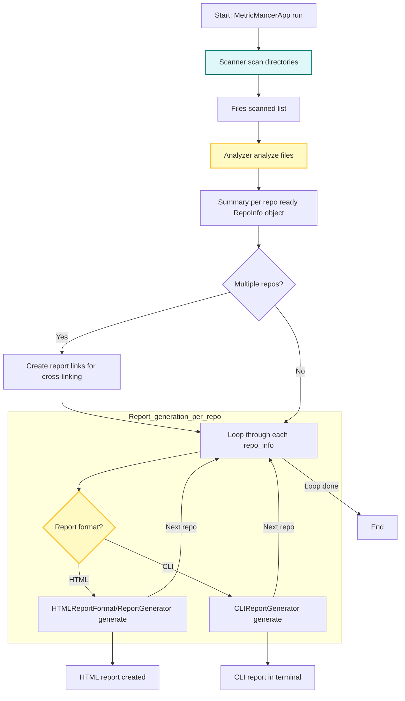
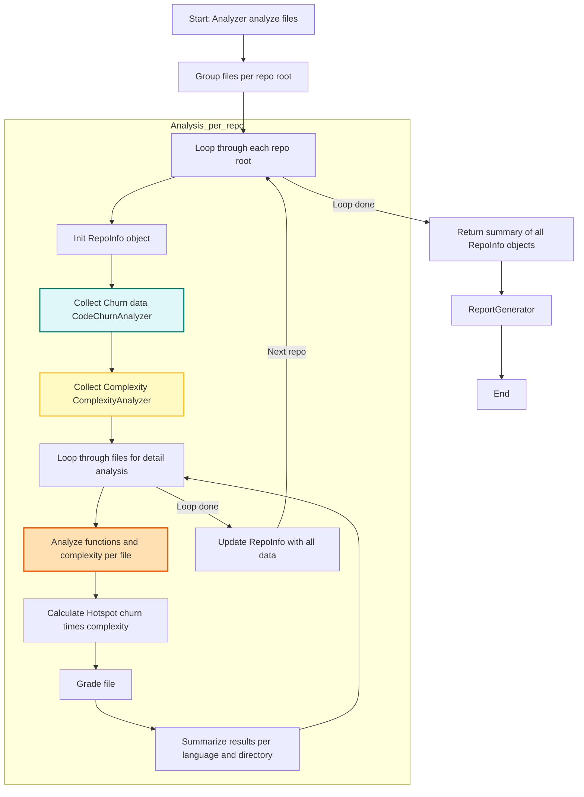
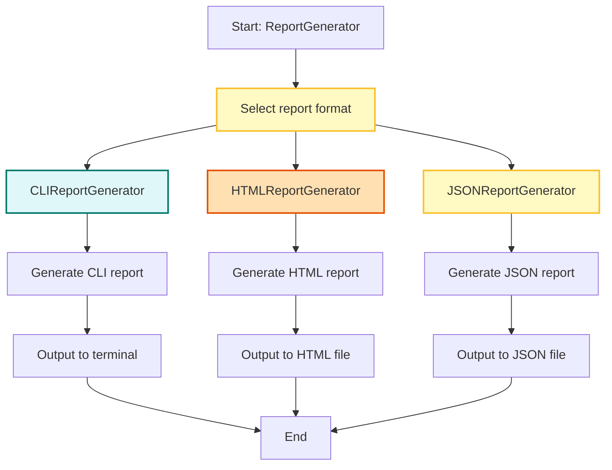
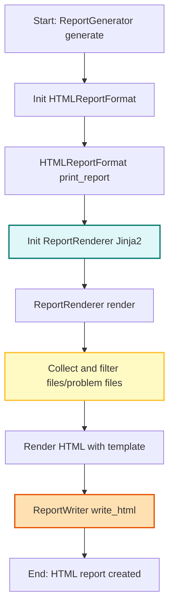
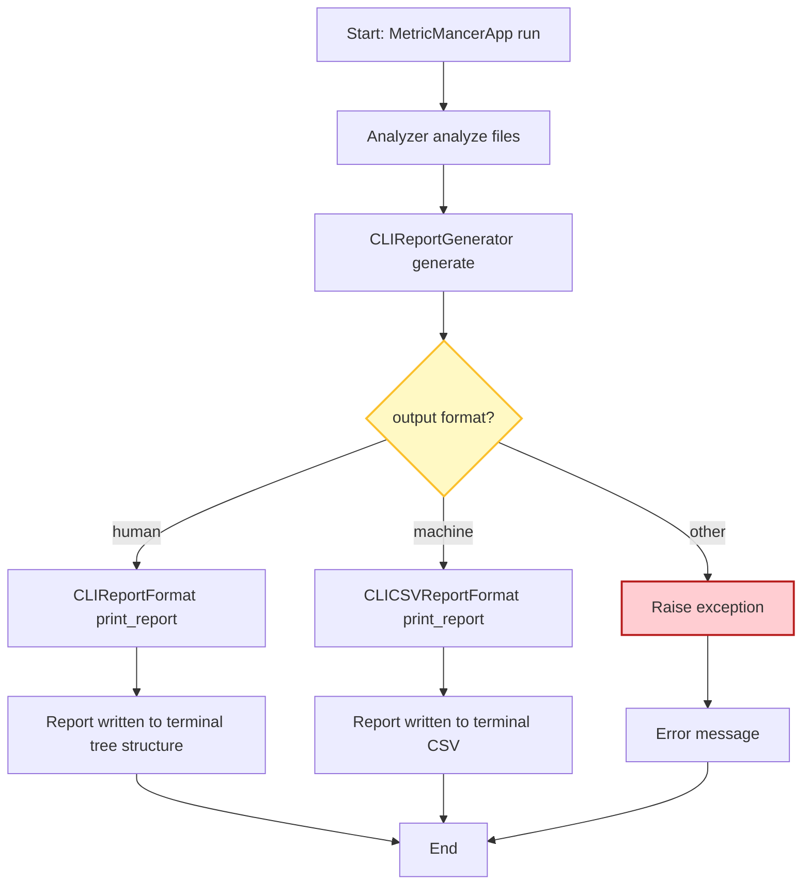
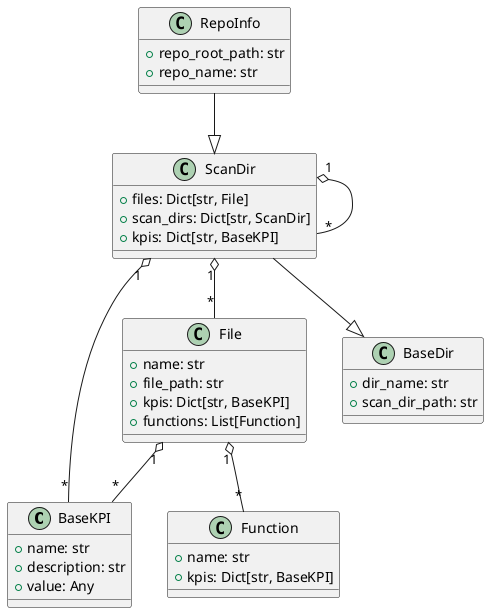

# Requirements and Design

## Table of Contents

- [Requirements and Design](#requirements-and-design)
  - [Table of Contents](#table-of-contents)
  - [1. Introduction](#1-introduction)
  - [2. Glossary](#2-glossary)
    - [2.1. KPI Extension and Implementation Status](#21-kpi-extension-and-implementation-status)
  - [3. System Overview](#3-system-overview)
    - [3.1. Application Overview](#31-application-overview)
      - [3.2.2. App Run Flow](#322-app-run-flow)
      - [3.2.3. Analyzer Analyze Flow](#323-analyzer-analyze-flow)
      - [3.2.4. ReportGenerator Flow](#324-reportgenerator-flow)
      - [3.2.5. HTML Report Flow](#325-html-report-flow)
      - [3.2.6. CLI Report Flow](#326-cli-report-flow)
    - [3.3. Data Model](#33-data-model)
      - [3.3.1. UML Diagram (PlantUML)](#331-uml-diagram-plantuml)
  - [4. Detailed Requirements](#4-detailed-requirements)
    - [4.1 Functional Requirements](#41-functional-requirements)
      - [4.1.1 Core Functional Requirements](#411-core-functional-requirements)
      - [4.1.2 Issue Tracker Integration and Defect Correlation](#412-issue-tracker-integration-and-defect-correlation)
        - [4.1.2.1 Defect Density and Issue Tracker Integration](#4121-defect-density-and-issue-tracker-integration)
          - [Integration Specification](#integration-specification)
          - [Correlating KPIs with Defects](#correlating-kpis-with-defects)
          - [Visualization and Reporting](#visualization-and-reporting)
          - [Acceptance Criteria](#acceptance-criteria)
        - [4.1.2.2 Code Ownership](#4122-code-ownership)
          - [Git Blame Analysis](#git-blame-analysis)
          - [Thresholds for Low Ownership](#thresholds-for-low-ownership)
          - [Visualization](#visualization)
          - [Acceptance Criteria (Code Ownership)](#acceptance-criteria-code-ownership)
        - [4.1.2.3 Logical Coupling](#4123-logical-coupling)
          - [Commit Parsing Example](#commit-parsing-example)
          - [Thresholds for Strong Logical Coupling](#thresholds-for-strong-logical-coupling)
          - [Reporting (Logical Coupling)](#reporting-logical-coupling)
          - [Acceptance Criteria (Logical Coupling)](#acceptance-criteria-logical-coupling)
        - [4.1.2.4 Temporal Coupling](#4124-temporal-coupling)
          - [Commit Parsing Example (Temporal Coupling)](#commit-parsing-example-temporal-coupling)
          - [Thresholds for Strong Coupling](#thresholds-for-strong-coupling)
          - [Reporting](#reporting)
          - [Acceptance Criteria (Temporal Coupling)](#acceptance-criteria-temporal-coupling)
    - [4.2 User Stories](#42-user-stories)
      - [4.2.1 Persona 1: Alice – The Senior Developer](#421-persona-1-alice--the-senior-developer)
      - [4.2.2 Persona 2: Bob – The DevOps Engineer](#422-persona-2-bob--the-devops-engineer)
      - [4.2.3 Persona 3: Carol – The Engineering Manager](#423-persona-3-carol--the-engineering-manager)
      - [4.2.4 Persona 4: Dave – The New Team Member](#424-persona-4-dave--the-new-team-member)
      - [4.2.5 Persona 5: Sam – The Software Quality Assurance Manager (SQAM)](#425-persona-5-sam--the-software-quality-assurance-manager-sqam)
      - [4.2.6 Persona 6: Erin – The Software Quality Assurance Engineer (SQAE)](#426-persona-6-erin--the-software-quality-assurance-engineer-sqae)
    - [8. Requirement Prioritization \& Risk Management](#8-requirement-prioritization--risk-management)
    - [9. Validation \& Verification](#9-validation--verification)
    - [10. Change Management](#10-change-management)
    - [11. Process \& Methodology](#11-process--methodology)

## 1. Introduction
[ToC](#table-of-contents)

MetricMancer is a software analytics tool designed to provide actionable insights into code quality, maintainability, and technical risk. Inspired by the principles and techniques from "Your Code as a Crime Scene" by Adam Tornhill, the project analyzes source code repositories to extract key performance indicators (KPIs) such as cyclomatic complexity, code churn, and hotspots.

The tool supports multi-language analysis and can generate reports in several formats, including CLI, HTML, and JSON. JSON reports are designed for integration with OpenSearch and dashboards. MetricMancer is built for extensibility, making it easy to add new metrics or adapt the tool to different codebases. The goal is to help teams identify refactoring candidates, monitor code health trends, and prioritize technical debt reduction—using real data from version control history and static analysis.

## 2. Glossary
[ToC](#table-of-contents)

**Temporal Coupling:**
Measures how often two or more files change together in the same commit. High temporal coupling can indicate hidden dependencies or poor modular design. *(Not implemented)*

**Change Coupling:**
Similar to temporal coupling but at the function level: which functions often change together? *(Not implemented)*

**Author Churn / Knowledge Map:**
Measures how many different developers have modified a file or module. Files with many different authors can be harder to maintain and have a higher risk of bugs. *(Not implemented)*

**Code Ownership:**
The proportion of code written by each developer. Low ownership can indicate a risk of knowledge spread or maintenance issues. *(Not implemented)*

**Defect Density:**
The number of bugs or defect reports linked to a file or module, often in relation to churn or complexity. *(Not implemented)*

**Hotspot Evolution:**
How do hotspots change over time? Do they grow, shrink, or remain stable? *(Not implemented)*

**Complexity Trend:**
Tracks whether the complexity of a file or module increases or decreases over time. *(Not implemented)*

**Code Age:**
How old is the code in a file or module? Newer code can be more unstable. *(Not implemented)*

**Test Coverage:**
The proportion of code covered by automated tests, ideally in relation to hotspots and churn. *(Not implemented)*

**Logical Coupling:**
Files or modules that often change together, even if they are not directly dependent in the code. *(Not implemented)*

**KPI (Key Performance Indicator):**
A measurable indicator used to evaluate code quality, maintainability, and risk. Examples: cyclomatic complexity, code churn, hotspots. (See "Your Code as a Crime Scene" for definitions and usage.)

**Cyclomatic Complexity:**
A measure of the logical complexity of a function/method, based on the number of independent paths through the code. High complexity indicates increased maintenance cost and testability risk. (Crime Scene: Chapter 2)

**Code Churn:**
The number of changes (commits) that have affected a file or function over time. High churn can indicate unstable or risky code. (Crime Scene: Chapter 3)

**Hotspot:**
A code section (file or function) that combines high complexity and high churn, making it a prioritized candidate for refactoring. (Crime Scene: Chapter 4)

**ScanDir:**
A node in the directory tree representing a directory and its contents, including aggregated KPIs. (Crime Scene: Chapter 5)

**RepoInfo:**
The root node in the analysis, representing an entire repository including metadata and KPIs at the repo level. (Crime Scene: Chapter 5)

**File:**
A single file in the analysis, with associated KPIs and analysis data. (Crime Scene: Chapter 5)

**Hotspot Score:**
A composite metric calculated as cyclomatic complexity × churn, used to identify risk zones in the code. (Crime Scene: Chapter 4)

**LOC (Lines of Code):**
The number of lines of code in a file or function. Used as a basis for several KPIs. (Crime Scene: Chapter 2)

**Parser:**
A component that parses source code to extract metric data, e.g., complexity or functions. (Crime Scene: Chapter 2)

**Dashboard:**
A visual overview of KPI results, often with charts and color coding to quickly identify risks. (Crime Scene: Chapter 6)

**Crime Scene Principles:**
The methodology and analysis models from the book "Your Code as a Crime Scene" by Adam Tornhill, which form the basis for the definitions and interpretations of KPIs in this project.

### 2.1. KPI Extension and Implementation Status
[ToC](#table-of-contents)

The following table summarizes the available and planned KPIs in MetricMancer, their implementation status, and extensibility notes:

| KPI Name                | Description                                                                 | Status           | Extensibility Notes                                  |
|-------------------------|-----------------------------------------------------------------------------|------------------|------------------------------------------------------|
| Cyclomatic Complexity   | Logical complexity of a function/method (McCabe)                             | Implemented      | New languages can be added via parser modules         |
| Code Churn              | Number of commits affecting a file/function                                  | Implemented      | Extendable to function-level churn with AST support   |
| Hotspot Score           | Composite: complexity × churn                                                | Implemented      | Thresholds/configuration can be adjusted              |
| Temporal Coupling       | How often files change together                                              | Not implemented  | Requires commit history analysis                      |
| Change Coupling         | How often functions change together                                          | Not implemented  | Requires fine-grained commit analysis                 |
| Author Churn/Knowledge Map | Number of unique authors per file/module                                  | Not implemented  | Needs author extraction from VCS                      |
| Code Ownership          | Proportion of code by each developer                                         | Not implemented  | Needs author and LOC analysis                         |
| Defect Density          | Number of bugs/defects per file/module                                       | Not implemented  | Needs integration with issue tracker                  |
| Hotspot Evolution       | How hotspots change over time                                                | Not implemented  | Requires historical KPI tracking                      |
| Complexity Trend        | Complexity increase/decrease over time                                       | Not implemented  | Requires historical analysis                          |
| Code Age                | Age of code in file/module                                                   | Not implemented  | Needs commit date analysis                            |
| Test Coverage           | Proportion of code covered by tests                                          | Not implemented  | Needs integration with test tools                     |
| Logical Coupling        | Files/modules that change together without direct dependency                 | Not implemented  | Requires commit and dependency analysis               |

To add a new KPI, implement a new KPI calculator module and register it in the configuration. The system is designed for easy extension with minimal coupling between components.

## 3. System Overview
[ToC](#table-of-contents)

MetricMancer is structured as a modular, layered system to maximize flexibility, maintainability, and extensibility. The architecture is divided into several key components:

- **Scanner:** Traverses the repository, identifies source files, and excludes hidden or irrelevant directories/files.
- **Parser:** Language-specific modules that extract functions, classes, and structural information from source files.
- **KPI Calculators:** Independent modules that compute metrics such as cyclomatic complexity, code churn, and hotspot scores. Each KPI is encapsulated as an object with its own calculation logic and metadata.
- **Data Model:** Central classes (e.g., RepoInfo, ScanDir, File) represent the hierarchical structure of the repository and aggregate KPI results at each level.
- **Report Generators:** Modules for producing output in various formats, including CLI, HTML, and JSON. These generators consume the data model and present results for different audiences and integrations.
- **Configuration & Extensibility:** The system is designed to allow easy addition of new languages, KPIs, or report formats by implementing new modules and registering them in the configuration.

The architecture supports both batch and incremental analysis, and is suitable for integration into CI/CD pipelines. By separating scanning, parsing, metric calculation, and reporting, MetricMancer enables teams to extend or adapt the tool to their specific needs with minimal coupling between components.

### 3.1. Application Overview
[ToC](#table-of-contents)

```mermaid
graph TD
  App[MetricMancerApp] --> Scanner[Scanner]
  Scanner -->|"directories"| Files[File List]
  Files --> Analyzer[Analyzer]
  Analyzer -->|"per repo"| RepoInfo[RepoInfo Objects]
  Analyzer --> CodeChurn[CodeChurnAnalyzer]
  Analyzer --> Complexity[ComplexityAnalyzer]
  Analyzer --> Hotspot[HotspotAnalyzer]
  RepoInfo --> ReportGenerator[ReportGenerator]
  ReportGenerator -->|"format: CLI"| CLIReport[CLIReportGenerator]
  ReportGenerator -->|"format: HTML"| HTMLReport[HTMLReportGenerator]
  CLIReport --> CLIOutput[CLI Output]
  HTMLReport --> HTMLOutput[HTML File]
  ReportGenerator -->|"format: JSON"| JSONReport[JSONReportGenerator]
  JSONReport --> JSONOutput[JSON File]
  ReportGenerator --> ErrorHandling[Error & Edge Case Handling]
  ErrorHandling -.-> App
```text

**Figure: Application Overview.**
This diagram shows the high-level architecture and main data flow in MetricMancer. The application starts with the `MetricMancerApp`, which delegates scanning to the `Scanner`. The scanner produces a list of files, which are analyzed by the `Analyzer` using various KPI analyzers (e.g., code churn, complexity, hotspots). The results are aggregated into `RepoInfo` objects and passed to the `ReportGenerator`, which can output reports in CLI, HTML, or JSON format. Error and edge case handling is integrated throughout the process.

### 3.2. Architecture

#### 3.2.1. Scanner Flow
[ToC](#table-of-contents)

```mermaid
graph TD
    A[Start: Scanner] --> B[Receive directories]
    B --> C[Iterate directories]
    C --> D[Find files in directory]
    D --> E[Filter files by type]
    E --> F[Collect file paths]
    F --> G[Return file list]

    %% Edge cases
    style D fill:#e0f7fa,stroke:#00796b,stroke-width:2px
    style E fill:#fff9c4,stroke:#fbc02d,stroke-width:2px
    %% Error handling: empty directory, permission error, no files found
```

**Figure: Scanner Flow.**
This diagram details the scanning process. The scanner receives a list of directories, iterates through them, finds files, filters them by type, collects file paths, and returns the final file list. Edge cases such as empty directories, permission errors, and no files found are handled explicitly.

#### 3.2.2. App Run Flow
[ToC](#table-of-contents)



**Figure: App Run Flow.**
This diagram illustrates the main execution flow of the application. After scanning directories, files are analyzed and summarized per repository. For each repository, the appropriate report format is selected and generated. The flow handles multiple repositories and includes error handling for empty directories and failures in scanning, analysis, or report generation.

#### 3.2.3. Analyzer Analyze Flow
[ToC](#table-of-contents)



**Figure: Analyzer Analyze Flow.**
This diagram describes how the analyzer processes files. Files are grouped per repository root, and for each repo, churn and complexity are collected, detailed analysis is performed per file, and hotspot scores are calculated. Results are summarized and aggregated into `RepoInfo` objects, which are then passed to the report generator. Edge cases such as empty files and exceptions in KPI analyzers are handled.

#### 3.2.4. ReportGenerator Flow
[ToC](#table-of-contents)



**Figure: ReportGenerator Flow.**
This diagram shows how the report generator selects the output format (CLI, HTML, or JSON), generates the report, and outputs it to the appropriate destination. It also highlights error handling for unknown formats and output errors.

#### 3.2.5. HTML Report Flow
[ToC](#table-of-contents)



**Figure: HTML Report Flow.**
This diagram details the process of generating an HTML report. The report generator initializes the HTML format, prints the report, uses the renderer to prepare data, and writes the final HTML file. Edge cases include missing templates, write errors, and empty analysis results.

#### 3.2.6. CLI Report Flow
[ToC](#table-of-contents)



**Figure: CLI Report Flow.**
This diagram shows the flow for generating CLI reports. After analysis, the CLI report generator selects the output format (human-readable or CSV), prints the report, and handles errors such as unknown formats or empty analysis results.

### 3.3. Data Model
[ToC](#table-of-contents)

The MetricMancer data model is designed to represent the hierarchical structure of a source code repository and to aggregate KPI results at each level. The main classes are:

**BaseKPI**
Represents a single key performance indicator (KPI) calculated for a function, file, directory, or repository. All specific KPIs (e.g., Cyclomatic Complexity, Code Churn, Hotspot Score) inherit from this base class.

- Fields:
  - `name`: Name of the KPI (e.g., "Cyclomatic Complexity")
  - `description`: Short description of what the KPI measures
  - `value`: The calculated value for this KPI (type depends on the KPI)
- Functional requirements:
  - Store the KPI's name, description, and value
  - Provide a consistent interface for all KPIs, enabling aggregation and reporting
  - Allow extension for new KPIs by subclassing and implementing custom calculation logic

**Function**
Represents a single function or method within a file.

- Fields:
  - `name`: Name of the function or method
  - `kpis`: Dictionary of KPIs for the function (`Dict[str, BaseKPI]`)
- Functional requirements:
  - Store the function's name
  - Store KPIs relevant to the function (e.g., complexity, churn)

**File**
Represents a single file that has been analyzed.

- Fields:
  - `name`: Name of the file
  - `file_path`: Relative path from the parent directory
  - `kpis`: Dictionary of KPIs for the file (`Dict[str, BaseKPI]`)
  - `functions`: List of functions in the file (`List[Function]`)
- Functional requirements:
  - Store the file's name and relative path
  - Store KPIs relevant to the file (e.g., complexity, churn, LOC, hotspot score)
  - Store a list of analyzed functions with their KPIs
  - Be easy to serialize to JSON and integrate into report structures

**BaseDir**
Base class for directory-like objects.

- Fields:
  - `dir_name`: Name of the directory
  - `scan_dir_path`: Relative path from the repository root

**ScanDir (inherits BaseDir)**
Represents a scanned directory, which can contain files and subdirectories.

- Fields:
  - `files`: Dictionary of files in the directory (`Dict[str, File]`)
  - `scan_dirs`: Dictionary of subdirectories (`Dict[str, ScanDir]`)
  - `kpis`: Dictionary of KPIs aggregated at the directory level (`Dict[str, BaseKPI]`)
- Functional requirements:
  - Store the directory's name and relative path
  - Store a set of files as File objects, indexed by filename
  - Store subdirectories as ScanDir instances, indexed by directory name
  - Store KPIs at the directory level, e.g., average complexity or total churn
  - Support recursive traversal for reporting and visualization

**RepoInfo (inherits ScanDir)**
Represents the top-level object for an analyzed repository, including its structure and KPIs.

- Fields:
  - `repo_root_path`: Absolute path to the repository root
  - `repo_name`: Name of the repository
  - Inherits all fields and behaviors from ScanDir
- Functional requirements:
  - Inherit all fields and behaviors from ScanDir, including recursive directory structure, files, and KPIs
  - Store a unique name for the repository
  - Store the absolute path to the repository root
  - Serve as the top node in the data model and be serializable to JSON, HTML, and other report formats
  - Aggregate KPIs from underlying directories and files for repository-level summaries

#### 3.3.1. UML Diagram (PlantUML)
[ToC](#table-of-contents)



> **Tips for rendering PlantUML diagrams in VS Code:**
>
> - To view the diagram as an image in VS Code, install either the "PlantUML" extension (jebbs.plantuml) or "Markdown Preview Enhanced" (shd101wyy.markdown-preview-enhanced).
> - For the PlantUML extension: Open the command palette and run "PlantUML: Preview Current Diagram" with the cursor inside the code block, or save the diagram as a `.puml` file and preview it.
> - For Markdown Preview Enhanced: Open the Markdown preview and click the run/play icon above the code block.
> - **Graphviz required:** Some diagrams (especially those using `@startuml`) require Graphviz (`dot`) to be installed. On macOS, run `brew install graphviz` in the terminal.
> - **Java required:** PlantUML requires Java to be installed. Check with `java -version` in the terminal.
> - If you encounter issues, see the extension documentation for troubleshooting and configuration tips.

## 4. Detailed Requirements
[ToC](#table-of-contents)
src/utils.py
src/db.py
src/bar.py
src/baz.py

### 4.1 Functional Requirements

#### 4.1.1 Core Functional Requirements

(Add or move core functional requirements here as needed.)

#### 4.1.2 Issue Tracker Integration and Defect Correlation

##### 4.1.2.1 Defect Density and Issue Tracker Integration

MetricMancer shall support integration with external issue trackers (e.g., Jira, GitHub Issues, GitLab, etc.) to correlate code metrics (KPIs) with defect data, as described in "Your Code as a Crime Scene, second edition".

###### Integration Specification

- The tool shall support configuration for connecting to one or more issue trackers via API or by importing exported issue data (CSV, JSON, etc.).
- The tool shall extract defect/bug reports, including at minimum: issue ID, type, status, creation date, resolution date, and affected files (if available).
- The tool shall support mapping commits to issues using commit messages (e.g., by recognizing issue keys such as JIRA-123 in commit messages) or by explicit links in the VCS.

###### Correlating KPIs with Defects

- For each file or module, the tool shall calculate **defect density** as the number of linked defects per KLOC (thousand lines of code) or per file.
- The tool shall correlate defect density with other KPIs (e.g., code churn, complexity, hotspots) to identify risk zones and prioritize refactoring.
- Reports shall highlight files with both high defect density and high values for other risk KPIs (e.g., churn, complexity, low ownership).

###### Visualization and Reporting

- The tool shall visualize defect density alongside other KPIs in reports and dashboards (e.g., as heatmaps or combined tables).
- Reports shall include recommendations for files with high defect density and high risk according to other KPIs.

###### Acceptance Criteria

- The tool can import or connect to at least one issue tracker and extract defect data.
- Defect density is calculated and reported for all files/modules with linked defects.
- Correlation between defect density and other KPIs is visualized and highlighted in reports.
- Example output as above.

##### 4.1.2.2 Code Ownership

Code ownership measures the proportion of code in a file or module contributed by each developer. Low ownership (many authors) can indicate a risk for knowledge spread, maintenance issues, or increased defect rates. This metric is based on "Your Code as a Crime Scene, second edition".

###### Git Blame Analysis

- Use `git blame` (or equivalent) to attribute each line of code in a file to its most recent author.
- Aggregate the number of lines per author for each file or module.
- Calculate the ownership percentage for each author as (lines by author) / (total lines in file).

**Example:**

| File         | Author         | Lines | Ownership (%) |
|--------------|----------------|-------|---------------|
| src/foo.py   | Alice          | 120   | 60%           |
| src/foo.py   | Bob            | 80    | 40%           |

###### Thresholds for Low Ownership

- **Low Ownership:** No single author owns more than 50% of a file's lines (default threshold, as recommended in the book).
- **Medium Ownership:** Top author owns 50–75% of lines.
- **High Ownership:** Top author owns more than 75% of lines.

These thresholds shall be user-configurable.

###### Visualization

- The tool shall visualize code ownership per file/module, e.g., as a bar chart or pie chart showing the proportion of lines per author.
- Reports shall highlight files with low ownership and recommend review or knowledge sharing.

###### Acceptance Criteria (Code Ownership)

- Code ownership is calculated for all files in the repository using git blame or equivalent.
- Files with low ownership are clearly flagged in reports and visualizations.
- Thresholds are user-configurable.
- Example output:

| File         | Top Author | Ownership (%) | Risk Level |
|--------------|------------|---------------|------------|
| src/foo.py   | Alice      | 60%           | Medium     |
| src/bar.py   | Bob        | 40%           | Low        |

##### 4.1.2.3 Logical Coupling

Logical coupling identifies files or modules that often change together, even if they are not directly dependent in the code. This metric helps reveal hidden dependencies and maintenance risks that are not visible in the static structure. The approach is based on "Your Code as a Crime Scene, second edition".

###### Commit Parsing Example

- Parse the commit history to extract all commits and the set of files changed in each commit (as for temporal coupling).
- For each file pair (A, B), count the number of commits where both files were changed together.
- Normalize the coupling by the total number of changes for each file, and filter out file pairs that are directly dependent (e.g., via imports or includes) if static analysis is available.

**Example:**

```
commit 123abc
Author: ...
Date: ...

src/service.py
src/utils.py

commit 456def
Author: ...
Date: ...

src/service.py
src/db.py
```

Here, `src/service.py` and `src/utils.py` are logically coupled if they change together frequently, even if there is no direct import/include between them.

###### Thresholds for Strong Logical Coupling

- **Strong Logical Coupling:** File pairs that change together in more than 20% of their total commits (as recommended in the book) shall be flagged as strongly coupled.
- **Medium Logical Coupling:** File pairs that change together in 10–20% of their total commits.
- **Weak Logical Coupling:** File pairs below 10%.

These thresholds shall be configurable by the user.

###### Reporting (Logical Coupling)

- The tool shall report all file pairs with strong or medium logical coupling, including the percentage and absolute number of co-changes.
- Reports shall highlight file pairs that are logically coupled but not directly dependent in the codebase, with recommendations for architectural review.

###### Acceptance Criteria (Logical Coupling)

- Logical coupling is calculated for all file pairs in the repository.
- File pairs exceeding the strong logical coupling threshold are clearly flagged in reports.
- Thresholds are user-configurable.
- Example output:

| File A         | File B         | Co-Changes | Total Changes (A) | Total Changes (B) | Coupling (%) | Strength | Static Dependency |
|----------------|----------------|------------|-------------------|-------------------|--------------|----------|-------------------|
| src/service.py | src/utils.py   | 10         | 25                | 20                | 40%          | Strong   | No                |
| src/service.py | src/db.py      | 3          | 25                | 15                | 12%          | Medium   | Yes               |

##### 4.1.2.4 Temporal Coupling

Temporal coupling measures how often two or more files change together in the same commit. High temporal coupling can indicate hidden dependencies, architectural erosion, or poor modular design. This metric is inspired by "Your Code as a Crime Scene, second edition".

###### Commit Parsing Example (Temporal Coupling)

- Parse the commit history (e.g., using `git log --name-only --pretty=format:`) to extract all commits and the set of files changed in each commit.
- For each file pair (A, B), count the number of commits where both files were changed together.
- Store and aggregate these counts for all file pairs in the repository.

**Example:**

```text
commit abc123
Author: ...
Date: ...

src/foo.py
src/bar.py

commit def456
Author: ...
Date: ...

src/foo.py
src/baz.py
```

In this example, `src/foo.py` and `src/bar.py` have a temporal coupling count of 1, and `src/foo.py` and `src/baz.py` also have a count of 1.

###### Thresholds for Strong Coupling

- **Strong Coupling:** File pairs that change together in more than 20% of their total commits (as recommended in the book) shall be flagged as strongly coupled.
- **Medium Coupling:** File pairs that change together in 10–20% of their total commits.
- **Weak Coupling:** File pairs below 10%.

These thresholds shall be configurable by the user.

###### Reporting

- The tool shall report all file pairs with strong or medium temporal coupling, including the percentage and absolute number of co-changes.
- Reports shall include recommendations for refactoring or architectural review for strongly coupled files.

###### Acceptance Criteria (Temporal Coupling)

- Temporal coupling is calculated for all file pairs in the repository.
- File pairs exceeding the strong coupling threshold are clearly flagged in reports.
- Thresholds are user-configurable.
- Example output:

| File A      | File B      | Co-Changes | Total Changes (A) | Total Changes (B) | Coupling (%) | Strength |
|-------------|-------------|------------|-------------------|-------------------|--------------|----------|
| src/foo.py  | src/bar.py  | 12         | 30                | 25                | 40%          | Strong   |
| src/foo.py  | src/baz.py  | 3          | 30                | 10                | 10%          | Medium   |

### 4.2 User Stories

MetricMancer is intended for software development teams, technical leads, architects, and quality engineers who need actionable insights into code quality and technical debt. Key stakeholders include:

- **Developers:** Use the tool to identify refactoring candidates and monitor code health.
- **Technical Leads/Architects:** Use reports to guide technical debt reduction and architectural improvements.
- **Quality Engineers:** Integrate metrics into CI/CD pipelines and dashboards for continuous monitoring.
- **Managers:** Track trends and risks to inform resource allocation and process improvements.

#### 4.2.1 Persona 1: Alice – The Senior Developer

**Background:** Alice is responsible for maintaining a large Python codebase. She is experienced in refactoring and cares about code quality and technical debt.

**User Stories:**

- As a senior developer, I want to quickly identify files with high complexity and churn so that I can prioritize refactoring efforts.
- As a senior developer, I want to see hotspots and risk zones in the codebase so that I can plan technical debt reduction.
- As a senior developer, I want to generate HTML reports to share with my team during code review meetings.

#### 4.2.2 Persona 2: Bob – The DevOps Engineer

**Background:** Bob manages CI/CD pipelines and is responsible for integrating quality checks into the build process.

**User Stories:**

- As a DevOps engineer, I want to run MetricMancer as part of the CI pipeline so that code quality metrics are always up to date.
- As a DevOps engineer, I want to export JSON reports so that I can feed metrics into dashboards and monitoring tools.
- As a DevOps engineer, I want to receive alerts if code churn or complexity exceeds certain thresholds.

#### 4.2.3 Persona 3: Carol – The Engineering Manager

**Background:** Carol leads a distributed development team and is responsible for long-term code health and resource allocation.

**User Stories:**

- As an engineering manager, I want to track trends in code quality over time so that I can measure the impact of process changes.
- As an engineering manager, I want to identify files with low code ownership so that I can encourage knowledge sharing and reduce risk.
- As an engineering manager, I want to use MetricMancer’s reports to justify technical debt reduction in planning meetings.

#### 4.2.4 Persona 4: Dave – The New Team Member

**Background:** Dave recently joined the team and is onboarding to a large, unfamiliar codebase.

**User Stories:**

- As a new team member, I want to use MetricMancer’s reports to find the most complex or risky parts of the code so I can focus my learning.
- As a new team member, I want to see which files are hotspots so I can ask for help or code review when working in those areas.

#### 4.2.5 Persona 5: Sam – The Software Quality Assurance Manager (SQAM)

**Background:** Sam oversees the quality assurance strategy for the organization. He is responsible for defining quality standards, ensuring process compliance, and reporting on quality metrics to leadership. Sam coordinates with engineering, QA, and management to drive continuous improvement and risk mitigation.

**User Stories:**

- As a SQAM, I want to use MetricMancer to track organization-wide code quality trends so that I can report on progress and justify quality initiatives to leadership.
- As a SQAM, I want to set and monitor quality gates (e.g., maximum allowed complexity or churn) so that teams are held accountable to quality standards.
- As a SQAM, I want to receive summary dashboards and risk reports from MetricMancer so that I can prioritize audits and allocate resources effectively.
- As a SQAM, I want to correlate MetricMancer metrics with business outcomes (e.g., defect rates, release stability) so that I can demonstrate the value of quality improvements.

#### 4.2.6 Persona 6: Erin – The Software Quality Assurance Engineer (SQAE)

**Background:** Erin is responsible for ensuring the overall quality of the software product. She focuses on process compliance, risk identification, and continuous improvement. Erin collaborates with developers, managers, and DevOps to integrate quality metrics and drive quality initiatives.

**User Stories:**

- As a SQAE, I want to integrate MetricMancer into the quality assurance process so that I can monitor code quality trends and enforce quality gates.
- As a SQAE, I want to receive automated reports highlighting files or modules with high risk (e.g., high churn, complexity, or defect density) so that I can proactively address quality issues.
- As a SQAE, I want to correlate code metrics with defect data from issue trackers so that I can identify root causes and recommend targeted improvements.
- As a SQAE, I want to export MetricMancer results to quality dashboards and share them with stakeholders for transparency and compliance.

### 8. Requirement Prioritization & Risk Management
[ToC](#table-of-contents)

Requirements are prioritized based on their impact on code quality, maintainability, and user value. Core analysis and reporting features are highest priority. Planned features (e.g., defect density, test coverage) are lower priority and scheduled for future releases.

Risks include:
  
- **Scalability:** Large repositories may impact performance. Mitigated by optimizing algorithms and supporting configuration.
- **Extensibility:** Risk of tight coupling is mitigated by modular architecture and plugin patterns.
- **Data Accuracy:** Incorrect parsing or churn calculation could mislead users. Mitigated by tests and validation.

### 9. Validation & Verification
[ToC](#table-of-contents)

Validation and verification are achieved through:
  
- **Automated Unit Tests:** Cover all major modules and KPIs.
- **Manual Review:** Reports are reviewed for clarity and accuracy.
- **Acceptance Criteria:** Each requirement includes acceptance notes for testability.
- **Continuous Integration:** Automated tests run on each commit to ensure ongoing quality.

### 10. Change Management
[ToC](#table-of-contents)

Requirements and design changes are managed via version control (Git). All changes are tracked, reviewed, and documented in the changelog. Major changes require stakeholder review and update of requirements tables.

### 11. Process & Methodology
[ToC](#table-of-contents)

MetricMancer is developed using an iterative, test-driven approach. The process emphasizes:
  
- **Modular Design:** Enables incremental development and easy extension.
- **Continuous Integration:** Ensures code quality and rapid feedback.
- **Documentation:** Requirements and design are updated alongside code.
- **Open Source Collaboration:** Contributions are reviewed and integrated via pull requests.

```text
```
