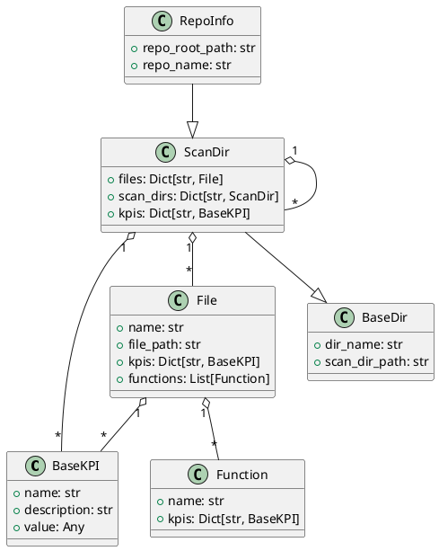

# Requirements and Design

## 1. Introduction

MetricMancer is a software analytics tool designed to provide actionable insights into code quality, maintainability, and technical risk. Inspired by the principles and techniques from "Your Code as a Crime Scene" by Adam Tornhill, the project analyzes source code repositories to extract key performance indicators (KPIs) such as cyclomatic complexity, code churn, and hotspots. 

The tool supports multi-language analysis and can generate reports in several formats, including CLI, HTML, and JSON. JSON reports are designed for integration with OpenSearch and dashboards. MetricMancer is built for extensibility, making it easy to add new metrics or adapt the tool to different codebases. The goal is to help teams identify refactoring candidates, monitor code health trends, and prioritize technical debt reduction—using real data from version control history and static analysis.

## 2. Glossary

**Temporal Coupling:**
Measures how often two or more files change together in the same commit. High temporal coupling can indicate hidden dependencies or poor modular design. *(Not implemented)*

**Change Coupling:**
Similar to temporal coupling but at the function level: which functions often change together? *(Not implemented)*

**Author Churn / Knowledge Map:**
Measures how many different developers have modified a file or module. Files with many different authors can be harder to maintain and have a higher risk of bugs. *(Not implemented)*

**Code Ownership:**
The proportion of code written by each developer. Low ownership can indicate a risk of knowledge spread or maintenance issues. *(Not implemented)*

**Defect Density:**
The number of bugs or defect reports linked to a file or module, often in relation to churn or complexity. *(Not implemented)*

**Hotspot Evolution:**
How do hotspots change over time? Do they grow, shrink, or remain stable? *(Not implemented)*

**Complexity Trend:**
Tracks whether the complexity of a file or module increases or decreases over time. *(Not implemented)*

**Code Age:**
How old is the code in a file or module? Newer code can be more unstable. *(Not implemented)*

**Test Coverage:**
The proportion of code covered by automated tests, ideally in relation to hotspots and churn. *(Not implemented)*

**Logical Coupling:**
Files or modules that often change together, even if they are not directly dependent in the code. *(Not implemented)*

**KPI (Key Performance Indicator):**
A measurable indicator used to evaluate code quality, maintainability, and risk. Examples: cyclomatic complexity, code churn, hotspots. (See "Your Code as a Crime Scene" for definitions and usage.)

**Cyclomatic Complexity:**
A measure of the logical complexity of a function/method, based on the number of independent paths through the code. High complexity indicates increased maintenance cost and testability risk. (Crime Scene: Chapter 2)

**Code Churn:**
The number of changes (commits) that have affected a file or function over time. High churn can indicate unstable or risky code. (Crime Scene: Chapter 3)

**Hotspot:**
A code section (file or function) that combines high complexity and high churn, making it a prioritized candidate for refactoring. (Crime Scene: Chapter 4)

**ScanDir:**
A node in the directory tree representing a directory and its contents, including aggregated KPIs. (Crime Scene: Chapter 5)

**RepoInfo:**
The root node in the analysis, representing an entire repository including metadata and KPIs at the repo level. (Crime Scene: Chapter 5)

**File:**
A single file in the analysis, with associated KPIs and analysis data. (Crime Scene: Chapter 5)

**Hotspot Score:**
A composite metric calculated as cyclomatic complexity × churn, used to identify risk zones in the code. (Crime Scene: Chapter 4)

**LOC (Lines of Code):**
The number of lines of code in a file or function. Used as a basis for several KPIs. (Crime Scene: Chapter 2)

**Parser:**
A component that parses source code to extract metric data, e.g., complexity or functions. (Crime Scene: Chapter 2)

**Dashboard:**
A visual overview of KPI results, often with charts and color coding to quickly identify risks. (Crime Scene: Chapter 6)

**Crime Scene Principles:**
The methodology and analysis models from the book "Your Code as a Crime Scene" by Adam Tornhill, which form the basis for the definitions and interpretations of KPIs in this project.

## 2.1. KPI Extension and Implementation Status

The following table summarizes the available and planned KPIs in MetricMancer, their implementation status, and extensibility notes:

| KPI Name                | Description                                                                 | Status           | Extensibility Notes                                  |
|-------------------------|-----------------------------------------------------------------------------|------------------|------------------------------------------------------|
| Cyclomatic Complexity   | Logical complexity of a function/method (McCabe)                             | Implemented      | New languages can be added via parser modules         |
| Code Churn              | Number of commits affecting a file/function                                  | Implemented      | Extendable to function-level churn with AST support   |
| Hotspot Score           | Composite: complexity × churn                                                | Implemented      | Thresholds/configuration can be adjusted              |
| Temporal Coupling       | How often files change together                                              | Not implemented  | Requires commit history analysis                      |
| Change Coupling         | How often functions change together                                          | Not implemented  | Requires fine-grained commit analysis                 |
| Author Churn/Knowledge Map | Number of unique authors per file/module                                  | Not implemented  | Needs author extraction from VCS                      |
| Code Ownership          | Proportion of code by each developer                                         | Not implemented  | Needs author and LOC analysis                         |
| Defect Density          | Number of bugs/defects per file/module                                       | Not implemented  | Needs integration with issue tracker                  |
| Hotspot Evolution       | How hotspots change over time                                                | Not implemented  | Requires historical KPI tracking                      |
| Complexity Trend        | Complexity increase/decrease over time                                       | Not implemented  | Requires historical analysis                          |
| Code Age                | Age of code in file/module                                                   | Not implemented  | Needs commit date analysis                            |
| Test Coverage           | Proportion of code covered by tests                                          | Not implemented  | Needs integration with test tools                     |
| Logical Coupling        | Files/modules that change together without direct dependency                 | Not implemented  | Requires commit and dependency analysis               |

To add a new KPI, implement a new KPI calculator module and register it in the configuration. The system is designed for easy extension with minimal coupling between components.

## 3. System Overview

MetricMancer is designed as a modular and extensible analytics platform for source code repositories. The system is built to analyze codebases of varying sizes and languages, extracting actionable metrics that help teams understand, maintain, and improve their software.

The core workflow consists of scanning the repository, parsing source files, and calculating a set of key performance indicators (KPIs) such as cyclomatic complexity, code churn, and hotspot scores. The architecture separates concerns into distinct modules for scanning, parsing, metric calculation, and reporting, making it easy to extend or adapt the tool for new languages or metrics.

MetricMancer supports both command-line and HTML reporting, providing both quick overviews and detailed, navigable reports. The system is optimized for performance and scalability, capable of analyzing large repositories efficiently. It is also designed to be scriptable and automatable, making it suitable for integration into CI/CD pipelines or as part of a continuous code health monitoring strategy.

The design is inspired by the analytical techniques described in "Your Code as a Crime Scene," and aims to make advanced code forensics accessible and actionable for development teams of all sizes.

### 3.1. Architecture

MetricMancer is structured as a modular, layered system to maximize flexibility, maintainability, and extensibility. The architecture is divided into several key components:

- **Scanner:** Traverses the repository, identifies source files, and excludes hidden or irrelevant directories/files.
- **Parser:** Language-specific modules that extract functions, classes, and structural information from source files.
- **KPI Calculators:** Independent modules that compute metrics such as cyclomatic complexity, code churn, and hotspot scores. Each KPI is encapsulated as an object with its own calculation logic and metadata.
- **Data Model:** Central classes (e.g., RepoInfo, ScanDir, File) represent the hierarchical structure of the repository and aggregate KPI results at each level.
- **Report Generators:** Modules for producing output in various formats, including CLI, HTML, and JSON. These generators consume the data model and present results for different audiences and integrations.
- **Configuration & Extensibility:** The system is designed to allow easy addition of new languages, KPIs, or report formats by implementing new modules and registering them in the configuration.

The architecture supports both batch and incremental analysis, and is suitable for integration into CI/CD pipelines. By separating scanning, parsing, metric calculation, and reporting, MetricMancer enables teams to extend or adapt the tool to their specific needs with minimal coupling between components.

### 3.2. Data Model


The MetricMancer data model is designed to represent the hierarchical structure of a source code repository and to aggregate KPI results at each level. The main classes are:

**BaseKPI**
Represents a single key performance indicator (KPI) calculated for a function, file, directory, or repository. All specific KPIs (e.g., Cyclomatic Complexity, Code Churn, Hotspot Score) inherit from this base class.

- Fields:
  - `name`: Name of the KPI (e.g., "Cyclomatic Complexity")
  - `description`: Short description of what the KPI measures
  - `value`: The calculated value for this KPI (type depends on the KPI)
- Functional requirements:
  - Store the KPI's name, description, and value
  - Provide a consistent interface for all KPIs, enabling aggregation and reporting
  - Allow extension for new KPIs by subclassing and implementing custom calculation logic

**Function**
Represents a single function or method within a file.

- Fields:
  - `name`: Name of the function or method
  - `kpis`: Dictionary of KPIs for the function (`Dict[str, BaseKPI]`)
- Functional requirements:
  - Store the function's name
  - Store KPIs relevant to the function (e.g., complexity, churn)

**File**
Represents a single file that has been analyzed.

- Fields:
  - `name`: Name of the file
  - `file_path`: Relative path from the parent directory
  - `kpis`: Dictionary of KPIs for the file (`Dict[str, BaseKPI]`)
  - `functions`: List of functions in the file (`List[Function]`)
- Functional requirements:
  - Store the file's name and relative path
  - Store KPIs relevant to the file (e.g., complexity, churn, LOC, hotspot score)
  - Store a list of analyzed functions with their KPIs
  - Be easy to serialize to JSON and integrate into report structures

**BaseDir**
Base class for directory-like objects.

- Fields:
  - `dir_name`: Name of the directory
  - `scan_dir_path`: Relative path from the repository root

**ScanDir (inherits BaseDir)**
Represents a scanned directory, which can contain files and subdirectories.

- Fields:
  - `files`: Dictionary of files in the directory (`Dict[str, File]`)
  - `scan_dirs`: Dictionary of subdirectories (`Dict[str, ScanDir]`)
  - `kpis`: Dictionary of KPIs aggregated at the directory level (`Dict[str, BaseKPI]`)
- Functional requirements:
  - Store the directory's name and relative path
  - Store a set of files as File objects, indexed by filename
  - Store subdirectories as ScanDir instances, indexed by directory name
  - Store KPIs at the directory level, e.g., average complexity or total churn
  - Support recursive traversal for reporting and visualization

**RepoInfo (inherits ScanDir)**
Represents the top-level object for an analyzed repository, including its structure and KPIs.

- Fields:
  - `repo_root_path`: Absolute path to the repository root
  - `repo_name`: Name of the repository
  - Inherits all fields and behaviors from ScanDir
- Functional requirements:
  - Inherit all fields and behaviors from ScanDir, including recursive directory structure, files, and KPIs
  - Store a unique name for the repository
  - Store the absolute path to the repository root
  - Serve as the top node in the data model and be serializable to JSON, HTML, and other report formats
  - Aggregate KPIs from underlying directories and files for repository-level summaries

#### UML Diagram (PlantUML)

 
## 4. Detailed Requirements


### 4.1.4 Issue Tracker Integration and Defect Correlation

**Defect Density and Issue Tracker Integration**

MetricMancer shall support integration with external issue trackers (e.g., Jira, GitHub Issues, GitLab, etc.) to correlate code metrics (KPIs) with defect data, as described in "Your Code as a Crime Scene, second edition".

#### Integration Specification

- The tool shall support configuration for connecting to one or more issue trackers via API or by importing exported issue data (CSV, JSON, etc.).
- The tool shall extract defect/bug reports, including at minimum: issue ID, type, status, creation date, resolution date, and affected files (if available).
- The tool shall support mapping commits to issues using commit messages (e.g., by recognizing issue keys such as JIRA-123 in commit messages) or by explicit links in the VCS.

#### Correlating KPIs with Defects

- For each file or module, the tool shall calculate **defect density** as the number of linked defects per KLOC (thousand lines of code) or per file.
- The tool shall correlate defect density with other KPIs (e.g., code churn, complexity, hotspots) to identify risk zones and prioritize refactoring.
- Reports shall highlight files with both high defect density and high values for other risk KPIs (e.g., churn, complexity, low ownership).

**Example:**

| File         | Defects | LOC  | Defect Density | Churn | Complexity | Hotspot Score |
|--------------|---------|------|---------------|-------|------------|---------------|
| src/foo.py   | 5       | 500  | 10/1KLOC      | 42    | 5          | 210           |

#### Visualization and Reporting

- The tool shall visualize defect density alongside other KPIs in reports and dashboards (e.g., as heatmaps or combined tables).
- Reports shall include recommendations for files with high defect density and high risk according to other KPIs.

#### Acceptance Criteria

- The tool can import or connect to at least one issue tracker and extract defect data.
- Defect density is calculated and reported for all files/modules with linked defects.
- Correlation between defect density and other KPIs is visualized and highlighted in reports.
- Example output as above.

---

**Code Ownership** measures the proportion of code in a file or module contributed by each developer. Low ownership (many authors) can indicate a risk for knowledge spread, maintenance issues, or increased defect rates. This metric is based on "Your Code as a Crime Scene, second edition".

#### Git Blame Analysis

To calculate code ownership, the tool shall:

- Use `git blame` (or equivalent) to attribute each line of code in a file to its most recent author.
- Aggregate the number of lines per author for each file or module.
- Calculate the ownership percentage for each author as (lines by author) / (total lines in file).

**Example:**

| File         | Author         | Lines | Ownership (%) |
|--------------|----------------|-------|---------------|
| src/foo.py   | Alice          | 120   | 60%           |
| src/foo.py   | Bob            | 80    | 40%           |

#### Thresholds for Low Ownership

The tool shall support configuration of thresholds to classify ownership risk:

- **Low Ownership:** No single author owns more than 50% of a file's lines (default threshold, as recommended in the book).
- **Medium Ownership:** Top author owns 50–75% of lines.
- **High Ownership:** Top author owns more than 75% of lines.

These thresholds shall be user-configurable.

#### Visualization

- The tool shall visualize code ownership per file/module, e.g., as a bar chart or pie chart showing the proportion of lines per author.
- Reports shall highlight files with low ownership and recommend review or knowledge sharing.

#### Acceptance Criteria

- Code ownership is calculated for all files in the repository using git blame or equivalent.
- Files with low ownership are clearly flagged in reports and visualizations.
- Thresholds are user-configurable.
- Example output:

| File         | Top Author | Ownership (%) | Risk Level |
|--------------|------------|---------------|------------|
| src/foo.py   | Alice      | 60%           | Medium     |
| src/bar.py   | Bob        | 40%           | Low        |

---

**Logical Coupling** identifies files or modules that often change together, even if they are not directly dependent in the code. This metric helps reveal hidden dependencies and maintenance risks that are not visible in the static structure. The approach is based on "Your Code as a Crime Scene, second edition".

#### Commit Parsing Example

To calculate logical coupling, the tool shall:

- Parse the commit history to extract all commits and the set of files changed in each commit (as for temporal coupling).
- For each file pair (A, B), count the number of commits where both files were changed together.
- Normalize the coupling by the total number of changes for each file, and filter out file pairs that are directly dependent (e.g., via imports or includes) if static analysis is available.

**Example:**

```
commit 123abc
Author: ...
Date: ...

src/service.py
src/utils.py

commit 456def
Author: ...
Date: ...

src/service.py
src/db.py
```

Here, `src/service.py` and `src/utils.py` are logically coupled if they change together frequently, even if there is no direct import/include between them.

#### Thresholds for Strong Logical Coupling

The tool shall support configuration of thresholds to classify logical coupling strength:

- **Strong Logical Coupling:** File pairs that change together in more than 20% of their total commits (as recommended in the book) shall be flagged as strongly coupled.
- **Medium Logical Coupling:** File pairs that change together in 10–20% of their total commits.
- **Weak Logical Coupling:** File pairs below 10%.

These thresholds shall be configurable by the user.

#### Reporting

- The tool shall report all file pairs with strong or medium logical coupling, including the percentage and absolute number of co-changes.
- Reports shall highlight file pairs that are logically coupled but not directly dependent in the codebase, with recommendations for architectural review.

#### Acceptance Criteria

- Logical coupling is calculated for all file pairs in the repository.
- File pairs exceeding the strong logical coupling threshold are clearly flagged in reports.
- Thresholds are user-configurable.
- Example output:

| File A         | File B         | Co-Changes | Total Changes (A) | Total Changes (B) | Coupling (%) | Strength | Static Dependency |
|----------------|----------------|------------|-------------------|-------------------|--------------|----------|-------------------|
| src/service.py | src/utils.py   | 10         | 25                | 20                | 40%          | Strong   | No                |
| src/service.py | src/db.py      | 3          | 25                | 15                | 12%          | Medium   | Yes               |

---

**Temporal Coupling** measures how often two or more files change together in the same commit. High temporal coupling can indicate hidden dependencies, architectural erosion, or poor modular design. This metric is inspired by "Your Code as a Crime Scene, second edition".

#### Commit Parsing Example

To calculate temporal coupling, the tool shall:

- Parse the commit history (e.g., using `git log --name-only --pretty=format:`) to extract all commits and the set of files changed in each commit.
- For each file pair (A, B), count the number of commits where both files were changed together.
- Store and aggregate these counts for all file pairs in the repository.

**Example:**

```
commit abc123
Author: ...
Date: ...

src/foo.py
src/bar.py

commit def456
Author: ...
Date: ...

src/foo.py
src/baz.py
```

In this example, `src/foo.py` and `src/bar.py` have a temporal coupling count of 1, and `src/foo.py` and `src/baz.py` also have a count of 1.

#### Thresholds for Strong Coupling

The tool shall support configuration of thresholds to classify coupling strength:

- **Strong Coupling:** File pairs that change together in more than 20% of their total commits (as recommended in the book) shall be flagged as strongly coupled.
- **Medium Coupling:** File pairs that change together in 10–20% of their total commits.
- **Weak Coupling:** File pairs below 10%.

These thresholds shall be configurable by the user.

#### Reporting

- The tool shall report all file pairs with strong or medium temporal coupling, including the percentage and absolute number of co-changes.
- Reports shall include recommendations for refactoring or architectural review for strongly coupled files.

#### Acceptance Criteria

- Temporal coupling is calculated for all file pairs in the repository.
- File pairs exceeding the strong coupling threshold are clearly flagged in reports.
- Thresholds are user-configurable.
- Example output:

| File A      | File B      | Co-Changes | Total Changes (A) | Total Changes (B) | Coupling (%) | Strength |
|-------------|-------------|------------|-------------------|-------------------|--------------|----------|
| src/foo.py  | src/bar.py  | 12         | 30                | 25                | 40%          | Strong   |
| src/foo.py  | src/baz.py  | 3          | 30                | 10                | 10%          | Medium   |

---

### 4.1 Functional Requirements

| ID  | Requirement                                                                                  | Status         | Notes/Acceptance Criteria                                  |
|-----|----------------------------------------------------------------------------------------------|---------------|------------------------------------------------------------|
| FR1 | The tool shall scan a source code repository recursively, excluding hidden directories/files. | Implemented   | Hidden folders (e.g., .git, .venv) are not scanned.         |
| FR1a| The tool shall exclude binary files from analysis.                                            | Implemented   | Binary files (e.g., images, executables) are detected and skipped. |
| FR2 | The tool shall support multiple programming languages.                                        | Implemented   | Parsers exist for Python, Java, C, C++, C#, Go, JS, etc.    |
| FR3 | The tool shall calculate cyclomatic complexity for each function/method.                      | Implemented   | Per-language parser modules extract functions/methods.      |
| FR4 | The tool shall calculate code churn for each file.                                            | Implemented   | Uses git commit history.                                   |
| FR5 | The tool shall calculate hotspot scores (complexity × churn) for files/functions.             | Implemented   | Hotspot = high complexity × high churn.                    |
| FR6 | The tool shall generate reports in CLI, HTML, and JSON formats.                               | Implemented   | CLI: tabular, HTML: interactive, JSON: for dashboards.      |
| FR7 | The tool shall support configuration of thresholds for KPIs.                                  | Implemented   | User can adjust thresholds in config.                       |
| FR8 | The tool shall be extensible to add new KPIs.                                                 | Implemented   | New KPI modules can be registered.                         |
| FR9 | The tool shall be scriptable and suitable for CI/CD integration.                              | Implemented   | CLI interface, JSON output for automation.                  |
| FR10| The tool shall aggregate KPIs at file, directory, and repository levels.                      | Implemented   | Data model supports aggregation at all levels.              |
| FR11| The tool shall allow easy addition of new language parsers.                                   | Implemented   | Parser modules are pluggable.                               |
| FR12| The tool shall not require internet access for core analysis.                                 | Implemented   | All core analysis is local.                                 |
| FR13| The tool shall support analysis of large repositories efficiently.                            | Implemented   | Performance tested on large codebases.                      |
| FR14| The tool shall provide clear error messages for unsupported files or parse errors.             | Implemented   | Errors are reported in CLI and logs.                        |
| FR15| The tool shall allow exclusion of files/directories via configuration.                        | Implemented   | User can specify exclude patterns.                          |
| FR16| The tool shall support future integration with issue trackers (e.g., Jira).                   | Planned       | Placeholder for defect density KPI.                         |
| FR17| The tool shall support future integration with test coverage tools.                            | Planned       | Placeholder for test coverage KPI.                          |
| FR18| The tool shall support historical trend analysis of KPIs.                                     | Planned       | Placeholder for complexity/churn trends, hotspot evolution. |

### 4.2 Non-Functional Requirements

| ID   | Requirement                                                                                 | Status         | Notes/Acceptance Criteria                                  |
|------|---------------------------------------------------------------------------------------------|---------------|------------------------------------------------------------|
| NFR1 | The tool shall be open source and licensed under MIT.                                       | Implemented   | LICENSE file present.                                      |
| NFR2 | The tool shall be documented in English.                                                    | Implemented   | Requirements, design, and usage docs in English.           |
| NFR3 | The tool shall be easy to install and run on macOS, Linux, and Windows.                     | Implemented   | Python 3.10+, no external dependencies required.           |
| NFR4 | The tool shall have automated tests for core functionality.                                 | Implemented   | Unit tests for all major modules.                          |
| NFR5 | The tool shall provide clear and actionable output for users.                               | Implemented   | CLI/HTML reports highlight risks and refactoring targets.  |
| NFR6 | The tool shall be performant and able to analyze large repositories in reasonable time.      | Implemented   | Benchmarked on large open source projects.                 |
| NFR7 | The tool shall be extensible with minimal code changes.                                     | Implemented   | Modular architecture, plugin pattern for KPIs/parsers.     |
| NFR8 | The tool shall not collect or transmit user data.                                           | Implemented   | No telemetry or external calls.                            |
| NFR9 | The tool shall provide meaningful error messages and logs.                                  | Implemented   | Errors and logs are user-friendly.                         |
| NFR10| The tool shall be maintainable and follow best practices for code quality.                  | Implemented   | PEP8, modularization, docstrings, type hints.              |
| NFR11| The tool shall support future localization to other languages.                              | Planned       | English is default; i18n planned for future.               |
| NFR12| The tool shall support accessibility in HTML reports.                                       | Planned       | ARIA roles, color contrast, keyboard navigation.           |

---

## 5. Example Outputs

Below are example outputs for the main report formats supported by MetricMancer. These illustrate the structure and content users can expect from the tool.

### 5.1 JSON Report Example

```json
{
  "repo_name": "example-repo",
  "repo_root_path": "/path/to/repo",
  "is_git_repo": true,
  "kpis": {
    "total_churn": 1234,
    "avg_complexity": 2.7
  },
  "scan_dirs": {
    "src": {
      "dir_name": "src",
      "scan_dir_path": "src",
      "kpis": { "churn": 567, "avg_complexity": 3.1 },
      "files": {
        "main.py": {
          "file_path": "src/main.py",
          "kpis": {
            "complexity": 5,
            "churn": 42,
            "hotspot_score": 210
          }
        }
      }
    }
  }
}
```

### 5.2 CLI Report Example

```
┌──────────────┬──────────────┬────────────┬───────────────┐
│ File         │ Complexity   │ Churn      │ Hotspot Score │
├──────────────┼──────────────┼────────────┼───────────────┤
│ src/main.py  │      5       │    42      │     210       │
│ src/utils.py │      2       │    10      │      20       │
└──────────────┴──────────────┴────────────┴───────────────┘

Repository KPIs:
  Total churn: 1234
  Average complexity: 2.7
```

## 6. HTML Reporting Architecture

The HTML reporting in MetricMancer is implemented as a modular, template-driven system that transforms the internal data model into an interactive, user-friendly report. The architecture is designed for extensibility, maintainability, and clear separation of concerns. The main components are:

- **HTML Report Generator (`report_generator.py` / `html_report_format.py`)**: This module orchestrates the generation of the HTML report. It consumes the analyzed data model (instances of `RepoInfo`, `ScanDir`, `File`, and their KPIs) and passes the relevant data to the rendering layer.

- **Template System**: HTML output is produced using Jinja2-style templates (or equivalent), which define the structure, layout, and styling of the report. Templates are stored in the `report/templates/` directory, making it easy to update the look and feel or add new report sections without changing Python code.

- **Report Data Renderer (`report_renderer.py`)**: This component is responsible for transforming the data model into a format suitable for the templates. It flattens hierarchical data, aggregates KPIs, and prepares context dictionaries for rendering. It also handles formatting (e.g., color-coding, risk highlighting) and injects interactive elements (e.g., collapsible sections, tooltips).

- **Static Assets**: CSS and JavaScript files are included to provide styling, responsive layout, and interactivity (such as sorting tables or expanding/collapsing directory trees). These assets are referenced from the template directory and bundled with the report output.

- **Report Writer (`report_writer.py`)**: Handles writing the final HTML file to disk, ensuring all referenced assets are copied or linked appropriately.

**Workflow:**
1. The user runs MetricMancer with the HTML output option.
2. The analysis pipeline produces a populated data model.
3. The HTML report generator invokes the renderer, which prepares the data for the template.
4. The template is rendered with the data, producing a complete HTML file.
5. Static assets are bundled, and the report is written to the output directory.

**Extensibility:**
- New report sections or visualizations can be added by creating new templates and updating the renderer.
- The template system allows for easy branding or customization.
- The architecture supports future enhancements such as charts, filtering, or integration with dashboards.

This modular approach ensures that the HTML reporting is both robust and easy to evolve as new requirements emerge.

---

## 7. Stakeholder Analysis

MetricMancer is intended for software development teams, technical leads, architects, and quality engineers who need actionable insights into code quality and technical debt. Key stakeholders include:

- **Developers:** Use the tool to identify refactoring candidates and monitor code health.
- **Technical Leads/Architects:** Use reports to guide technical debt reduction and architectural improvements.
- **Quality Engineers:** Integrate metrics into CI/CD pipelines and dashboards for continuous monitoring.
- **Managers:** Track trends and risks to inform resource allocation and process improvements.

## 8. Requirement Prioritization & Risk Management

Requirements are prioritized based on their impact on code quality, maintainability, and user value. Core analysis and reporting features are highest priority. Planned features (e.g., defect density, test coverage) are lower priority and scheduled for future releases.

Risks include:
- **Scalability:** Large repositories may impact performance. Mitigated by optimizing algorithms and supporting configuration.
- **Extensibility:** Risk of tight coupling is mitigated by modular architecture and plugin patterns.
- **Data Accuracy:** Incorrect parsing or churn calculation could mislead users. Mitigated by tests and validation.

## 9. Validation & Verification

Validation and verification are achieved through:
- **Automated Unit Tests:** Cover all major modules and KPIs.
- **Manual Review:** Reports are reviewed for clarity and accuracy.
- **Acceptance Criteria:** Each requirement includes acceptance notes for testability.
- **Continuous Integration:** Automated tests run on each commit to ensure ongoing quality.

## 10. Change Management

Requirements and design changes are managed via version control (Git). All changes are tracked, reviewed, and documented in the changelog. Major changes require stakeholder review and update of requirements tables.

## 11. Process & Methodology

MetricMancer is developed using an iterative, test-driven approach. The process emphasizes:
- **Modular Design:** Enables incremental development and easy extension.
- **Continuous Integration:** Ensures code quality and rapid feedback.
- **Documentation:** Requirements and design are updated alongside code.
- **Open Source Collaboration:** Contributions are reviewed and integrated via pull requests.
```
```
