# Requirements and Design

## 1. Introduction

[ToC](#table-of-contents)

MetricMancer is a software analytics tool designed to provide actionable insights into code quality, maintainability, and technical risk. Inspired by the principles and techniques from "Your Code as a Crime Scene" by Adam Tornhill, the project analyzes source code repositories to extract key performance indicators (KPIs) such as cyclomatic complexity, code churn, and hotspots.

The tool supports multi-language analysis and can generate reports in several formats, including CLI, HTML, and JSON. JSON reports are designed for integration with OpenSearch and dashboards. MetricMancer is built for extensibility, making it easy to add new metrics or adapt the tool to different codebases. The goal is to help teams identify refactoring candidates, monitor code health trends, and prioritize technical debt reduction—using real data from version control history and static analysis.

## Table of Contents

- [Requirements and Design](#requirements-and-design)
  - [1. Introduction](#1-introduction)
  - [Table of Contents](#table-of-contents)
  - [2. Glossary](#2-glossary)
    - [2.1. KPI Extension and Implementation Status](#21-kpi-extension-and-implementation-status)
  - [3. System Overview](#3-system-overview)
- [3.1 System Flow and Architecture Diagrams](#31-system-flow-and-architecture-diagrams)
    - [3.1.1 System Overview](#311-system-overview)
    - [3.1.2 Application Flow](#312-application-flow)
    - [3.1.3 Analysis Flow](#313-analysis-flow)
    - [3.1.4 Scanner and Data Collection](#314-scanner-and-data-collection)
    - [3.1.5 Report Generation](#315-report-generation)
      - [3.1.5.1 Report Generation Overview](#3151-report-generation-overview)
      - [3.1.5.2 HTML Report](#3152-html-report)
      - [3.1.5.3 CLI Report](#3153-cli-report)
      - [3.1.5.4 JSON Report](#3154-json-report)
    - [3.1.6 KPI Modules](#316-kpi-modules)
    - [3.1.7 Configuration and CLI Flow](#317-configuration-and-cli-flow)
    - [3.1.8 Error Handling](#318-error-handling)
    - [3.2 Data Model](#32-data-model)
      - [3.2.1 UML Diagram](#321-uml-diagram)
  - [4. Detailed Requirements](#4-detailed-requirements)
    - [4.1 User Stories](#41-user-stories)
      - [4.1.1 Persona 1: Alice – The Senior Developer](#411-persona-1-alice--the-senior-developer)
      - [4.1.2 Persona 2: Bob – The DevOps Engineer](#412-persona-2-bob--the-devops-engineer)
      - [4.1.3 Persona 3: Carol – The Engineering Manager](#413-persona-3-carol--the-engineering-manager)
      - [4.1.4 Persona 4: Dave – The New Team Member](#414-persona-4-dave--the-new-team-member)
      - [4.1.5 Persona 5: Sam – The Software Quality Assurance Manager (SQAM)](#415-persona-5-sam--the-software-quality-assurance-manager-sqam)
      - [4.1.6 Persona 6: Erin – The Software Quality Assurance Engineer (SQAE)](#416-persona-6-erin--the-software-quality-assurance-engineer-sqae)
      - [4.1.7 Persona 7: Mia – The Executive Manager](#417-persona-7-mia--the-executive-manager)
    - [4.2 Functional Requirements](#42-functional-requirements)
      - [4.2.1 Core Functional Requirements](#421-core-functional-requirements)
      - [4.2.2 Core Non-Functional Requirements](#422-core-non-functional-requirements)
    - [4.3 Mapping: Requirements to User Stories](#43-mapping-requirements-to-user-stories)
    - [4.4 Mapping: Requirements to test cases](#44-mapping-requirements-to-test-cases)

## 2. Glossary

[ToC](#table-of-contents)

**Temporal Coupling:**
Measures how often two or more files change together in the same commit. High temporal coupling can indicate hidden dependencies or poor modular design. *(Not implemented)*

**Change Coupling:**
Similar to temporal coupling but at the function level: which functions often change together? *(Not implemented)*

**Author Churn / Knowledge Map:**
Measures how many different developers have modified a file or module. Files with many different authors can be harder to maintain and have a higher risk of bugs. *(Not implemented)*

**Code Ownership:**
The proportion of code written by each developer. Low ownership can indicate a risk of knowledge spread or maintenance issues. *(Not implemented)*

**Defect Density:**
The number of bugs or defect reports linked to a file or module, often in relation to churn or complexity. *(Not implemented)*

**Hotspot Evolution:**
How do hotspots change over time? Do they grow, shrink, or remain stable? *(Not implemented)*

**Complexity Trend:**
Tracks whether the complexity of a file or module increases or decreases over time. *(Not implemented)*

**Code Age:**
How old is the code in a file or module? Newer code can be more unstable. *(Not implemented)*

**Test Coverage:**
The proportion of code covered by automated tests, ideally in relation to hotspots and churn. *(Not implemented)*

**Logical Coupling:**
Files or modules that often change together, even if they are not directly dependent in the code. *(Not implemented)*

**KPI (Key Performance Indicator):**
A measurable indicator used to evaluate code quality, maintainability, and risk. Examples: cyclomatic complexity, code churn, hotspots. (See "Your Code as a Crime Scene" for definitions and usage.)

**Cyclomatic Complexity:**
A measure of the logical complexity of a function/method, based on the number of independent paths through the code. High complexity indicates increased maintenance cost and testability risk. (Crime Scene: Chapter 2)

**Code Churn:**
The number of changes (commits) that have affected a file or function over time. High churn can indicate unstable or risky code. (Crime Scene: Chapter 3)

**Hotspot:**
A code section (file or function) that combines high complexity and high churn, making it a prioritized candidate for refactoring. (Crime Scene: Chapter 4)

**ScanDir:**
A node in the directory tree representing a directory and its contents, including aggregated KPIs. (Crime Scene: Chapter 5)

**RepoInfo:**
The root node in the analysis, representing an entire repository including metadata and KPIs at the repo level. (Crime Scene: Chapter 5)

**File:**
A single file in the analysis, with associated KPIs and analysis data. (Crime Scene: Chapter 5)

**Hotspot Score:**
A composite metric calculated as cyclomatic complexity × churn, used to identify risk zones in the code. (Crime Scene: Chapter 4)

**LOC (Lines of Code):**
The number of lines of code in a file or function. Used as a basis for several KPIs. (Crime Scene: Chapter 2)

**Parser:**
A component that parses source code to extract metric data, e.g., complexity or functions. (Crime Scene: Chapter 2)

**Dashboard:**
A visual overview of KPI results, often with charts and color coding to quickly identify risks. (Crime Scene: Chapter 6)

**Crime Scene Principles:**
The methodology and analysis models from the book "Your Code as a Crime Scene" by Adam Tornhill, which form the basis for the definitions and interpretations of KPIs in this project.

### 2.1. KPI Extension and Implementation Status

[ToC](#table-of-contents)

The following table summarizes the available and planned KPIs in MetricMancer, their implementation status, and extensibility notes:

| KPI Name                | Description                                                                 | Status           | Extensibility Notes                                  |
|-------------------------|-----------------------------------------------------------------------------|------------------|------------------------------------------------------|
| Cyclomatic Complexity   | Logical complexity of a function/method (McCabe)                             | Implemented      | New languages can be added via parser modules         |
| Code Churn              | Number of commits affecting a file/function                                  | Implemented      | Extendable to function-level churn with AST support   |
| Hotspot Score           | Composite: complexity × churn                                                | Implemented      | Thresholds/configuration can be adjusted              |
| Temporal Coupling       | How often files change together                                              | Not implemented  | Requires commit history analysis                      |
| Change Coupling         | How often functions change together                                          | Not implemented  | Requires fine-grained commit analysis                 |
| Author Churn/Knowledge Map | Number of unique authors per file/module                                  | Not implemented  | Needs author extraction from VCS                      |
| Code Ownership          | Proportion of code by each developer                                         | Not implemented  | Needs author and LOC analysis                         |
| Defect Density          | Number of bugs/defects per file/module                                       | Not implemented  | Needs integration with issue tracker                  |
| Hotspot Evolution       | How hotspots change over time                                                | Not implemented  | Requires historical KPI tracking                      |
| Complexity Trend        | Complexity increase/decrease over time                                       | Not implemented  | Requires historical analysis                          |
| Code Age                | Age of code in file/module                                                   | Not implemented  | Needs commit date analysis                            |
| Test Coverage           | Proportion of code covered by tests                                          | Not implemented  | Needs integration with test tools                     |
| Logical Coupling        | Files/modules that change together without direct dependency                 | Not implemented  | Requires commit and dependency analysis               |

To add a new KPI, implement a new KPI calculator module and register it in the configuration. The system is designed for easy extension with minimal coupling between components.

## 3. System Overview

[ToC](#table-of-contents)

MetricMancer is structured as a modular, layered system to maximize flexibility, maintainability, and extensibility. The architecture is divided into several key components:

- **Scanner:** Traverses the repository, identifies source files, and excludes hidden or irrelevant directories/files.
- **Parser:** Language-specific modules that extract functions, classes, and structural information from source files.
- **KPI Calculators:** Independent modules that compute metrics such as cyclomatic complexity, code churn, and hotspot scores. Each KPI is encapsulated as an object with its own calculation logic and metadata.
- **Data Model:** Central classes (e.g., RepoInfo, ScanDir, File) represent the hierarchical structure of the repository and aggregate KPI results at each level.
- **Report Generators:** Modules for producing output in various formats, including CLI, HTML, and JSON. These generators consume the data model and present results for different audiences and integrations.
- **Configuration & Extensibility:** The system is designed to allow easy addition of new languages, KPIs, or report formats by implementing new modules and registering them in the configuration.

The architecture supports both batch and incremental analysis, and is suitable for integration into CI/CD pipelines. By separating scanning, parsing, metric calculation, and reporting, MetricMancer enables teams to extend or adapt the tool to their specific needs with minimal coupling between components.

# 3.1 System Flow and Architecture Diagrams
[ToC](#table-of-contents)

This chapter presents the main flows and architectural components of MetricMancer, visualized with mermaid diagrams. Each section includes a detailed description and the corresponding diagram.

### 3.1.1 System Overview
[ToC](#table-of-contents)

This overview diagram shows the main components and data flows in MetricMancer, from scanning directories to analyzing files and generating reports in different formats. Edge cases and error handling are visualized, and the color coding matches the legend for consistency across all diagrams.

### 3.1.2 Application Flow
[ToC](#table-of-contents)

This diagram outlines the main application run flow in MetricMancer, from startup through scanning, analysis, and report generation in various formats. It also highlights key edge cases and error handling at each stage, using the standard color coding and legend.

### 3.1.3 Analysis Flow
[ToC](#table-of-contents)

This diagram details the flow of the Analyzer component in MetricMancer. It shows how files are grouped, analyzed for churn and complexity, and how results are aggregated per repository. Edge cases such as unknown extensions, read errors, and empty files are visualized, with color coding matching the legend.

### 3.1.4 Scanner and Data Collection
[ToC](#table-of-contents)

This diagram describes the flow of the Scanner component in MetricMancer. It covers directory traversal, file filtering, and error handling for hidden files, permissions, and invalid directories. The color coding and legend are consistent with the rest of the documentation.

### 3.1.5 Report Generation

#### 3.1.5.1 Report Generation Overview
[ToC](#table-of-contents)

This diagram summarizes the flow of the ReportGenerator component, including format selection, report generation for CLI, HTML, and JSON, and error handling for unknown formats. The color coding and legend are consistent with the rest of the documentation.

#### 3.1.5.2 HTML Report
[ToC](#table-of-contents)

This diagram shows the flow for generating an HTML report in MetricMancer. It covers initialization, rendering, filtering, and writing the HTML file, as well as cross-linking and potential edge cases. The color coding and legend are consistent with the rest of the documentation.

#### 3.1.5.3 CLI Report
[ToC](#table-of-contents)

This diagram illustrates the CLI report generation flow in MetricMancer, including analysis, format selection, and output to terminal or CSV. It also shows error handling for unsupported formats and output errors, using the standard color coding and legend.

#### 3.1.5.4 JSON Report
[ToC](#table-of-contents)

This diagram shows the flow for generating a JSON report in MetricMancer, from data preparation and serialization to file writing. Edge cases such as serialization and file write errors are visualized, with color coding and legend matching the rest of the documentation.

```mermaid
flowchart TD
StartJSON[Start JSONReportGenerator]:::start
StartJSON --> Prepare[Prepare data]:::calc
Prepare --> Serialize[Serialize to JSON]:::agg
Serialize --> WriteFile[Write JSON file]:::agg
WriteFile --> EndNode[End]:::start

%% Edge cases
WriteFile -.-> WarnWrite[Warn: file write error]:::warn
Serialize -.-> WarnSer[Warn: serialization error]:::warn
Prepare -.-> WarnPrep[Warn: missing/invalid data]:::warn

%% Legend
LegendStart[Start/End]:::start
LegendCalc[Data collection/Computation]:::calc
LegendLoop[Loop/Grouping]:::loop
LegendAgg[Aggregation/Model]:::agg
LegendWarn[Warning/Error]:::warn

LegendStart -.-> LegendCalc
LegendCalc -.-> LegendLoop
LegendLoop -.-> LegendAgg
LegendAgg -.-> LegendWarn

classDef start fill:#e8f5e9,stroke:#388e3c,stroke-width:2px,color:#212121;
classDef calc fill:#e3f2fd,stroke:#1976d2,stroke-width:2px,color:#1a237e;
classDef loop fill:#fffde7,stroke:#fbc02d,stroke-width:2px,color:#212121;
classDef agg fill:#ede7f6,stroke:#7b1fa2,stroke-width:2px,color:#4a148c;
classDef warn fill:#ffebee,stroke:#c62828,stroke-width:2px,color:#b71c1c;

class LegendStart start;
class LegendCalc calc;
class LegendLoop loop;
class LegendAgg agg;
class LegendWarn warn;
```

### 3.1.6 KPI Modules
[ToC](#table-of-contents)

This diagram illustrates the typical flow of a KPI module in MetricMancer, such as CodeChurnAnalyzer, ComplexityAnalyzer, or HotspotAnalyzer. The process starts with receiving file or repository data, proceeds to KPI calculation, and returns the result. Edge cases like missing input or calculation errors are visualized. The color coding and legend match the conventions used throughout the documentation.

### 3.1.7 Configuration and CLI Flow
[ToC](#table-of-contents)

This diagram describes how MetricMancer loads configuration and parses CLI arguments. The process starts at application launch, parses CLI arguments, loads the config file, merges both sources, and validates the resulting configuration. Edge cases such as missing config files, invalid CLI arguments, or validation errors are highlighted. The color coding and legend are consistent with the rest of the documentation.

### 3.1.8 Error Handling
[ToC](#table-of-contents)

This diagram shows the system-level error handling flow in MetricMancer. The main operation is attempted, and on success, the flow continues as normal. If an exception occurs, it is caught, logged, and a user-facing error or warning is shown. Unhandled exceptions are also visualized as edge cases. The color coding and legend are consistent with the rest of the documentation.

### 3.2 Data Model

[ToC](#table-of-contents)

The MetricMancer data model is designed to represent the hierarchical structure of a source code repository and to aggregate KPI results at each level. The main classes are:

**BaseKPI**
Represents a single key performance indicator (KPI) calculated for a function, file, directory, or repository. All specific KPIs (e.g., Cyclomatic Complexity, Code Churn, Hotspot Score) inherit from this base class.

- Fields:
  - `name`: Name of the KPI (e.g., "Cyclomatic Complexity")
  - `description`: Short description of what the KPI measures
  - `value`: The calculated value for this KPI (type depends on the KPI)
- Functional requirements:
  - Store the KPI's name, description, and value
  - Provide a consistent interface for all KPIs, enabling aggregation and reporting
  - Allow extension for new KPIs by subclassing and implementing custom calculation logic

**Function**
Represents a single function or method within a file.

- Fields:
  - `name`: Name of the function or method
  - `kpis`: Dictionary of KPIs for the function (`Dict[str, BaseKPI]`)
- Functional requirements:
  - Store the function's name
  - Store KPIs relevant to the function (e.g., complexity, churn)

**File**
Represents a single file that has been analyzed.

- Fields:
  - `name`: Name of the file
  - `file_path`: Relative path from the parent directory
  - `kpis`: Dictionary of KPIs for the file (`Dict[str, BaseKPI]`)
  - `functions`: List of functions in the file (`List[Function]`)
- Functional requirements:
  - Store the file's name and relative path
  - Store KPIs relevant to the file (e.g., complexity, churn, LOC, hotspot score)
  - Store a list of analyzed functions with their KPIs
  - Be easy to serialize to JSON and integrate into report structures

**BaseDir**
Base class for directory-like objects.

- Fields:
  - `dir_name`: Name of the directory
  - `scan_dir_path`: Relative path from the repository root

**ScanDir (inherits BaseDir)**
Represents a scanned directory, which can contain files and subdirectories.

- Fields:
  - `files`: Dictionary of files in the directory (`Dict[str, File]`)
  - `scan_dirs`: Dictionary of subdirectories (`Dict[str, ScanDir]`)
  - `kpis`: Dictionary of KPIs aggregated at the directory level (`Dict[str, BaseKPI]`)
- Functional requirements:
  - Store the directory's name and relative path
  - Store a set of files as File objects, indexed by filename
  - Store subdirectories as ScanDir instances, indexed by directory name
  - Store KPIs at the directory level, e.g., average complexity or total churn
  - Support recursive traversal for reporting and visualization

**RepoInfo (inherits ScanDir)**
Represents the top-level object for an analyzed repository, including its structure and KPIs.

- Fields:
  - `repo_root_path`: Absolute path to the repository root
  - `repo_name`: Name of the repository
  - Inherits all fields and behaviors from ScanDir
- Functional requirements:
  - Inherit all fields and behaviors from ScanDir, including recursive directory structure, files, and KPIs
  - Store a unique name for the repository
  - Store the absolute path to the repository root
  - Serve as the top node in the data model and be serializable to JSON, HTML, and other report formats
  - Aggregate KPIs from underlying directories and files for repository-level summaries

#### 3.2.1 UML Diagram

[ToC](#table-of-contents)

## 4. Detailed Requirements

### 4.1 User Stories

[ToC](#table-of-contents)

MetricMancer is intended for software development teams, technical leads, architects, and quality engineers who need actionable insights into code quality and technical debt. Key stakeholders include:

- **Developers:** Use the tool to identify refactoring candidates and monitor code health.
- **Technical Leads/Architects:** Use reports to guide technical debt reduction and architectural improvements.
- **Quality Engineers:** Integrate metrics into CI/CD pipelines and dashboards for continuous monitoring.
- **Managers:** Track trends and risks to inform resource allocation and process improvements.

#### 4.1.1 Persona 1: Alice – The Senior Developer

[ToC](#table-of-contents)

**Background:** Alice is responsible for maintaining a large Python codebase. She is experienced in refactoring and cares about code quality and technical debt.

**User Stories:**

- As a senior developer, I want to quickly identify files with high complexity and churn so that I can prioritize refactoring efforts.
- As a senior developer, I want to see hotspots and risk zones in the codebase so that I can plan technical debt reduction.
- As a senior developer, I want to generate HTML reports to share with my team during code review meetings.

#### 4.1.2 Persona 2: Bob – The DevOps Engineer

[ToC](#table-of-contents)

**Background:** Bob manages CI/CD pipelines and is responsible for integrating quality checks into the build process.

**User Stories:**

- As a DevOps engineer, I want to run MetricMancer as part of the CI pipeline so that code quality metrics are always up to date.
- As a DevOps engineer, I want to export JSON reports so that I can feed metrics into dashboards and monitoring tools.
- As a DevOps engineer, I want to receive alerts if code churn or complexity exceeds certain thresholds.

#### 4.1.3 Persona 3: Carol – The Engineering Manager

[ToC](#table-of-contents)

**Background:** Carol leads a distributed development team and is responsible for long-term code health and resource allocation.

**User Stories:**

- As an engineering manager, I want to track code quality trends over time so that I can identify areas of improvement and measure the impact of technical debt reduction initiatives.
- As an engineering manager, I want to receive summary dashboards and risk reports so that I can prioritize refactoring and allocate resources effectively.
- As an engineering manager, I want to identify files or modules with low code ownership so that I can encourage knowledge sharing and reduce maintenance risk.
- As an engineering manager, I want to correlate code quality metrics with business outcomes (e.g., defect rates, release stability) so that I can justify investments in code quality to stakeholders.
- As an engineering manager, I want to use MetricMancer reports to support planning and decision-making in sprint and release meetings.

#### 4.1.4 Persona 4: Dave – The New Team Member

[ToC](#table-of-contents)

**Background:** Dave recently joined the team and is onboarding to a large, unfamiliar codebase.

**User Stories:**

- As a new team member, I want to use MetricMancer’s reports to find the most complex or risky parts of the code so I can focus my learning.
- As a new team member, I want to see which files are hotspots so I can ask for help or code review when working in those areas.

#### 4.1.5 Persona 5: Sam – The Software Quality Assurance Manager (SQAM)

[ToC](#table-of-contents)

**Background:** Sam oversees the quality assurance strategy for the organization. He is responsible for defining quality standards, ensuring process compliance, and reporting on quality metrics to leadership. Sam coordinates with engineering, QA, and management to drive continuous improvement and risk mitigation.

**User Stories:**

- As a SQAM, I want to use MetricMancer to track organization-wide code quality trends so that I can report on progress and justify quality initiatives to leadership.
- As a SQAM, I want to set and monitor quality gates (e.g., maximum allowed complexity or churn) so that teams are held accountable to quality standards.
- As a SQAM, I want to receive summary dashboards and risk reports from MetricMancer so that I can prioritize audits and allocate resources effectively.
- As a SQAM, I want to correlate MetricMancer metrics with business outcomes (e.g., defect rates, release stability) so that I can demonstrate the value of quality improvements.

#### 4.1.6 Persona 6: Erin – The Software Quality Assurance Engineer (SQAE)

[ToC](#table-of-contents)

**Background:** Erin is responsible for ensuring the overall quality of the software product. She focuses on process compliance, risk identification, and continuous improvement. Erin collaborates with developers, managers, and DevOps to integrate quality metrics and drive quality initiatives.

**User Stories:**

- As a SQAE, I want to integrate MetricMancer into the quality assurance process so that I can monitor code quality trends and enforce quality gates.
- As a SQAE, I want to receive automated reports highlighting files or modules with high risk (e.g., high churn, complexity, or defect density) so that I can proactively address quality issues.
- As a SQAE, I want to correlate code metrics with defect data from issue trackers so that I can identify root causes and recommend targeted improvements.
- As a SQAE, I want to export MetricMancer results to quality dashboards and share them with stakeholders for transparency and compliance.

#### 4.1.7 Persona 7: Mia – The Executive Manager

[ToC](#table-of-contents)

**Background:** Mia is a senior executive responsible for multiple development teams and overall software delivery. She needs high-level insights to support strategic decisions and communicate with stakeholders.

**User Stories:**

- As an executive manager, I want to receive concise, high-level summaries of code quality and technical debt across all projects so that I can make informed decisions and report to upper management or the board.

### 4.2 Functional Requirements

#### 4.2.1 Core Functional Requirements

[ToC](#table-of-contents)

| Req-ID | Type           | Group                    | Name                              | Description                                                                 | Rationale (Why?) | Implementation Status |
|--------|----------------|--------------------------|-----------------------------------|-----------------------------------------------------------------------------|------------------|----------------------|
| FR1    | Functional     | Core Analysis            | Calculate complexity              | The tool shall calculate cyclomatic complexity for all functions/methods.   | Identify complex code and refactoring needs | Implemented |
| FR2    | Functional     | Core Analysis            | Calculate churn                   | The tool shall calculate code churn for all files.                          | Find unstable/risky code | Implemented |
| FR3    | Functional     | Core Analysis            | Identify hotspots                 | The tool shall identify hotspots (high churn × high complexity).            | Focus improvement on risk zones | Implemented |
| FR4    | Functional     | Core Analysis            | Calculate code ownership          | The tool shall calculate code ownership per file.                           | Identify knowledge silos and risk | Implemented |
| FR5    | Functional     | Core Analysis            | Calculate shared ownership        | The tool shall calculate shared ownership per file and function, and aggregate shared ownership up through directory/package to repository level. | Identify collaboration, knowledge spread, and risk | **Planned/Partial** |
| FR6    | Functional     | Core Analysis            | Calculate logical coupling        | The tool shall calculate logical coupling between files.                    | Find hidden dependencies | Planned |
| FR7    | Functional     | Core Analysis            | Calculate temporal coupling       | The tool shall calculate temporal coupling between files.                   | Find hidden dependencies | Planned |
| FR8    | Functional     | Core Analysis            | Quality trends                    | The tool shall track and visualize code quality over time.                  | Follow up on improvement work | Planned |
| FR9    | Functional     | Reporting & Visualization| Generate reports                  | The tool shall generate CLI, HTML, and JSON reports.                        | Different audiences and integrations | Implemented |
| FR10   | Functional     | Reporting & Visualization| Visualize KPIs                    | The tool shall visualize KPIs in HTML reports.                              | Facilitate interpretation and communication | Implemented |
| FR11   | Functional     | Reporting & Visualization| Dashboards for management         | The tool shall provide summary dashboards/reports for management.           | Facilitate management decisions | Planned |
| FR12   | Functional     | Reporting & Visualization| Export/integration with dashboards| The tool shall support export/integration with external dashboards.         | Enable further analysis | Planned |
| FR13   | Functional     | Integration & Automation | CI/CD support                     | The tool shall be able to run automatically in CI/CD pipelines.             | Enable continuous quality assurance | Implemented |
| FR14   | Functional     | Integration & Automation | Issue tracker integration         | The tool shall support integration with issue trackers.                     | Link code quality to defects | Planned |
| FR15   | Functional     | Integration & Automation | Alert on thresholds               | The tool shall alert if churn/complexity exceeds thresholds.                | Early warning of risks | Planned |
| FR16   | Functional     | Integration & Automation | Quality gates                     | The tool shall support quality gates (e.g., max churn/complexity).          | Ensure code standards | Planned |
| FR17   | Functional     | Usability & Extensibility| Multi-language support            | The tool shall support analysis of multiple languages in one run.           | Enable analysis of polyglot codebases | Implemented |
| FR18   | Functional     | Usability & Extensibility| Onboarding support                | The tool shall help new developers find complex/risky code.                 | Faster onboarding | Planned |
| FR19   | Functional     | Usability & Extensibility| Recommend knowledge sharing       | The tool shall suggest knowledge sharing for low-ownership files.           | Spread knowledge in the team | Planned |

#### 4.2.2 Core Non-Functional Requirements

[ToC](#table-of-contents)

| Req-ID | Type           | Group                    | Name                              | Description                                                                 | Rationale (Why?) | Implementation Status |
|--------|----------------|--------------------------|-----------------------------------|-----------------------------------------------------------------------------|------------------|----------------------|
| NFR1   | Non-Functional | Usability & Extensibility| Performance                       | Analysis of a medium-sized codebase (<10k files) shall take <5 min.         | Enable use in CI and daily operation | Implemented |
| NFR2   | Non-Functional | Usability & Extensibility| Extensibility                     | It shall be easy to add new KPIs and languages.                             | Future-proof and adapt the tool | Implemented |
| NFR3   | Non-Functional | Usability & Extensibility| Platforms                         | The tool shall work on Windows, macOS, and Linux.                           | Support all common development environments | Implemented |
| NFR4   | Non-Functional | Usability & Extensibility| Error handling                    | The tool shall provide clear error messages for invalid input.               | Facilitate troubleshooting and usability | Implemented |

### 4.3 Mapping: Requirements to User Stories

| Requirement(s)                  | User Story / Persona Description                                 |
|----------------------------------|-----------------------------------------------------------------|
| FR1, FR2, FR3, FR10, FR15, FR18 | [Alice](#411-persona-1-alice--the-senior-developer): Identify complex/risky code, see hotspots, onboarding    |
| FR6, FR11, FR13, FR19, FR21     | [Bob](#412-persona-2-bob--the-devops-engineer): Export reports, dashboards, integration                    |
| FR7, FR15, FR20                 | [Carol](#413-persona-3-carol--the-engineering-manager): Link code quality to defects, trends, business goals     |
| FR4, NFR3                       | [Dave](#414-persona-4-dave--the-new-team-member): Multi-language analysis, platform support                 |
| FR12, NFR1                      | [Sam](#415-persona-5-sam--the-software-quality-assurance-manager-sqam): CI/CD, performance                                        |
| FR14, FR19                      | [Sam](#415-persona-5-sam--the-software-quality-assurance-manager-sqam): Alerts, quality gates                                      |
| FR9, FR10                       | [Erin](#416-persona-6-erin--the-software-quality-assurance-engineer-sqae): Couplings, QA process                                    |
| NFR4                            | All: Error handling                                             |

### 4.4 Mapping: Requirements to test cases

| Requirement | Test Case(s)                                                                                                                        | Status       |
|-------------|-------------------------------------------------------------------------------------------------------------------------------------|--------------|
| FR1         | tests/app/test_complexity_analyzer.py:test_calculate_for_file_success, test_analyze_functions_success, test_calculate_for_file_import_error, test_calculate_for_file_no_parser, test_analyze_functions_attribute_error, test_analyze_functions_no_parser, tests/app/test_complexity_analyzer_edge.py:test_calculate_for_file_empty_config, test_calculate_for_file_import_error, test_calculate_for_file_missing_methods, test_analyze_functions_empty_config, test_analyze_functions_attribute_error, test_analyze_functions_missing_method | Implemented  |
| FR2         | tests/app/test_churn_detection.py:test_churn_detected, tests/app/test_churn_kpi_path_mismatch.py:test_churn_lookup_with_absolute_path, test_churn_lookup_with_relative_path_should_match_absolute, tests/app/test_code_churn_analyzer.py:test_analyze_churn_data, test_analyze_handles_exception, test_init_repo_scan_pairs, tests/app/test_code_churn_analyzer_edge.py:test_analyze_handles_pydriller_exception, test_analyze_no_churn_data, test_empty_repo_scan_pairs, test_find_git_repo_root_exception, test_find_git_repo_root_none | Implemented  |
| FR3         | tests/kpis/test_hotspot_kpi.py:test_hotspot_kpi, tests/kpis/test_hotspot_kpi_edge.py:test_calculate_with_negative, test_calculate_with_none, test_calculate_with_only_churn, test_calculate_with_only_complexity, test_calculate_with_zero | Implemented  |
| FR4         | tests/kpis/test_code_ownership.py:test_calculate_ownership_basic, test_calculate_ownership_error, tests/kpis/test_code_ownership_kpi.py:test_file_does_not_exist, test_file_not_tracked_by_git, test_file_tracked_and_blame_works, test_blame_fails | Implemented  |
| FR5         | tests/kpis/test_Shared_Ownership_KPI.py:test_shared_ownership_basic, test_shared_ownership_all_above_threshold, test_shared_ownership_all_below_threshold, test_shared_ownership_na, test_shared_ownership_with_precomputed_data, tests/kpis/test_shared_ownership_aggregator.py:test_aggregator_basic_statistics, test_aggregator_distribution, test_aggregator_empty_files, test_aggregator_handles_errors, test_aggregator_initialization, test_aggregator_invalid_kpi_value, test_aggregator_missing_shared_ownership_kpi, test_aggregator_most_shared_file, test_aggregator_percentages, test_aggregator_realistic_scenario, test_convenience_functions, test_shared_ownership_stats_dataclass, test_shared_ownership_stats_properties | Implemented  |
| FR6         | tests/report/test_cli_report_generator.py:test_generate_human_calls_cli_report_format, test_generate_machine_calls_cli_csv_report_format, test_generate_unsupported_format_raises, test_init_sets_attributes, tests/report/test_report_writer.py:test_write_html_creates_file_and_writes_content | Implemented  |
| FR7         | tests/app/test_analyzer.py:test_analyze_structure_and_kpis, test_analyze_empty_list, test_builds_nested_scandir_hierarchy, test_hotspot_kpi_includes_calculation_values, test_skips_unsupported_extension_files, test_unreadable_file_is_skipped_and_warned, test_zero_functions_results_in_zero_complexity_and_hotspot | Implemented  |
| FR8         | tests/app/test_metric_mancer_app.py:test_init_sets_attributes, test_run_multiple_repos, test_run_single_repo, tests/app/test_metric_mancer_app_edge.py:test_run_with_empty_directories, test_run_with_none_report_generator_cls, test_run_with_report_generate_exception | Implemented  |
| FR9         | tests/app/test_analyzer.py:test_analyze_structure_and_kpis, test_analyze_empty_list, test_builds_nested_scandir_hierarchy | Implemented  |
| FR10        | tests/app/test_scanner.py:test_scan_finds_supported_files, test_scan_multiple_directories, test_scan_ignores_hidden_files_and_dirs, test_scan_ignores_hidden_root_directory, test_scan_handles_non_existent_directory, test_scan_returns_empty_list_for_no_supported_files | Implemented  |
| FR11        | tests/app/test_tree_printer.py:test_build_tree_single_file, test_build_tree_nested, test_sort_paths, test_split_files_folders, test_sort_items, test_print_tree_output | Implemented  |
| FR12        | tests/report/test_cli_report_generator.py:test_generate_human_calls_cli_report_format, test_generate_machine_calls_cli_csv_report_format, test_generate_unsupported_format_raises, test_init_sets_attributes | Implemented  |
| FR13        | tests/app/test_metric_mancer_app.py:test_run_multiple_repos, test_run_single_repo, tests/app/test_metric_mancer_app_edge.py:test_run_with_empty_directories, test_run_with_none_report_generator_cls, test_run_with_report_generate_exception | Implemented  |
| FR14        |  | Planned |
| FR15        |  | Planned |
| FR16        |  | Planned |
| FR17        | tests/app/test_analyzer.py:test_analyze_structure_and_kpis, test_analyze_empty_list, test_builds_nested_scandir_hierarchy | Implemented  |
| FR18        |  | Planned |
| FR19        | tests/app/test_analyzer_shared_ownership.py:test_analyzer_includes_shared_ownership_kpi, test_shared_ownership_exception_handling | Planned      |

