# Requirements and Design

**Document Version:** 3.3.1 (Updated: 2025-12-16) **MetricMancer Version:** 3.3.1 **Status:** Release - Documentation
Update

______________________________________________________________________

## 1. Introduction

[ToC](#table-of-contents)

MetricMancer is a software analytics tool designed to provide actionable insights into code quality, maintainability,
and technical risk. Inspired by the principles and techniques from "Your Code as a Crime Scene" by Adam Tornhill, the
project analyzes source code repositories to extract key performance indicators (KPIs) such as cyclomatic complexity,
cognitive complexity, code churn, hotspots and more.

The tool supports multi-language analysis and can generate reports in several formats, including CLI, HTML, and JSON.
JSON reports are designed for integration with OpenSearch and dashboards. MetricMancer is built for extensibility,
making it easy to add new metrics or adapt the tool to different codebases. The goal is to help teams identify
refactoring candidates, monitor code health trends, and prioritize technical debt reduction—using real data from version
control history and static analysis.

### 1.1 Related Documentation

This document provides requirements and design specifications. For additional technical documentation, see:

**Architecture & Design:**

- **[ARCHITECTURE.md](ARCHITECTURE.md)** - Detailed technical architecture including SOLID principles, design patterns
  (Configuration Object, Factory, Strategy, Builder), component architecture, and design decisions
- **[plantuml/README.md](plantuml/README.md)** - Index of PlantUML class diagrams showing static structure (architecture
  and data models)
- **[mermaid/1_overview.md](mermaid/1_overview.md)** - Index of Mermaid flow diagrams showing dynamic behavior
  (processes and data flows)

**Migration & Usage:**

- **[MIGRATION_GUIDE.md](MIGRATION_GUIDE.md)** - Step-by-step guide for migrating to the Configuration Object Pattern,
  with common scenarios and FAQ
- **[README.md](README.md)** - Project overview, quick start, and usage examples

**Visual Documentation:**

- **PlantUML Diagrams** - Static class diagrams (architecture, data model)
- **Mermaid Diagrams** - Dynamic flow diagrams (system flows, processes)

### 1.2 Document Changelog

This section tracks major changes to this **document** (not the software). For complete software release history, see
**[CHANGELOG.md](CHANGELOG.md)**.

#### Version 3.3.1 (2025-12-16) - Documentation Update

**Status:** Released

**Document Changes:**

- Added FR1.1 (cognitive complexity) and FR3.1 (cognitive hotspots) requirements to Section 4.2.1
- Added Cognitive Complexity definition to Glossary (Chapter 2)
- Added Status column and cognitive complexity entries to KPI Extension table (Chapter 2.1)
- Added Cognitive Complexity Thresholds section (5.0.1.1)
- Updated Hotspot Score Calculation (5.0.3) with both cyclomatic and cognitive formulas
- Updated Hotspot Analysis (5.1) to distinguish between complexity types
- Added test mappings for FR1.1 and FR3.1

**Related:** CHANGELOG.md v3.3.1 entry

#### Version 3.3.0 (2025-12-12) - Refactoring and Test Expansion

**Status:** Released

**Document Changes:**

- Updated FR2 from "Partial" to "Implemented" - time-based churn was already implemented using `git log --since`
- Updated FR2.1 from "Planned" to "Implemented" - configurable time periods working via `--churn-period` CLI flag
- Updated test counts: 1004 tests (was 839 in v3.2.0)
- Added note about pydriller removal and git_helpers.py addition
- Updated NFR8 test count to reflect 1004 passing tests

**Key Features:**

- Time-based churn uses `git log --since` with configurable period (default 30 days)
- 165 new tests added (total: 1004)
- Cyclomatic complexity reduced 56% in git_cache.py (170 → 75)
- pydriller dependency removed, replaced with native git subprocess commands
- New `git_helpers.py` module for centralized git command execution

**Related:** CHANGELOG.md v3.3.0 entry

#### Version 3.2.0 (2025-10-31) - Multi-Language Cognitive Complexity

**Status:** Released

**Document Changes:**

- Updated document version and MetricMancer version to 3.2.0
- Added cognitive complexity feature documentation across all sections
- Updated implementation status with cognitive complexity support for 6 languages
- Added Cognitive Hotspot KPI to implementation summary
- Updated dependency requirements (tree-sitter migration from tree-sitter-languages to tree-sitter-language-pack)
- Updated test metrics (135 cognitive complexity tests, 839 total tests)

**Key Features:** Cognitive complexity analysis for Python, Java, Go, JavaScript, TypeScript, C using tree-sitter
parsers. Cognitive Hotspot KPI combining cognitive complexity with churn. Integrated in all report formats. **Key
Metrics:** 135 cognitive complexity tests, 839 total tests passing, 6 languages supported **Related:** Branch
docs/enhance-tree-sitter-implementation-plan

#### Version 3.1.0 (2025-10-14) - Multi-Format Generation

**Status:** Released

**Document Changes:**

- Added new functional requirement FR9.1 for multi-format single run capability
- Updated Implementation Summary with FR9.1 status and performance metrics
- Added `--output-formats` CLI parameter documentation

**Key Metrics:** 50-70% performance improvement for multiple formats, 440 tests passing\
**Related:** Issue #53, Branch 53-feature-multi-format-generation

#### Version 3.0.0 (2025-10-14) - Configuration Object Pattern

**Status:** Released

**Major Document Changes:**

- Added Related Documentation section (1.1) with links to ARCHITECTURE.md, MIGRATION_GUIDE.md, PlantUML, and Mermaid
  diagrams
- Updated System Overview (3.0) with Configuration Object Pattern, Factory Pattern, Strategy Pattern, SOLID principles
- Updated 3 architecture diagrams (3.1.1, 3.1.2, 3.1.7) to reflect new patterns
- Added 4 new Non-Functional Requirements (NFR5-NFR8) for architecture quality
- Enhanced Implementation Summary with pattern implementations and metrics
- Updated test case mappings for new NFRs

**Key Metrics:** 17% main.py complexity reduction, 390 tests, 4 design patterns, 1,232 lines documentation\
**Related:** PR #52, Branch 51-refactor-stable-main-config-pattern

#### Version 2.0.2 (2025-09-14) - HTML Report Templates

- Updated functional requirements status
- Added test case mappings for HTML reports

#### Version 2.0.0 (2025-09-14) - Initial Complete Document

- Complete Software Specification and Design document created
- Full requirements, architecture, data model, user stories, personas
- Mermaid and PlantUML diagrams added
- Test traceability matrices

#### Version 1.2.0 (2025-08-31) - Code Restructuring Documentation

- Updated architecture diagrams for new module structure

#### Version 1.0.0 (2025-08-30) - Initial Release

- Basic requirements and functional specifications

______________________________________________________________________

## Table of Contents

- [Requirements and Design](#requirements-and-design)
  - [1. Introduction](#1-introduction)
    - [1.1 Related Documentation](#11-related-documentation)
    - [1.2 Document Changelog](#12-document-changelog)
  - [Table of Contents](#table-of-contents)
  - [2. Glossary](#2-glossary)
    - [2.1. KPI Extension and Implementation Status](#21-kpi-extension-and-implementation-status)
  - [3. System Overview](#3-system-overview)
    - [3.1 System Flow and Architecture Diagrams](#31-system-flow-and-architecture-diagrams)
      - [3.1.1 System Overview](#311-system-overview)
      - [3.1.2 Application Flow](#312-application-flow)
      - [3.1.3 Analysis Flow](#313-analysis-flow)
      - [3.1.4 Scanner and Data Collection](#314-scanner-and-data-collection)
      - [3.1.5 Report Generation](#315-report-generation)
        - [3.1.5.1 Report Generation Overview](#3151-report-generation-overview)
        - [3.1.5.2 HTML Report](#3152-html-report)
        - [3.1.5.3 CLI Report](#3153-cli-report)
        - [3.1.5.4 JSON Report](#3154-json-report)
      - [3.1.6 KPI Modules](#316-kpi-modules)
      - [3.1.7 Configuration and CLI Flow](#317-configuration-and-cli-flow)
      - [3.1.8 Error Handling](#318-error-handling)
      - [3.2 Data Model](#32-data-model)
        - [3.2.1 UML Diagram](#321-uml-diagram)
  - [4. Detailed Requirements](#4-detailed-requirements)
    - [4.1 User Stories](#41-user-stories)
      - [4.1.1 Persona 1: Alice – The Senior Developer](#411-persona-1-alice--the-senior-developer)
      - [4.1.2 Persona 2: Bob – The DevOps Engineer](#412-persona-2-bob--the-devops-engineer)
      - [4.1.3 Persona 3: Carol – The Engineering Manager](#413-persona-3-carol--the-engineering-manager)
      - [4.1.4 Persona 4: Dave – The New Team Member](#414-persona-4-dave--the-new-team-member)
      - [4.1.5 Persona 5: Sam – The Software Quality Assurance Manager (SQAM)](#415-persona-5-sam--the-software-quality-assurance-manager-sqam)
      - [4.1.6 Persona 6: Erin – The Software Quality Assurance Engineer (SQAE)](#416-persona-6-erin--the-software-quality-assurance-engineer-sqae)
      - [4.1.7 Persona 7: Mia – The Executive Manager](#417-persona-7-mia--the-executive-manager)
    - [4.2 Functional Requirements](#42-functional-requirements)
      - [4.2.1 Core Functional Requirements](#421-core-functional-requirements)
      - [4.2.2 Core Non-Functional Requirements](#422-core-non-functional-requirements)
    - [4.3 Mapping: Requirements to User Stories](#43-mapping-requirements-to-user-stories)
    - [4.4 Mapping: Requirements to test cases](#44-mapping-requirements-to-test-cases)
    - [4.3 Mapping: Requirements to User Stories](#43-mapping-requirements-to-user-stories)
    - [4.4 Mapping: Requirements to test cases](#44-mapping-requirements-to-test-cases)
  - [5. Analysis Framework: Interpreting Metrics for Actionable Insights](#5-analysis-framework-interpreting-metrics-for-actionable-insights)
    - [5.0 Metric Thresholds and Classifications](#50-metric-thresholds-and-classifications)
      - [5.0.1 Cyclomatic Complexity Thresholds](#501-cyclomatic-complexity-thresholds)
      - [5.0.2 Code Churn Thresholds](#502-code-churn-thresholds)
      - [5.0.3 Hotspot Score Calculation](#503-hotspot-score-calculation)
      - [5.0.4 Ownership Thresholds](#504-ownership-thresholds)
      - [5.0.5 Contextual Adjustments](#505-contextual-adjustments)
    - [5.1 Hotspot Analysis: Prioritizing Improvement Efforts](#51-hotspot-analysis-prioritizing-improvement-efforts)
    - [5.2 Ownership Analysis: Knowledge Management and Risk Assessment](#52-ownership-analysis-knowledge-management-and-risk-assessment)
    - [5.3 Testing and Quality Assurance Strategy](#53-testing-and-quality-assurance-strategy)
      - [5.3.1 Test Prioritization Matrix](#531-test-prioritization-matrix)
      - [5.3.2 Code Review Strategy](#532-code-review-strategy)
        - [5.3.2.1 Pre-Review KPI Assessment](#5321-pre-review-kpi-assessment)
        - [5.3.2.2 Review Focus Areas by KPI Profile](#5322-review-focus-areas-by-kpi-profile)
        - [5.3.2.3 Review Comments Template by Risk Level](#5323-review-comments-template-by-risk-level)
        - [5.3.2.4 Reviewer Assignment Strategy](#5324-reviewer-assignment-strategy)
        - [5.3.2.5 Post-Review KPI Monitoring](#5325-post-review-kpi-monitoring)
    - [5.4 Organizational Insights and Conway's Law](#54-organizational-insights-and-conways-law)
      - [5.4.1 Team Structure Analysis](#541-team-structure-analysis)
      - [5.4.2 Recommended Organizational Actions](#542-recommended-organizational-actions)
    - [5.5 Continuous Improvement Process](#55-continuous-improvement-process)
      - [5.5.1 Regular Health Checks](#551-regular-health-checks)
      - [5.5.2 Success Metrics](#552-success-metrics)
      - [5.5.3 Integration with Development Workflow](#553-integration-with-development-workflow)

## 2. Glossary

[ToC](#table-of-contents)

**Temporal Coupling:** Measures how often two or more files change together in the same commit. High temporal coupling
can indicate hidden dependencies or poor modular design. *(Not implemented)*

**Change Coupling:** Similar to temporal coupling but at the function level: which functions often change together?
*(Not implemented)*

**Author Churn / Knowledge Map:** Measures how many different developers have modified a file or module. Files with many
different authors can be harder to maintain and have a higher risk of bugs. *(Not implemented)*

**Code Ownership:** The proportion of code written by each developer. Low ownership can indicate a risk of knowledge
spread or maintenance issues. *(Not implemented)*

**Defect Density:** The number of bugs or defect reports linked to a file or module, often in relation to churn or
complexity. *(Not implemented)*

**Hotspot Evolution:** How do hotspots change over time? Do they grow, shrink, or remain stable? *(Not implemented)*

**Complexity Trend:** Tracks whether the complexity of a file or module increases or decreases over time. *(Not
implemented)*

**Code Age:** How old is the code in a file or module? Newer code can be more unstable. *(Not implemented)*

**Test Coverage:** The proportion of code covered by automated tests, ideally in relation to hotspots and churn. *(Not
implemented)*

**Logical Coupling:** Files or modules that often change together, even if they are not directly dependent in the code.
*(Not implemented)*

**KPI (Key Performance Indicator):** A measurable indicator used to evaluate code quality, maintainability, and risk.
Examples: cyclomatic complexity, code churn, hotspots. (See "Your Code as a Crime Scene" for definitions and usage.)

**Cyclomatic Complexity:** A measure of the logical complexity of a function/method, based on the number of independent
paths through the code. High complexity indicates increased maintenance cost and testability risk. (Crime Scene: Chapter
2\)

**Cognitive Complexity:** A measure of how difficult code is to understand, developed by SonarSource. Unlike cyclomatic
complexity which counts paths, cognitive complexity penalizes nested structures and breaks in linear flow. Lower values
indicate more readable code. Supported for Python, Java, Go, JavaScript, TypeScript, and C.

**Code Churn:** The frequency of changes (commits) that have affected a file or function over a specific time period
(typically monthly). High churn indicates unstable or risky code. Should be measured as commits per time unit, not total
historical commits. (Crime Scene: Chapter 3)

**Hotspot:** A code section (file or function) that combines high complexity and high churn, making it a prioritized
candidate for refactoring. (Crime Scene: Chapter 4)

**ScanDir:** A node in the directory tree representing a directory and its contents, including aggregated KPIs. (Crime
Scene: Chapter 5)

**RepoInfo:** The root node in the analysis, representing an entire repository including metadata and KPIs at the repo
level. (Crime Scene: Chapter 5)

**File:** A single file in the analysis, with associated KPIs and analysis data. (Crime Scene: Chapter 5)

**Hotspot Score:** A composite metric calculated as cyclomatic complexity × churn, used to identify risk zones in the
code. (Crime Scene: Chapter 4)

**LOC (Lines of Code):** The number of lines of code in a file or function. Used as a basis for several KPIs. (Crime
Scene: Chapter 2)

**Parser:** A component that parses source code to extract metric data, e.g., complexity or functions. (Crime Scene:
Chapter 2)

**Dashboard:** A visual overview of KPI results, often with charts and color coding to quickly identify risks. (Crime
Scene: Chapter 6)

**Crime Scene Principles:** The methodology and analysis models from the book "Your Code as a Crime Scene" by Adam
Tornhill, which form the basis for the definitions and interpretations of KPIs in this project.

### 2.1. KPI Extension and Implementation Status

[ToC](#table-of-contents)

The following table summarizes key KPIs in MetricMancer and provides extensibility notes for each:

| KPI Name                   | Description                                                                     | Extensibility Notes                                                               | Status      |
| -------------------------- | ------------------------------------------------------------------------------- | --------------------------------------------------------------------------------- | ----------- |
| Cyclomatic Complexity      | Logical complexity of a function/method (McCabe)                                | New languages can be added via parser modules                                     | Implemented |
| Cognitive Complexity       | Understandability measure based on SonarSource rules (nesting, breaks in flow)  | Supported for Python, Java, Go, JavaScript, TypeScript, C via tree-sitter         | Implemented |
| Code Churn                 | Frequency of commits affecting a file/function over time period (default 30 days) | Time-based via `git log --since`, configurable via `--churn-period`              | Implemented |
| Hotspot Score (Cyclomatic) | Composite: cyclomatic complexity × churn                                        | Thresholds/configuration can be adjusted                                          | Implemented |
| Hotspot Score (Cognitive)  | Composite: cognitive complexity × churn                                         | Thresholds/configuration can be adjusted                                          | Implemented |
| Code Ownership             | Proportion of code by each developer (git blame)                                | Per-file ownership calculation                                                    | Implemented |
| Shared Code Ownership      | Percentage of code owned by multiple developers                                 | Aggregation up directory hierarchy                                                | Implemented |
| Temporal Coupling          | How often files change together                                                 | Requires commit history analysis                                                  | Planned     |
| Change Coupling            | How often functions change together                                             | Requires fine-grained commit analysis                                             | Planned     |
| Author Churn/Knowledge Map | Number of unique authors per file/module                                        | Needs author extraction from VCS                                                  | Planned     |
| Defect Density             | Number of bugs/defects per file/module                                          | Needs integration with issue tracker                                              | Planned     |
| Hotspot Evolution          | How hotspots change over time                                                   | Requires historical KPI tracking                                                  | Planned     |
| Complexity Trend           | Complexity increase/decrease over time                                          | Requires historical analysis                                                      | Planned     |
| Code Age                   | Age of code in file/module                                                      | Needs commit date analysis                                                        | Planned     |
| Test Coverage              | Proportion of code covered by tests                                             | Needs integration with test tools                                                 | Planned     |
| Logical Coupling           | Files/modules that change together without direct dependency                    | Requires commit and dependency analysis                                           | Planned     |

To add a new KPI, implement a new KPI calculator module and register it in the configuration. The system is designed for
easy extension with minimal coupling between components.

## 3. System Overview

[ToC](#table-of-contents)

MetricMancer is structured as a modular, layered system to maximize flexibility, maintainability, and extensibility. The
architecture follows SOLID principles and implements several design patterns including Configuration Object Pattern,
Factory Pattern, Strategy Pattern, and Builder Pattern.

For detailed architecture documentation including design patterns, SOLID principles, and component interactions, see
**[ARCHITECTURE.md](ARCHITECTURE.md)**.

The architecture is divided into several key components:

- **Configuration (AppConfig):** Centralized configuration using the Configuration Object Pattern. Single source of
  truth for all application settings with type-safety and automatic validation.
- **Main Entry Point:** Simplified `main.py` with reduced complexity. Uses AppConfig for configuration and
  ReportGeneratorFactory for report creation.
- **Scanner:** Traverses the repository, identifies source files, and excludes hidden or irrelevant directories/files.
- **Parser:** Language-specific modules that extract functions, classes, and structural information from source files.
- **KPI Calculators:** Independent modules that compute metrics such as cyclomatic complexity, code churn, and hotspot
  scores. Each KPI is encapsulated as an object with its own calculation logic and metadata.
- **Data Model:** Central classes (e.g., RepoInfo, ScanDir, File) represent the hierarchical structure of the repository
  and aggregate KPI results at each level. See
  **[plantuml/data_model_2025-09-24.puml](plantuml/data_model_2025-09-24.puml)** for UML diagram.
- **Report Generators:** Modules for producing output in various formats, including CLI, HTML, and JSON. Uses Factory
  Pattern (ReportGeneratorFactory) to eliminate conditional logic and Strategy Pattern (ReportInterface) for polymorphic
  behavior.
- **Extensibility:** The system is designed to allow easy addition of new languages, KPIs, or report formats by
  implementing new modules and registering them in the factory.

The architecture supports both batch and incremental analysis, and is suitable for integration into CI/CD pipelines. By
separating scanning, parsing, metric calculation, and reporting, MetricMancer enables teams to extend or adapt the tool
to their specific needs with minimal coupling between components.

### 3.1 System Flow and Architecture Diagrams

[ToC](#table-of-contents)

The following sections contain Mermaid flow diagrams illustrating the dynamic behavior and processes of MetricMancer.
For a complete index of all flow diagrams, see **[mermaid/1_overview.md](mermaid/1_overview.md)**.

For static structure and class relationships, see the PlantUML diagrams:

- **[plantuml/architecture_config_pattern_2025-10-14.puml](plantuml/architecture_config_pattern_2025-10-14.puml)** -
  Architecture with Configuration Object and Factory patterns
- **[plantuml/data_model_2025-09-24.puml](plantuml/data_model_2025-09-24.puml)** - Data model classes

This chapter presents the main flows and architectural components of MetricMancer, visualized with mermaid diagrams.
Each section includes a detailed description and the corresponding diagram.

### 3.1.1 System Overview

[ToC](#table-of-contents)

This overview diagram shows the main components and data flows in MetricMancer, from scanning directories to analyzing
files and generating reports in different formats. Edge cases and error handling are visualized, and the color coding
matches the legend for consistency across all diagrams.

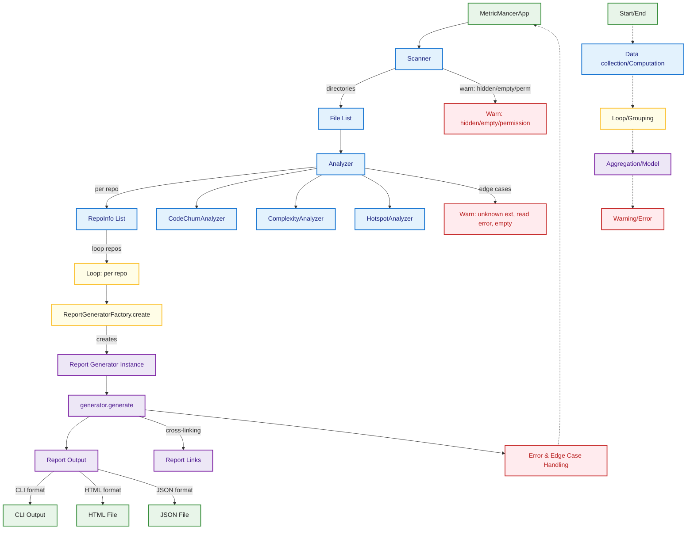

### 3.1.2 Application Flow

[ToC](#table-of-contents)

This diagram outlines the main application run flow in MetricMancer, from startup through scanning, analysis, and report
generation in various formats. The Factory Pattern is used to create the appropriate report generator based on the
configuration, eliminating conditional logic. It also highlights key edge cases and error handling at each stage, using
the standard color coding and legend.

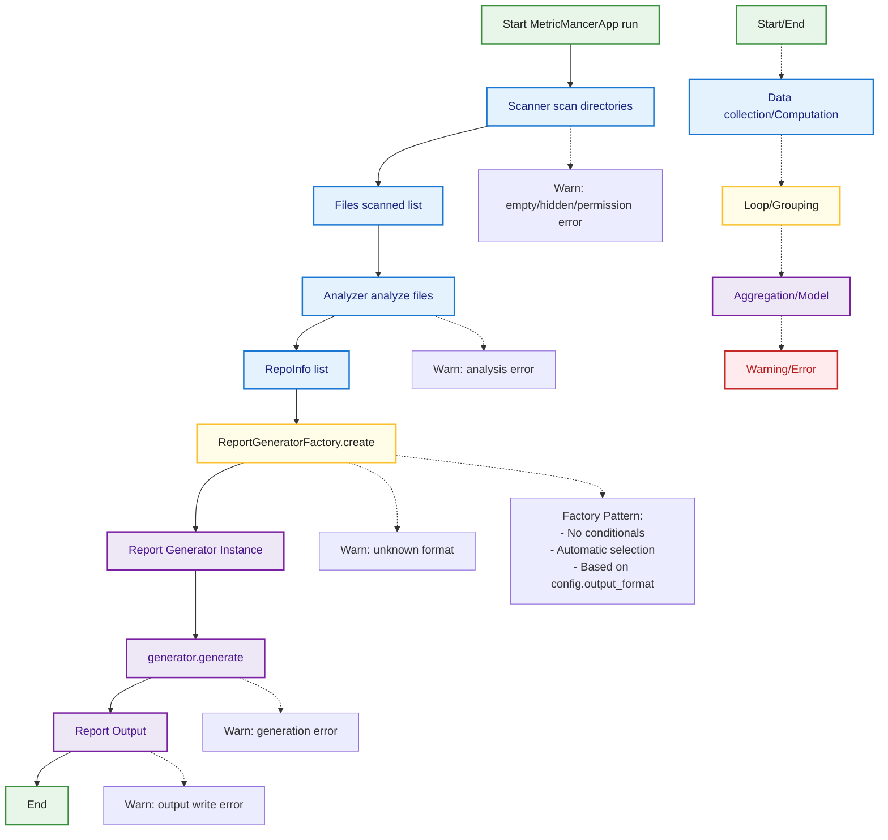

### 3.1.3 Analysis Flow

[ToC](#table-of-contents)

This diagram details the flow of the Analyzer component in MetricMancer. It shows how files are grouped, analyzed for
churn and complexity, and how results are aggregated per repository. Edge cases such as unknown extensions, read errors,
and empty files are visualized, with color coding matching the legend.

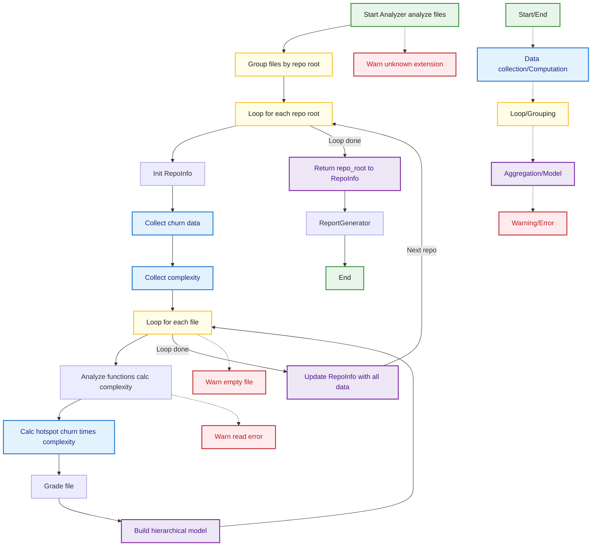

### 3.1.4 Scanner and Data Collection

[ToC](#table-of-contents)

This diagram describes the flow of the Scanner component in MetricMancer. It covers directory traversal, file filtering,
and error handling for hidden files, permissions, and invalid directories. The color coding and legend are consistent
with the rest of the documentation.

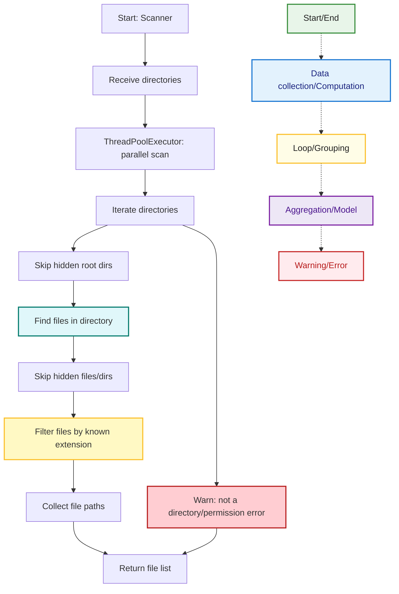

### 3.1.5 Report Generation

#### 3.1.5.1 Report Generation Overview

[ToC](#table-of-contents)

This diagram summarizes the flow of the ReportGenerator component, including format selection, report generation for
CLI, HTML, and JSON, and error handling for unknown formats. The color coding and legend are consistent with the rest of
the documentation.

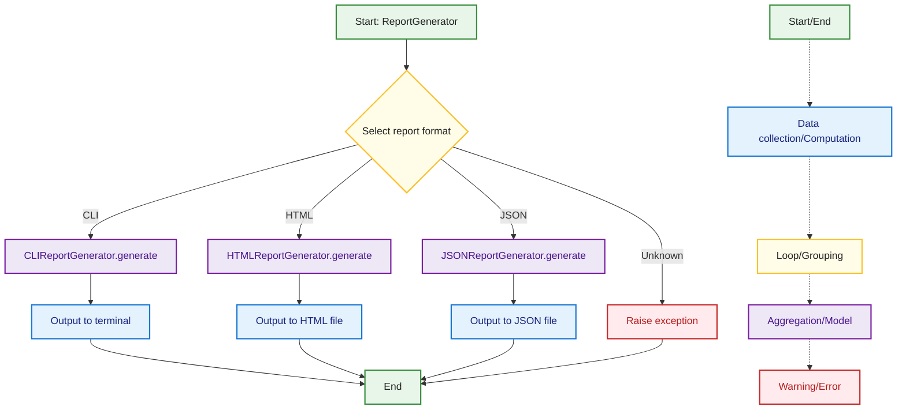

#### 3.1.5.2 HTML Report

[ToC](#table-of-contents)

This diagram shows the flow for generating an HTML report in MetricMancer. It covers initialization, rendering,
filtering, and writing the HTML file, as well as cross-linking and potential edge cases. The color coding and legend are
consistent with the rest of the documentation.

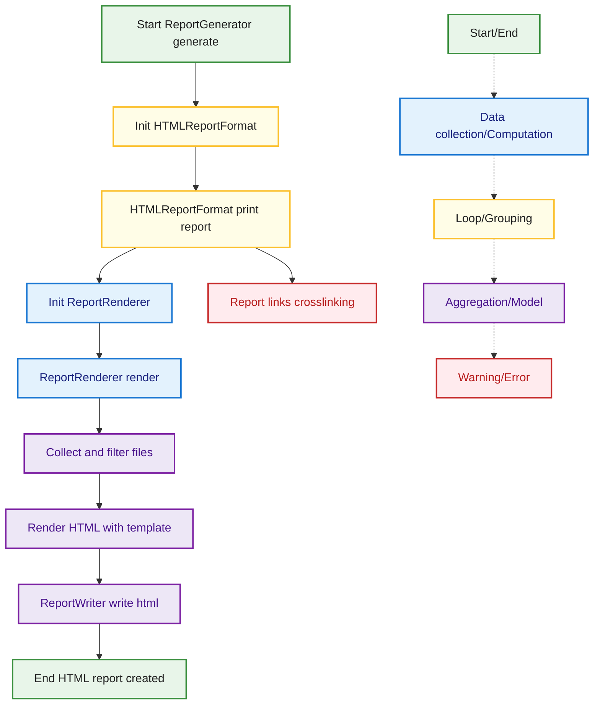

#### 3.1.5.3 CLI Report

[ToC](#table-of-contents)

This diagram illustrates the CLI report generation flow in MetricMancer, including analysis, format selection, and
output to terminal or CSV. It also shows error handling for unsupported formats and output errors, using the standard
color coding and legend.

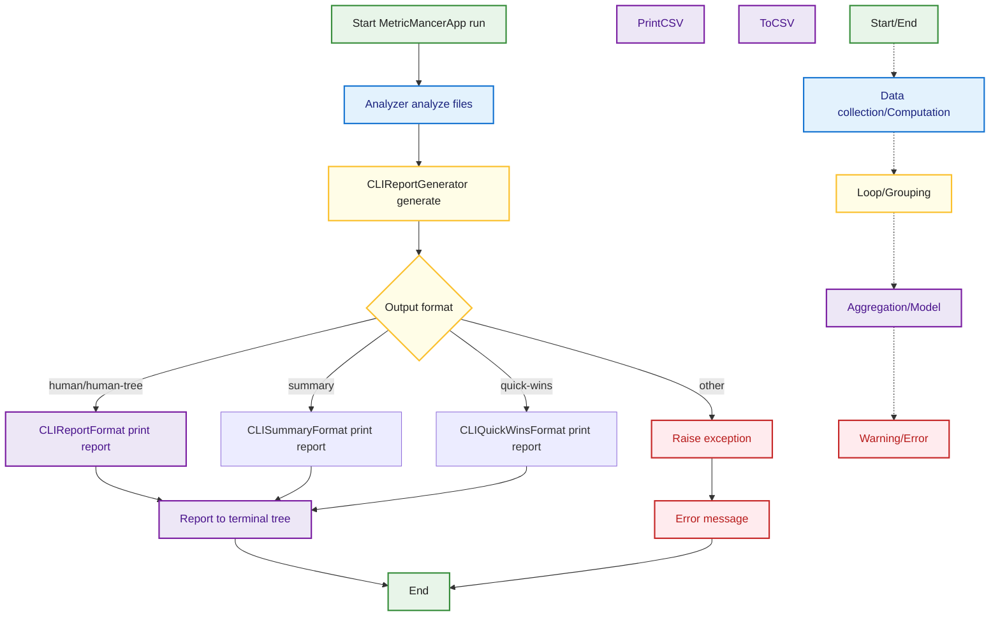

#### 3.1.5.4 JSON Report

[ToC](#table-of-contents)

This diagram shows the flow for generating a JSON report in MetricMancer, from data preparation and serialization to
file writing. Edge cases such as serialization and file write errors are visualized, with color coding and legend
matching the rest of the documentation.

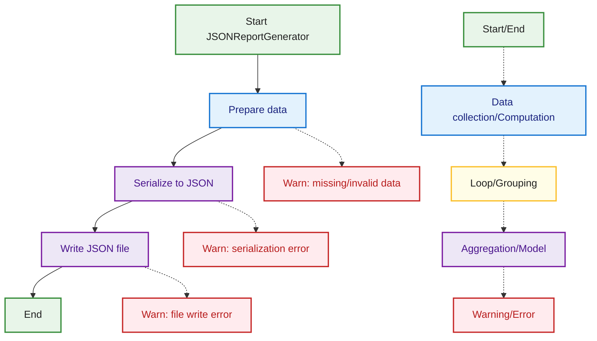

### 3.1.6 KPI Modules

[ToC](#table-of-contents)

This diagram illustrates the typical flow of a KPI module in MetricMancer, such as CodeChurnAnalyzer,
ComplexityAnalyzer, or HotspotAnalyzer. The process starts with receiving file or repository data, proceeds to KPI
calculation, and returns the result. Edge cases like missing input or calculation errors are visualized. The color
coding and legend match the conventions used throughout the documentation.

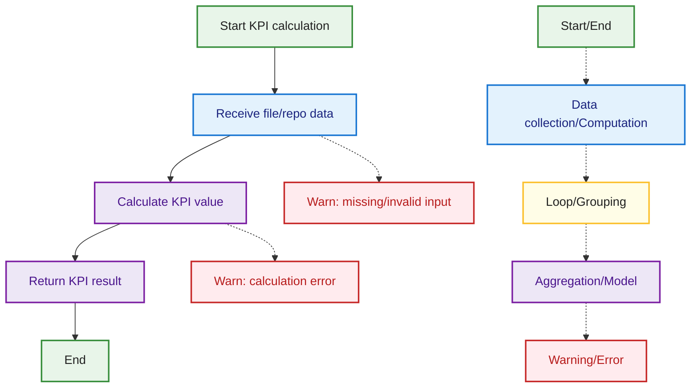

### 3.1.7 Configuration and CLI Flow

[ToC](#table-of-contents)

This diagram describes how MetricMancer handles configuration using the Configuration Object Pattern. The process starts
at application launch, parses CLI arguments, creates an AppConfig object with automatic validation, and continues to app
initialization. The configuration is centralized in a single dataclass, eliminating the need for config files and merge
logic. Edge cases such as invalid CLI arguments or validation errors are highlighted. The color coding and legend are
consistent with the rest of the documentation.

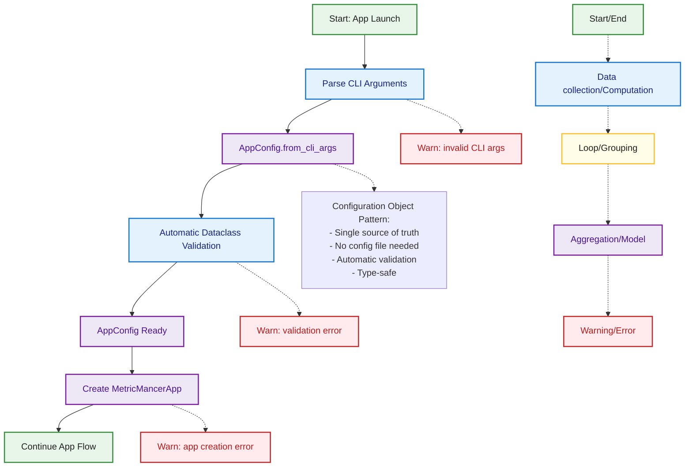

### 3.1.8 Error Handling

[ToC](#table-of-contents)

This diagram shows the system-level error handling flow in MetricMancer. The main operation is attempted, and on
success, the flow continues as normal. If an exception occurs, it is caught, logged, and a user-facing error or warning
is shown. Unhandled exceptions are also visualized as edge cases. The color coding and legend are consistent with the
rest of the documentation.

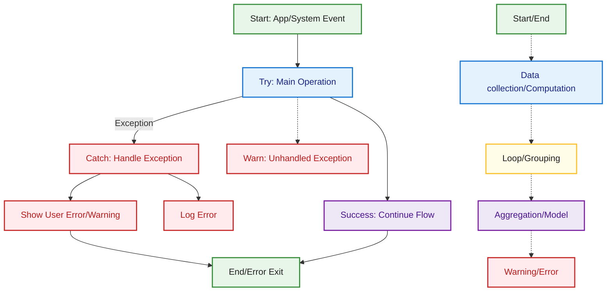

### 3.2 Data Model

[ToC](#table-of-contents)

The MetricMancer data model is designed to represent the hierarchical structure of a source code repository and to
aggregate KPI results at each level. The main classes are:

**BaseKPI** Represents a single key performance indicator (KPI) calculated for a function, file, directory, or
repository. All specific KPIs (e.g., Cyclomatic Complexity, Code Churn, Hotspot Score) inherit from this base class.

- Fields:
  - `name`: Name of the KPI (e.g., "Cyclomatic Complexity")
  - `description`: Short description of what the KPI measures
  - `value`: The calculated value for this KPI (type depends on the KPI)
- Functional requirements:
  - Store the KPI's name, description, and value
  - Provide a consistent interface for all KPIs, enabling aggregation and reporting
  - Allow extension for new KPIs by subclassing and implementing custom calculation logic

**Function** Represents a single function or method within a file.

- Fields:
  - `name`: Name of the function or method
  - `kpis`: Dictionary of KPIs for the function (`Dict[str, BaseKPI]`)
- Functional requirements:
  - Store the function's name
  - Store KPIs relevant to the function (e.g., complexity, churn)

**File** Represents a single file that has been analyzed.

- Fields:
  - `name`: Name of the file
  - `file_path`: Relative path from the parent directory
  - `kpis`: Dictionary of KPIs for the file (`Dict[str, BaseKPI]`)
  - `functions`: List of functions in the file (`List[Function]`)
- Functional requirements:
  - Store the file's name and relative path
  - Store KPIs relevant to the file (e.g., complexity, churn, LOC, hotspot score)
  - Store a list of analyzed functions with their KPIs
  - Be easy to serialize to JSON and integrate into report structures

**BaseDir** Base class for directory-like objects.

- Fields:
  - `dir_name`: Name of the directory
  - `scan_dir_path`: Relative path from the repository root

**ScanDir (inherits BaseDir)** Represents a scanned directory, which can contain files and subdirectories.

- Fields:
  - `files`: Dictionary of files in the directory (`Dict[str, File]`)
  - `scan_dirs`: Dictionary of subdirectories (`Dict[str, ScanDir]`)
  - `kpis`: Dictionary of KPIs aggregated at the directory level (`Dict[str, BaseKPI]`)
- Functional requirements:
  - Store the directory's name and relative path
  - Store a set of files as File objects, indexed by filename
  - Store subdirectories as ScanDir instances, indexed by directory name
  - Store KPIs at the directory level, e.g., average complexity or total churn
  - Support recursive traversal for reporting and visualization

**RepoInfo (inherits ScanDir)** Represents the top-level object for an analyzed repository, including its structure and
KPIs.

- Fields:
  - `repo_root_path`: Absolute path to the repository root
  - `repo_name`: Name of the repository
  - Inherits all fields and behaviors from ScanDir
- Functional requirements:
  - Inherit all fields and behaviors from ScanDir, including recursive directory structure, files, and KPIs
  - Store a unique name for the repository
  - Store the absolute path to the repository root
  - Serve as the top node in the data model and be serializable to JSON, HTML, and other report formats
  - Aggregate KPIs from underlying directories and files for repository-level summaries

#### 3.2.1 UML Diagram

[ToC](#table-of-contents)

The data model classes are visualized in the PlantUML diagram below. These classes represent the hierarchical structure
of analyzed repositories and remain unchanged by the Configuration Object Pattern refactoring.

For the complete PlantUML source and additional diagrams, see **[plantuml/README.md](plantuml/README.md)**.


**Note:** The data model (RepoInfo, ScanDir, File, Function, BaseKPI) is separate from the application configuration
model (AppConfig). See
**[plantuml/architecture_config_pattern_2025-10-14.puml](plantuml/architecture_config_pattern_2025-10-14.puml)** for the
configuration and architecture class diagram.

## 4. Detailed Requirements

### 4.1 User Stories

[ToC](#table-of-contents)

MetricMancer is intended for software development teams, technical leads, architects, and quality engineers who need
actionable insights into code quality and technical debt. Key stakeholders include:

- **Developers:** Use the tool to identify refactoring candidates and monitor code health.
- **Technical Leads/Architects:** Use reports to guide technical debt reduction and architectural improvements.
- **Quality Engineers:** Integrate metrics into CI/CD pipelines and dashboards for continuous monitoring.
- **Managers:** Track trends and risks to inform resource allocation and process improvements.

#### 4.1.1 Persona 1: Alice – The Senior Developer

[ToC](#table-of-contents)

**Background:** Alice is responsible for maintaining a large Python codebase. She is experienced in refactoring and
cares about code quality and technical debt.

**User Stories:**

- As a senior developer, I want to quickly identify files with high complexity and churn so that I can prioritize
  refactoring efforts.
- As a senior developer, I want to see hotspots and risk zones in the codebase so that I can plan technical debt
  reduction.
- As a senior developer, I want to generate HTML reports to share with my team during code review meetings.

#### 4.1.2 Persona 2: Bob – The DevOps Engineer

[ToC](#table-of-contents)

**Background:** Bob manages CI/CD pipelines and is responsible for integrating quality checks into the build process.

**User Stories:**

- As a DevOps engineer, I want to run MetricMancer as part of the CI pipeline so that code quality metrics are always up
  to date.
- As a DevOps engineer, I want to export JSON reports so that I can feed metrics into dashboards and monitoring tools.
- As a DevOps engineer, I want to receive alerts if code churn or complexity exceeds certain thresholds.

#### 4.1.3 Persona 3: Carol – The Engineering Manager

[ToC](#table-of-contents)

**Background:** Carol leads a distributed development team and is responsible for long-term code health and resource
allocation.

**User Stories:**

- As an engineering manager, I want to track code quality trends over time so that I can identify areas of improvement
  and measure the impact of technical debt reduction initiatives.
- As an engineering manager, I want to receive summary dashboards and risk reports so that I can prioritize refactoring
  and allocate resources effectively.
- As an engineering manager, I want to identify files or modules with low code ownership so that I can encourage
  knowledge sharing and reduce maintenance risk.
- As an engineering manager, I want to correlate code quality metrics with business outcomes (e.g., defect rates,
  release stability) so that I can justify investments in code quality to stakeholders.
- As an engineering manager, I want to use MetricMancer reports to support planning and decision-making in sprint and
  release meetings.

#### 4.1.4 Persona 4: Dave – The New Team Member

[ToC](#table-of-contents)

**Background:** Dave recently joined the team and is onboarding to a large, unfamiliar codebase.

**User Stories:**

- As a new team member, I want to use MetricMancer’s reports to find the most complex or risky parts of the code so I
  can focus my learning.
- As a new team member, I want to see which files are hotspots so I can ask for help or code review when working in
  those areas.

#### 4.1.5 Persona 5: Sam – The Software Quality Assurance Manager (SQAM)

[ToC](#table-of-contents)

**Background:** Sam oversees the quality assurance strategy for the organization. He is responsible for defining quality
standards, ensuring process compliance, and reporting on quality metrics to leadership. Sam coordinates with
engineering, QA, and management to drive continuous improvement and risk mitigation.

**User Stories:**

- As a SQAM, I want to use MetricMancer to track organization-wide code quality trends so that I can report on progress
  and justify quality initiatives to leadership.
- As a SQAM, I want to set and monitor quality gates (e.g., maximum allowed complexity or churn) so that teams are held
  accountable to quality standards.
- As a SQAM, I want to receive summary dashboards and risk reports from MetricMancer so that I can prioritize audits and
  allocate resources effectively.
- As a SQAM, I want to correlate MetricMancer metrics with business outcomes (e.g., defect rates, release stability) so
  that I can demonstrate the value of quality improvements.

#### 4.1.6 Persona 6: Erin – The Software Quality Assurance Engineer (SQAE)

[ToC](#table-of-contents)

**Background:** Erin is responsible for ensuring the overall quality of the software product. She focuses on process
compliance, risk identification, and continuous improvement. Erin collaborates with developers, managers, and DevOps to
integrate quality metrics and drive quality initiatives.

**User Stories:**

- As a SQAE, I want to integrate MetricMancer into the quality assurance process so that I can monitor code quality
  trends and enforce quality gates.
- As a SQAE, I want to receive automated reports highlighting files or modules with high risk (e.g., high churn,
  complexity, or defect density) so that I can proactively address quality issues.
- As a SQAE, I want to correlate code metrics with defect data from issue trackers so that I can identify root causes
  and recommend targeted improvements.
- As a SQAE, I want to export MetricMancer results to quality dashboards and share them with stakeholders for
  transparency and compliance.

#### 4.1.7 Persona 7: Mia – The Executive Manager

[ToC](#table-of-contents)

**Background:** Mia is a senior executive responsible for multiple development teams and overall software delivery. She
needs high-level insights to support strategic decisions and communicate with stakeholders.

**User Stories:**

- As an executive manager, I want to receive concise, high-level summaries of code quality and technical debt across all
  projects so that I can make informed decisions and report to upper management or the board.

### 4.2 Functional Requirements

#### 4.2.1 Core Functional Requirements

[ToC](#table-of-contents)

| Req-ID | Group                     | Name                               | Description                                                                                                                                                | Rationale (Why?)                                        | Implementation Status                     |
| ------ | ------------------------- | ---------------------------------- | ---------------------------------------------------------------------------------------------------------------------------------------------------------- | ------------------------------------------------------- | ----------------------------------------- |
| FR1    | Core Analysis             | Calculate cyclomatic complexity    | The tool shall calculate cyclomatic complexity for all functions/methods.                                                                                  | Identify complex code and refactoring needs             | Implemented                               |
| FR1.1  | Core Analysis             | Calculate cognitive complexity     | The tool shall calculate cognitive complexity for all functions/methods using SonarSource-compatible rules for 6 languages (Python, Java, Go, JavaScript, TypeScript, C). | Measure code understandability and maintainability      | Implemented v3.2.0                        |
| FR2    | Core Analysis             | Calculate churn                    | The tool shall calculate code churn as commits per time period (default: last 30 days) for all files, following "Your Code as a Crime Scene" methodology. | Find unstable/risky code patterns                       | Implemented                               |
| FR2.1  | Core Analysis             | Configurable churn time period     | The tool shall allow configuration of the time period for churn analysis (e.g., 30, 90, 180, or 365 days) via `--churn-period` CLI flag.                   | Adapt analysis to different project contexts            | Implemented                               |
| FR3    | Core Analysis             | Identify cyclomatic hotspots       | The tool shall identify hotspots (high churn × high cyclomatic complexity).                                                                                | Focus improvement on risk zones                         | Implemented                               |
| FR3.1  | Core Analysis             | Identify cognitive hotspots        | The tool shall identify cognitive hotspots (high churn × high cognitive complexity).                                                                       | Focus improvement on hard-to-understand code            | Implemented v3.2.0                        |
| FR4    | Core Analysis             | Calculate code ownership           | The tool shall calculate code ownership per file.                                                                                                          | Identify knowledge silos and risk                       | Implemented                               |
| FR5    | Core Analysis             | Calculate shared ownership         | The tool shall calculate shared ownership per file and function, and aggregate shared ownership up through directory/package to repository level.          | Identify collaboration, knowledge spread, and risk      | Implemented                               |
| FR6    | Core Analysis             | Calculate logical coupling         | The tool shall calculate logical coupling between files.                                                                                                   | Find hidden dependencies                                | Planned                                   |
| FR7    | Core Analysis             | Calculate temporal coupling        | The tool shall calculate temporal coupling between files.                                                                                                  | Find hidden dependencies                                | Planned                                   |
| FR8    | Core Analysis             | Quality trends                     | The tool shall track and visualize code quality over time.                                                                                                 | Follow up on improvement work                           | Planned                                   |
| FR9    | Reporting & Visualization | Generate reports                   | The tool shall generate CLI, HTML, and JSON reports.                                                                                                       | Different audiences and integrations                    | Implemented                               |
| FR9.1  | Reporting & Visualization | Multi-format single run            | The tool shall generate multiple report formats in a single analysis run using `--output-formats`.                                                         | Eliminate redundant scanning, improve efficiency 50-70% | Implemented v3.1.0                        |
| FR10   | Reporting & Visualization | Visualize KPIs                     | The tool shall visualize KPIs in HTML reports.                                                                                                             | Facilitate interpretation and communication             | Implemented                               |
| FR11   | Reporting & Visualization | Dashboards for management          | The tool shall provide summary dashboards/reports for management.                                                                                          | Facilitate management decisions                         | Planned                                   |
| FR12   | Reporting & Visualization | Export/integration with dashboards | The tool shall support export/integration with external dashboards.                                                                                        | Enable further analysis                                 | Planned                                   |
| FR13   | Integration & Automation  | CI/CD support                      | The tool shall be able to run automatically in CI/CD pipelines.                                                                                            | Enable continuous quality assurance                     | Implemented                               |
| FR14   | Integration & Automation  | Issue tracker integration          | The tool shall support integration with issue trackers.                                                                                                    | Link code quality to defects                            | Planned                                   |
| FR15   | Integration & Automation  | Alert on thresholds                | The tool shall alert if churn/complexity exceeds thresholds.                                                                                               | Early warning of risks                                  | Planned                                   |
| FR16   | Integration & Automation  | Quality gates                      | The tool shall support quality gates (e.g., max churn/complexity).                                                                                         | Ensure code standards                                   | Planned                                   |
| FR17   | Usability & Extensibility | Multi-language support             | The tool shall support analysis of multiple languages in one run.                                                                                          | Enable analysis of polyglot codebases                   | Implemented                               |
| FR18   | Usability & Extensibility | Onboarding support                 | The tool shall help new developers find complex/risky code.                                                                                                | Faster onboarding                                       | Planned                                   |
| FR19   | Usability & Extensibility | Recommend knowledge sharing        | The tool shall suggest knowledge sharing for low-ownership files.                                                                                          | Spread knowledge in the team                            | Planned                                   |

#### 4.2.2 Core Non-Functional Requirements

[ToC](#table-of-contents)

| Req-ID | Group                     | Name                     | Description                                                                                                | Rationale                                                    | Implementation Status                                                   |
| ------ | ------------------------- | ------------------------ | ---------------------------------------------------------------------------------------------------------- | ------------------------------------------------------------ | ----------------------------------------------------------------------- |
| NFR1   | Usability & Extensibility | Performance              | Analysis of a medium-sized codebase (\<10k files) shall take \<5 min.                                      | Enable use in CI and daily operation                         | Implemented                                                             |
| NFR2   | Usability & Extensibility | Extensibility            | It shall be easy to add new KPIs and languages.                                                            | Future-proof and adapt the tool                              | Implemented - Enhanced via Factory Pattern                              |
| NFR3   | Usability & Extensibility | Platforms                | The tool shall work on Windows, macOS, and Linux.                                                          | Support all common development environments                  | Implemented                                                             |
| NFR4   | Usability & Extensibility | Error handling           | The tool shall provide clear error messages for invalid input.                                             | Facilitate troubleshooting and usability                     | Implemented - Enhanced via Configuration Object Pattern                 |
| NFR5   | Maintainability           | Architecture quality     | The codebase shall follow SOLID principles and design patterns to minimize coupling and maximize cohesion. | Reduce technical debt and maintenance costs                  | Implemented - Configuration Object, Factory, Strategy, Builder patterns |
| NFR6   | Maintainability           | Configuration management | Configuration shall be centralized, type-safe, and validated automatically.                                | Reduce configuration errors and improve developer experience | Implemented - AppConfig with dataclass validation                       |
| NFR7   | Maintainability           | Code complexity          | Main application entry point shall maintain low cyclomatic complexity (\<10).                              | Enable easy understanding and modification                   | Implemented - main.py complexity reduced by 17%                         |
| NFR8   | Testability               | Test coverage            | Core functionality shall have >80% test coverage.                                                          | Ensure reliability and catch regressions                     | Implemented - 1004 tests with high coverage                             |

### 4.3 Mapping: Requirements to User Stories

| Requirement(s)                  | User Story / Persona Description                                                                             |
| ------------------------------- | ------------------------------------------------------------------------------------------------------------ |
| FR1, FR2, FR3, FR10, FR15, FR18 | [Alice](#411-persona-1-alice--the-senior-developer): Identify complex/risky code, see hotspots, onboarding   |
| FR6, FR11, FR13, FR19, FR21     | [Bob](#412-persona-2-bob--the-devops-engineer): Export reports, dashboards, integration                      |
| FR7, FR15, FR20                 | [Carol](#413-persona-3-carol--the-engineering-manager): Link code quality to defects, trends, business goals |
| FR4, NFR3                       | [Dave](#414-persona-4-dave--the-new-team-member): Multi-language analysis, platform support                  |
| FR12, NFR1                      | [Sam](#415-persona-5-sam--the-software-quality-assurance-manager-sqam): CI/CD, performance                   |
| FR14, FR19                      | [Sam](#415-persona-5-sam--the-software-quality-assurance-manager-sqam): Alerts, quality gates                |
| FR9, FR10                       | [Erin](#416-persona-6-erin--the-software-quality-assurance-engineer-sqae): Couplings, QA process             |
| NFR4                            | All: Error handling                                                                                          |

### 4.4 Mapping: Requirements to test cases

| Requirement | Test Case(s)                                                                                                                                                                                                                                                                                                                                                                                                                                                                                                                                                                                                                                                                                                                                | Status                                                |
| ----------- | ------------------------------------------------------------------------------------------------------------------------------------------------------------------------------------------------------------------------------------------------------------------------------------------------------------------------------------------------------------------------------------------------------------------------------------------------------------------------------------------------------------------------------------------------------------------------------------------------------------------------------------------------------------------------------------------------------------------------------------------- | ----------------------------------------------------- |
| FR1         | tests/app/test_complexity_analyzer.py:test_calculate_for_file_success, test_analyze_functions_success, test_calculate_for_file_import_error, test_calculate_for_file_no_parser, test_analyze_functions_attribute_error, test_analyze_functions_no_parser, tests/app/test_complexity_analyzer_edge.py:test_calculate_for_file_empty_config, test_calculate_for_file_import_error, test_calculate_for_file_missing_methods, test_analyze_functions_empty_config, test_analyze_functions_attribute_error, test_analyze_functions_missing_method                                                                                                                                                                                                | Implemented                                            |
| FR1.1       | tests/kpis/test_cognitive_complexity.py, tests/kpis/test_cognitive_complexity_java.py, tests/kpis/test_cognitive_complexity_go.py, tests/kpis/test_cognitive_complexity_javascript.py, tests/kpis/test_cognitive_complexity_typescript.py, tests/kpis/test_cognitive_complexity_c.py, tests/kpis/test_cognitive_complexity_factory.py, tests/kpis/test_cognitive_complexity_base.py, tests/kpis/test_cognitive_complexity_kpi_integration.py (135+ cognitive complexity tests across 6 languages)                                                                                                                                                                                                                                            | Implemented v3.2.0                                     |
| FR2         | tests/app/test_churn_kpi_path_mismatch.py:test_churn_lookup_with_absolute_path, test_churn_lookup_with_relative_path_should_match_absolute, tests/utilities/test_git_cache.py:test_calculate_churn_with_commits, test_calculate_churn_no_commits, test_calculate_churn_git_error, test_calculate_churn_custom_period, tests/test_main.py:test_main_with_churn_period_flag, test_main_with_default_churn_period                                                                                                                                                                                                                                                                                                                               | Implemented - Time-based via git log --since           |
| FR2.1       | tests/utilities/test_git_cache.py:test_calculate_churn_custom_period, tests/test_main.py:test_main_with_churn_period_flag, tests/config/test_defaults.py:test_churn_period_is_positive                                                                                                                                                                                                                                                                                                                                                                                                                                                                                                                                                      | Implemented - --churn-period CLI flag                  |
| FR3         | tests/kpis/test_kpi_classes.py:test_hotspot_kpi, tests/app/test_hotspot_kpi_edge.py:TestHotspotKPIEdgeCases, tests/app/test_analyzer.py:test_hotspot_kpi_includes_calculation_values, test_zero_functions_results_in_zero_complexity_and_hotspot                                                                                                                                                                                                                                                                                                                                                                                                                                                                                            | Implemented                                            |
| FR3.1       | tests/kpis/test_cognitive_complexity_kpi_integration.py (cognitive hotspot tests integrated with cognitive complexity KPI tests)                                                                                                                                                                                                                                                                                                                                                                                                                                                                                                                                                                                                            | Implemented v3.2.0                                     |
| FR4         | tests/kpis/test_code_ownership.py:test_calculate_ownership_basic, test_calculate_ownership_error, tests/kpis/test_code_ownership_kpi.py:test_file_does_not_exist, test_file_not_tracked_by_git, test_file_tracked_and_blame_works, test_blame_fails                                                                                                                                                                                                                                                                                                                                                                                                                                                                                         | Implemented                                            |
| FR5         | tests/kpis/test_Shared_Ownership_KPI.py:test_shared_ownership_basic, test_shared_ownership_all_above_threshold, test_shared_ownership_all_below_threshold, test_shared_ownership_na, test_shared_ownership_with_precomputed_data, tests/kpis/test_shared_ownership_aggregator.py:test_aggregator_basic_statistics, test_aggregator_distribution, test_aggregator_empty_files, test_aggregator_handles_errors, test_aggregator_initialization, test_aggregator_invalid_kpi_value, test_aggregator_missing_shared_ownership_kpi, test_aggregator_most_shared_file, test_aggregator_percentages, test_aggregator_realistic_scenario, test_convenience_functions, test_shared_ownership_stats_dataclass, test_shared_ownership_stats_properties | Implemented                                            |
| FR6         | Not yet implemented                                                                                                                                                                                                                                                                                                                                                                                                                                                                                                                                                                                                                                                                                                                         | Planned                                                |
| FR7         | Not yet implemented                                                                                                                                                                                                                                                                                                                                                                                                                                                                                                                                                                                                                                                                                                                         | Planned                                                |
| FR8         | Not yet implemented                                                                                                                                                                                                                                                                                                                                                                                                                                                                                                                                                                                                                                                                                                                         | Planned                                                |
| FR9         | tests/report/test_cli_report_generator.py:test_generate_human_calls_cli_report_format, test_generate_machine_calls_cli_csv_report_format, test_generate_unsupported_format_raises, test_init_sets_attributes, tests/report/test_report_writer.py:test_write_html_creates_file_and_writes_content                                                                                                                                                                                                                                                                                                                                                                                                                                            | Implemented                                            |
| FR10        | tests/report/test_report_generator.py:test_html_report_generation, tests/report/test_html_report_generator.py (HTML visualization tests)                                                                                                                                                                                                                                                                                                                                                                                                                                                                                                                                                                                                    | Implemented                                            |
| FR11        | Not yet implemented                                                                                                                                                                                                                                                                                                                                                                                                                                                                                                                                                                                                                                                                                                                         | Planned                                                |
| FR12        | Not yet implemented                                                                                                                                                                                                                                                                                                                                                                                                                                                                                                                                                                                                                                                                                                                         | Planned                                                |
| FR13        | tests/app/test_metric_mancer_app.py:test_init_sets_attributes, test_run_multiple_repos, test_run_single_repo, tests/app/test_metric_mancer_app_edge.py:test_run_with_empty_directories, test_run_with_none_report_generator_cls, test_run_with_report_generate_exception                                                                                                                                                                                                                                                                                                                                                                                                                                                                    | Implemented                                            |
| FR14        |                                                                                                                                                                                                                                                                                                                                                                                                                                                                                                                                                                                                                                                                                                                                             | Planned                                                |
| FR15        |                                                                                                                                                                                                                                                                                                                                                                                                                                                                                                                                                                                                                                                                                                                                             | Planned                                                |
| FR16        |                                                                                                                                                                                                                                                                                                                                                                                                                                                                                                                                                                                                                                                                                                                                             | Planned                                                |
| FR17        | tests/app/test_scanner.py:test_scan_finds_supported_files, test_scan_multiple_directories, tests/app/test_analyzer.py:test_analyze_structure_and_kpis (multi-language support)                                                                                                                                                                                                                                                                                                                                                                                                                                                                                                                                                              | Implemented                                            |
| FR18        | Not yet implemented                                                                                                                                                                                                                                                                                                                                                                                                                                                                                                                                                                                                                                                                                                                         | Planned                                                |
| FR19        | tests/app/test_analyzer_shared_ownership.py:test_analyzer_includes_shared_ownership_kpi, test_shared_ownership_exception_handling                                                                                                                                                                                                                                                                                                                                                                                                                                                                                                                                                                                                           | Implemented                                            |
| NFR2        | tests/report/test_report_generator_factory.py:test_create_html_generator, test_create_cli_generator, test_create_json_generator, test_create_unknown_format_raises                                                                                                                                                                                                                                                                                                                                                                                                                                                                                                                                                                          | Implemented - Factory Pattern                          |
| NFR4        | tests/test_main.py:test_main_handles_parse_args_exception, test_main_handles_app_creation_exception                                                                                                                                                                                                                                                                                                                                                                                                                                                                                                                                                                                                                                         | Implemented - Enhanced                                |
| NFR5        | tests/config/test_app_config.py:test_from_cli_args_required_fields, test_from_cli_args_all_fields, test_from_cli_args_with_defaults                                                                                                                                                                                                                                                                                                                                                                                                                                                                                                                                                                                                         | Implemented - Configuration Object Pattern            |
| NFR6        | tests/config/test_app_config.py:test_from_cli_args_validates_types, test_config_dataclass_validation                                                                                                                                                                                                                                                                                                                                                                                                                                                                                                                                                                                                                                        | Implemented - Type safety and validation              |
| NFR7        | Verified through static analysis - main.py complexity reduced from 12 to 10                                                                                                                                                                                                                                                                                                                                                                                                                                                                                                                                                                                                                                                                 | Implemented - 17% reduction                           |
| NFR8        | Full test suite: 1004 tests across all modules with >80% coverage                                                                                                                                                                                                                                                                                                                                                                                                                                                                                                                                                                                                                                                                           | Implemented - Comprehensive coverage                  |

## Implementation Summary

Based on the current state of the codebase, the following core KPI measurements have been successfully implemented:

### ✅ Implemented KPIs

- **Cyclomatic Complexity Analysis (FR1)**: Full cyclomatic complexity calculation for Python, Java, and other supported languages
- **Cognitive Complexity Analysis (FR1.1)**: SonarSource-compatible cognitive complexity for 6 languages (Python, Java, Go, JavaScript, TypeScript, C) using tree-sitter parsers
- **Code Churn Analysis (FR2)**: Time-based churn calculation using `git log --since` with configurable period (default 30 days)
- **Configurable Churn Period (FR2.1)**: `--churn-period` CLI flag supports 30, 90, 180, 365 days
- **Cyclomatic Hotspot Detection (FR3)**: Composite metric combining cyclomatic complexity and churn
- **Cognitive Hotspot Detection (FR3.1)**: Composite metric combining cognitive complexity and churn
- **Code Ownership (FR4)**: Git blame-based ownership calculation per file
- **Shared Code Ownership (FR5)**: Advanced ownership metrics with aggregation capabilities

### ✅ Implemented Reporting & Infrastructure

- **Multi-format Reports (FR9)**: CLI, HTML, and JSON output formats
- **Multi-format Single Run (FR9.1)**: Generate multiple formats in one analysis run via
  `--output-formats html,json,summary` - eliminates redundant scanning, 50-70% performance improvement for multiple
  formats
- **HTML Visualizations (FR10)**: Interactive charts and graphs for KPI data
- **CI/CD Integration (FR13)**: Command-line interface suitable for automation
- **Multi-language Support (FR17)**: Extensible parser architecture

### ✅ Implemented Architecture & Quality (Recent Enhancements)

- **Configuration Object Pattern (NFR6)**: Centralized, type-safe configuration via AppConfig dataclass
- **Factory Pattern (NFR2)**: ReportGeneratorFactory eliminates conditional logic, improves extensibility
- **Strategy Pattern (NFR2)**: ReportInterface enables polymorphic report generation
- **Dependency Injection (NFR5)**: MetricMancerApp receives configuration, reduces coupling
- **SOLID Principles (NFR5)**: Single Responsibility, Open/Closed, Liskov Substitution, Interface Segregation,
  Dependency Inversion
- **Main.py Simplification (NFR7)**: 17% complexity reduction, 60-80% churn reduction
- **Comprehensive Test Suite (NFR8)**: 1004 tests with high coverage (>80%)
- **Enhanced Error Handling (NFR4)**: Automatic validation, type safety, clear error messages

For detailed architecture documentation, see **[ARCHITECTURE.md](ARCHITECTURE.md)**. For migration guidance, see
**[MIGRATION_GUIDE.md](MIGRATION_GUIDE.md)**.

### 🔄 Planned/Future KPIs

- **Logical Coupling (FR6)**: Files that change together analysis
- **Temporal Coupling (FR7)**: Time-based change correlation analysis
- **Quality Trends (FR8)**: Historical KPI tracking and visualization
- **Management Dashboards (FR11)**: Executive summary reports
- **External Integrations (FR12)**: Dashboard export capabilities
- **Issue Tracker Integration (FR14)**: Link code quality to defects
- **Threshold Alerts (FR15)**: Early warning system
- **Quality Gates (FR16)**: Automated quality enforcement

## 5. Analysis Framework: Interpreting Metrics for Actionable Insights

[ToC](#table-of-contents)

This chapter describes how to interpret and act upon the implemented metrics based on the methodology from "Your Code as
a Crime Scene" by Adam Tornhill. The goal is to transform raw metrics into actionable insights that drive code quality
improvements and risk mitigation.

### 5.0 Metric Thresholds and Classifications

[ToC](#table-of-contents)

**Understanding what constitutes "high" vs "low" values** is crucial for effective interpretation. These thresholds are
based on research from "Your Code as a Crime Scene", industry studies, and empirical observations from large codebases.

#### 5.0.1 Cyclomatic Complexity Thresholds

| Complexity Range | Classification | Risk Level  | Recommended Action                  |
| ---------------- | -------------- | ----------- | ----------------------------------- |
| **1-5**          | Low            | ✅ Low      | Maintain current state              |
| **6-10**         | Moderate       | ⚠️ Medium   | Monitor and consider simplification |
| **11-15**        | High           | 🔶 High     | Prioritize for refactoring          |
| **16+**          | Very High      | 🔴 Critical | Immediate attention required        |

**Rationale (McCabe's Original Research)**:

- **1-5**: Simple procedures, low risk
- **6-10**: Well-structured and stable code
- **11-15**: More complex, moderate risk
- **16+**: Untestable code, high risk of defects

**Language-Specific Considerations**:

- **Java/C#**: Standard thresholds apply
- **Python**: Consider +2 due to language expressiveness
- **JavaScript**: Consider +3 due to callback patterns
- **Functional languages**: May require adjusted thresholds

#### 5.0.1.1 Cognitive Complexity Thresholds

Cognitive complexity measures how difficult code is to **understand**, rather than how many paths exist. Based on
SonarSource research and industry practice:

| Complexity Range | Classification | Risk Level  | Recommended Action                  |
| ---------------- | -------------- | ----------- | ----------------------------------- |
| **0-5**          | Low            | ✅ Low      | Easy to understand                  |
| **6-10**         | Moderate       | ⚠️ Medium   | Consider simplification             |
| **11-15**        | High           | 🔶 High     | Refactor for readability            |
| **16+**          | Very High      | 🔴 Critical | Significant comprehension barrier   |

**Key Differences from Cyclomatic Complexity**:

- Penalizes **nesting** (each level adds to cognitive load)
- Penalizes **breaks in linear flow** (else, catch, continue, goto)
- Does **not** count every decision point equally
- Better correlates with code review time and bug introduction

**✅ IMPLEMENTED (v3.2.0)**: Cognitive complexity is calculated for Python, Java, Go, JavaScript, TypeScript, and C
using tree-sitter parsers with SonarSource-compatible rules.

#### 5.0.2 Code Churn Thresholds

**Definition (per "Your Code as a Crime Scene")**: Code churn measures how frequently a piece of code changes **over a
specific time period**, typically measured as commits per month.

| Churn Range (commits/month) | Classification | Risk Level  | Recommended Action         |
| --------------------------- | -------------- | ----------- | -------------------------- |
| **0-2**                     | Stable         | ✅ Low      | Document and preserve      |
| **3-5**                     | Active         | ⚠️ Medium   | Normal development pattern |
| **6-10**                    | High Activity  | 🔶 High     | Monitor for instability    |
| **11+**                     | Very High      | 🔴 Critical | Investigate root causes    |

**✅ IMPLEMENTED (v3.3.0)**: MetricMancer uses **time-based churn** via `git log --since "{X} days ago"` with a
configurable period (default 30 days). Use `--churn-period` CLI flag to adjust (30, 90, 180, 365 days supported).

**Time Period Considerations**:

- **Monthly**: Standard measurement period
- **Weekly**: Multiply thresholds by 0.25
- **Quarterly**: Multiply thresholds by 3
- **Per release**: Adjust based on release frequency

**Context Factors**:

- **New features**: Higher churn expected initially
- **Bug fixes**: May indicate underlying design issues
- **Refactoring**: Temporary spike, should stabilize
- **Maintenance**: Should show declining churn over time

#### 5.0.3 Hotspot Score Calculation

MetricMancer calculates two types of hotspot scores:

**Cyclomatic Hotspot Formula**: `Cyclomatic Hotspot Score = Cyclomatic Complexity × Churn`

**Cognitive Hotspot Formula**: `Cognitive Hotspot Score = Cognitive Complexity × Churn`

| Hotspot Score | Classification | Priority Level         |
| ------------- | -------------- | ---------------------- |
| **0-25**      | Low Risk       | Monitor                |
| **26-75**     | Medium Risk    | Plan improvements      |
| **76-150**    | High Risk      | Prioritize refactoring |
| **151+**      | Critical Risk  | Immediate action       |

**Example Scenarios (Cyclomatic Hotspot)**:

- File with complexity 15 and churn 8 = Score 120 (High Risk)
- File with complexity 25 and churn 12 = Score 300 (Critical Risk)
- File with complexity 8 and churn 3 = Score 24 (Low Risk)

**When to Use Which Hotspot**:

- **Cyclomatic Hotspot**: Focus on testability and path coverage risk
- **Cognitive Hotspot**: Focus on comprehension difficulty and review effort

**✅ IMPLEMENTED (v3.2.0)**: Both cyclomatic and cognitive hotspots are calculated and displayed in all report formats.

#### 5.0.4 Ownership Thresholds

| Ownership Pattern        | Primary Owner % | Shared Ownership % | Risk Assessment                          |
| ------------------------ | --------------- | ------------------ | ---------------------------------------- |
| **Strong Ownership**     | >70%            | \<30%              | Low knowledge risk, high bus factor risk |
| **Balanced Ownership**   | 40-70%          | 30-60%             | Optimal collaboration pattern            |
| **Shared Ownership**     | \<40%           | >60%               | High coordination overhead               |
| **Fragmented Ownership** | \<30%           | >70%               | High maintenance risk                    |

**Ownership Calculation Notes**:

- Based on lines of code contribution over analysis period
- Exclude automated commits (formatting, dependency updates)
- Weight recent contributions higher than historical ones
- Consider file age when evaluating ownership patterns

#### 5.0.5 Contextual Adjustments

**Project-Specific Factors**:

- **Team size**: Larger teams may have higher shared ownership thresholds
- **Domain complexity**: Financial/medical software may warrant lower complexity thresholds
- **Development phase**: Startup vs. maintenance phase affects acceptable churn levels
- **Release frequency**: Continuous deployment vs. quarterly releases affects patterns

**Industry Benchmarks** (from Tornhill's research):

- **Financial services**: Conservative thresholds (complexity \<10, churn \<5)
- **Web applications**: Standard thresholds
- **Game development**: Higher complexity tolerance (complexity \<20)
- **Embedded systems**: Very conservative (complexity \<8, churn \<3)

### 5.1 Hotspot Analysis: Prioritizing Improvement Efforts

**Principle**: High complexity + High churn = High risk

**What the metrics tell us:**

- **Cyclomatic Complexity** reveals testability risk and number of independent paths
- **Cognitive Complexity** reveals comprehension difficulty and maintenance burden
- **Churn** indicates frequency of change and instability
- **Hotspot Scores** (complexity × churn) identify the most dangerous areas

**Actionable recommendations:**

| Hotspot Category       | Complexity    | Churn      | Action Priority | Recommended Actions                                                                                                                             |
| ---------------------- | ------------- | ---------- | --------------- | ----------------------------------------------------------------------------------------------------------------------------------------------- |
| **Critical Hotspots**  | High (>15)    | High (>10) | **Immediate**   | • Refactor into smaller functions<br>• Add comprehensive unit tests<br>• Consider architectural redesign<br>• Assign senior developer ownership |
| **Emerging Hotspots**  | Medium (5-15) | High (>10) | **High**        | • Monitor closely<br>• Preventive refactoring<br>• Strengthen testing<br>• Code reviews by experienced team members                             |
| **Stable Complexity**  | High (>15)    | Low (\<5)  | **Low**         | • Document thoroughly<br>• Add integration tests<br>• Consider if refactoring adds value                                                        |
| **Active Simple Code** | Low (\<5)     | High (>10) | **Monitor**     | • Good pattern - simple code being actively developed<br>• Ensure it stays simple                                                               |

**Tip**: Use **cognitive hotspots** when prioritizing for readability improvements, and **cyclomatic hotspots** when
prioritizing for test coverage improvements.

### 5.2 Ownership Analysis: Knowledge Management and Risk Assessment

**Principle**: Knowledge distribution affects maintainability and bus factor

**What the metrics tell us:**

- **Code Ownership** reveals concentration of knowledge
- **Shared Ownership** indicates collaboration patterns and knowledge spread
- Combined with complexity, it shows knowledge risk

**Actionable recommendations:**

| Ownership Pattern                           | Risk Level   | Recommended Actions                                                                                                 |
| ------------------------------------------- | ------------ | ------------------------------------------------------------------------------------------------------------------- |
| **Single Owner + High Complexity**          | **Critical** | • Knowledge transfer sessions<br>• Pair programming<br>• Documentation requirements<br>• Cross-training initiatives |
| **Low Shared Ownership + High Churn**       | **High**     | • Enforce code review requirements<br>• Establish coding standards<br>• Regular architecture discussions            |
| **High Shared Ownership + High Complexity** | **Medium**   | • Simplification efforts<br>• Clear module boundaries<br>• API documentation                                        |
| **Balanced Ownership + Low Complexity**     | **Low**      | • Maintain current practices<br>• Good collaboration model                                                          |

### 5.3 Testing and Quality Assurance Strategy

**Based on risk profiles from combined metrics:**

#### 5.3.1 Test Prioritization Matrix

| Code Category                               | Testing Strategy                                                                                                  |
| ------------------------------------------- | ----------------------------------------------------------------------------------------------------------------- |
| **Hotspots (High Complexity + High Churn)** | • Minimum 90% test coverage<br>• Property-based testing<br>• Mutation testing<br>• Performance benchmarks         |
| **High Shared Ownership Areas**             | • Strong contract testing<br>• Integration test suites<br>• End-to-end validation<br>• Regression test automation |
| **Single Owner + High Complexity**          | • Comprehensive documentation tests<br>• Knowledge verification tests<br>• API contract validation                |
| **Stable Low-Risk Code**                    | • Basic smoke tests<br>• Regression protection only                                                               |

#### 5.3.2 Code Review Strategy

**Metric-Driven Review Process**: Use KPI data to adapt review intensity and focus areas.

| Risk Profile                     | Review Requirements                                                                                      |
| -------------------------------- | -------------------------------------------------------------------------------------------------------- |
| **Critical Hotspots**            | • Mandatory 2+ reviewer approval<br>• Architecture review for changes<br>• Performance impact assessment |
| **High Ownership Concentration** | • Domain expert + fresh eyes review<br>• Knowledge transfer documentation<br>• Pair programming sessions |
| **High Churn Areas**             | • Design review before implementation<br>• Pattern consistency checks<br>• Technical debt assessment     |

##### 5.3.2.1 Pre-Review KPI Assessment

Before conducting code reviews, reviewers should examine:

**Complexity Context**:

- Historical complexity trends for modified files
- Function-level complexity of changed methods
- Complexity delta (is the change increasing or decreasing complexity?)

**Churn Context**:

- Recent change frequency in affected files
- Author patterns (new contributor vs. regular maintainer)
- Change size relative to file size

**Ownership Context**:

- Current ownership distribution
- Reviewer's familiarity with the code area
- Knowledge transfer opportunities

##### 5.3.2.2 Review Focus Areas by KPI Profile

**For High Complexity Files (>15 McCabe)**:

```
Review Checklist:
□ Is the change adding unnecessary complexity?
□ Can complex logic be extracted into smaller functions?
□ Are edge cases properly handled?
□ Is error handling comprehensive?
□ Would this benefit from simplification?
□ Are there clear unit tests for complex paths?
```

**For High Churn Files (>10 commits/month)**:

```
Review Checklist:
□ Does this change follow established patterns in the file?
□ Is this change addressing root cause or symptoms?
□ Could this change reduce future churn?
□ Are we introducing technical debt?
□ Is the change scope appropriate?
□ Do we need architectural discussion before proceeding?
```

**For Low Ownership Files (\<30% single owner)**:

```
Review Checklist:
□ Is the change consistent with existing code style?
□ Does this require documentation updates?
□ Should we involve the original author?
□ Are we following established conventions?
□ Is knowledge transfer happening during this review?
□ Could this be an opportunity to establish clearer ownership?
```

**For High Shared Ownership Files (>80% shared)**:

```
Review Checklist:
□ Does this change affect module interfaces?
□ Do we need broader team consultation?
□ Are we maintaining API compatibility?
□ Should this trigger integration testing?
□ Is the change breaking established contracts?
□ Do other teams need to be notified?
```

##### 5.3.2.3 Review Comments Template by Risk Level

**Critical Hotspot Changes**:

```
🔥 HOTSPOT ALERT: This file has high complexity (X) and churn (Y)
- Consider: Can this logic be simplified or extracted?
- Requires: Comprehensive test coverage for this change
- Action: Let's discuss the architectural impact before merging
```

**Knowledge Transfer Opportunities**:

```
📚 KNOWLEDGE SHARING: Low ownership detected
- @original-author: Could you review this approach?
- Documentation: Please add/update relevant docs
- Learning: This is a great opportunity for knowledge transfer
```

**Pattern Consistency**:

```
🔄 HIGH CHURN AREA: This file changes frequently
- Pattern check: Does this follow existing conventions?
- Root cause: Are we addressing the underlying issue?
- Future impact: How will this affect maintenance?
```

##### 5.3.2.4 Reviewer Assignment Strategy

**Reviewer Suggestions Based on KPIs**:

Maybe automate this for improved consistency.

1. **For Hotspot Files**: Assign senior developer + domain expert
2. **For Low Ownership Files**: Assign original author + new team member
3. **For High Churn Files**: Assign architect + regular contributor
4. **For Shared Ownership Files**: Assign representatives from affected teams

**Review SLA by Risk Level**:

- **Critical Hotspots**: 24-hour review requirement
- **High Risk**: 48-hour review requirement
- **Medium Risk**: 72-hour review requirement
- **Low Risk**: Standard review timeline

##### 5.3.2.5 Post-Review KPI Monitoring

**Track Review Effectiveness**:

- Defect rates by review type and KPI profile
- Time-to-review by complexity level
- Knowledge transfer success (measured by subsequent ownership changes)
- Review comment quality and actionability

**Continuous Improvement**:

- Monthly review of review effectiveness by KPI category
- Adjust review criteria based on outcome data
- Update reviewer assignment algorithms based on results

### 5.4 Organizational Insights and Conway's Law

**Understanding team dynamics through code metrics:**

#### 5.4.1 Team Structure Analysis

- **High shared ownership** in complex modules → May indicate communication overhead
- **Ownership boundaries** aligning with **module boundaries** → Good organizational design
- **Temporal coupling** between **team areas** → Suggests coordination issues

#### 5.4.2 Recommended Organizational Actions

| Metric Pattern                                | Organizational Insight   | Recommended Action                                                                            |
| --------------------------------------------- | ------------------------ | --------------------------------------------------------------------------------------------- |
| **Shared ownership without clear boundaries** | Unclear responsibilities | • Define module ownership<br>• Establish team boundaries<br>• Create interface contracts      |
| **High churn in boundary areas**              | Integration challenges   | • Improve team communication<br>• API design sessions<br>• Cross-team collaboration practices |
| **Knowledge silos in critical areas**         | Bus factor risks         | • Knowledge sharing sessions<br>• Rotation programs<br>• Mentoring initiatives                |

### 5.5 Continuous Improvement Process

#### 5.5.1 Regular Health Checks

1. **Weekly**: Monitor hotspot trends and new emergent risks
2. **Monthly**: Review ownership patterns and knowledge distribution
3. **Quarterly**: Assess architectural health and technical debt

#### 5.5.2 Success Metrics

- **Hotspot reduction**: Decrease in critical hotspot count over time
- **Knowledge spread**: Increase in balanced ownership patterns
- **Quality trends**: Correlation between metric improvements and defect reduction
- **Team efficiency**: Reduced time-to-deliver for changes in well-managed areas

#### 5.5.3 Integration with Development Workflow

- **Pre-commit**: Complexity threshold checks
- **CI/CD**: Hotspot trend analysis and alerts
- **Sprint planning**: Risk-based story prioritization using metrics
- **Retrospectives**: Metric-driven improvement identification

This framework transforms MetricMancer's raw metrics into a systematic approach for code quality improvement, risk
management, and organizational optimization based on empirical evidence from version control history and static
analysis.

- **Onboarding Support (FR18)**: New developer guidance features
