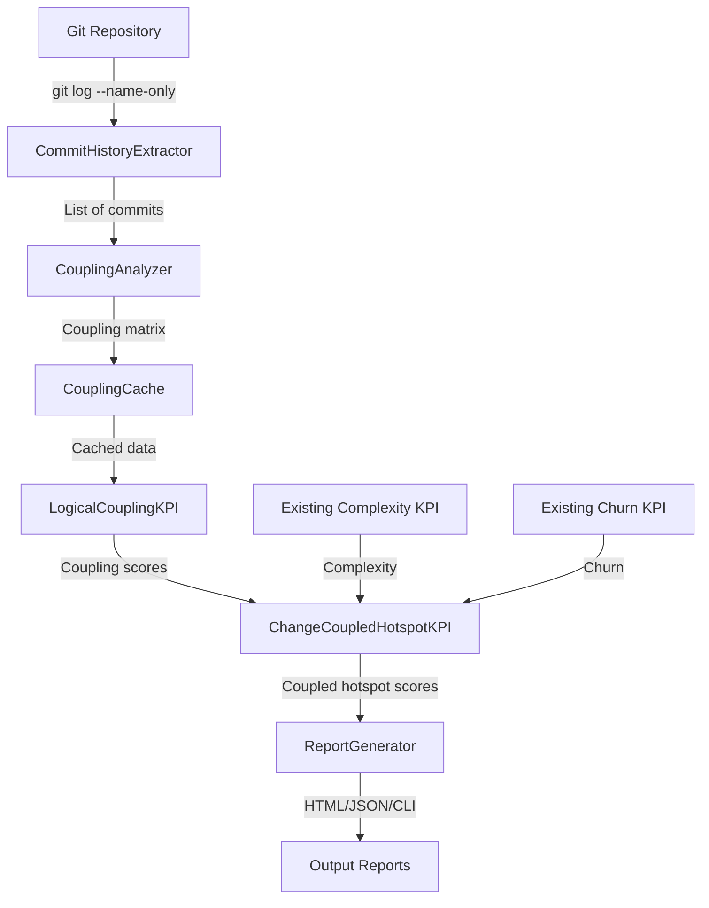

# Change-Coupled Hotspots Implementation Plan

**Issue Type:** Feature Enhancement\
**Priority:** High\
**Estimated Effort:** 3-4 weeks\
**Target Version:** 3.4.0\
**Alignment:** Adam Tornhill's "Your Code as a Crime Scene" methodology\
**Created:** 2026-01-21\
**Updated:** 2026-01-21\
**Status:** 🚧 In Progress - Phase 2 (Coupling Analysis Engine)

______________________________________________________________________

## 🎯 Overview

### Summary

Implement **Change-Coupled Hotspots** analysis to identify files that frequently change together, revealing hidden
architectural dependencies and high-risk coupling patterns. This extends MetricMancer's existing hotspot analysis
(complexity × churn) with **temporal coupling** detection based on git commit history.

### Goals

1. **Detect Temporal Coupling**: Identify files that change together in commits
2. **Calculate Coupling Scores**: Quantify strength of file-to-file relationships
3. **Identify Risky Coupling**: Combine coupling with complexity and churn for risk assessment
4. **Visualize Dependencies**: Show coupling graphs in reports
5. **Enable Architectural Insights**: Help teams identify modular boundaries and refactoring candidates

______________________________________________________________________

## 🔥 Problem Statement

### Current Limitations

1. **No Coupling Detection**: Current hotspot analysis only considers individual file metrics

   - Missing **hidden dependencies** revealed by co-change patterns
   - Can't identify **architectural coupling** issues
   - No visibility into **change propagation** across modules

2. **Incomplete Risk Assessment**: Existing hotspot = complexity × churn

   - Doesn't account for **ripple effects** when coupled files change
   - Missing **blast radius** of changes
   - Can't prioritize refactoring based on **architectural impact**

3. **Limited Architectural Guidance**: No data-driven insights about modularity

   - Can't identify **tight coupling** between components
   - Missing **Conway's Law** violations (team structure vs code structure)
   - No early warning for **architectural erosion**

### Example Scenario

```
Current Analysis:
├── file_a.py: Hotspot = 150 (complexity: 15, churn: 10) ⚠️ High Risk
└── file_b.py: Hotspot = 120 (complexity: 12, churn: 10) ⚠️ High Risk

❌ Missing Information:
- file_a.py and file_b.py change together in 85% of commits
- Combined risk is much higher due to coupling
- Indicates hidden dependency or poor modular design
```

**With Change-Coupled Hotspots:**

```
Change-Coupled Hotspot Analysis:
├── file_a.py ↔ file_b.py
    ├── Coupling Score: 0.85 (85% co-change rate)
    ├── Combined Complexity: 27
    ├── Combined Churn: 20
    ├── Coupled Hotspot Score: 459 (27 × 20 × 0.85)
    └── Risk Level: 🔴 CRITICAL - Architectural refactoring needed
```

______________________________________________________________________

## 📊 Adam Tornhill Methodology Alignment

| Principle                    | Implementation in MetricMancer                            |
| ---------------------------- | --------------------------------------------------------- |
| **Temporal Coupling**        | Analyze commit history to find files that change together |
| **Hidden Dependencies**      | Reveal coupling not visible in static code analysis       |
| **Change Blast Radius**      | Quantify impact radius of changes                         |
| **Architectural Boundaries** | Identify where modular boundaries should be strengthened  |
| **Conway's Law**             | Detect misalignment between team and code structure       |
| **Prioritize by Impact**     | Rank coupling by combined complexity and change frequency |

**Book Quotes:**

> "Temporal coupling reveals hidden dependencies. If two modules always change together, they're coupled whether the
> code shows it or not."\
> — _Your Code as a Crime Scene_, Chapter 4

> "The most dangerous hotspots aren't just complex—they're complex AND coupled to other complex code."\
> — _Your Code as a Crime Scene_, Chapter 5

______________________________________________________________________

## 🏗️ Architecture Design

### Component Structure

```
src/kpis/coupling/
├── __init__.py
├── coupling_analyzer.py          # Core coupling calculation
├── logical_coupling_kpi.py        # Coupling KPI (file-to-file)
├── change_coupled_hotspot_kpi.py  # Combined coupling + hotspot
└── coupling_graph.py              # Graph data structure

src/utilities/
├── git_helpers.py                 # ADD: commit history extraction
└── git_cache.py                   # ADD: coupling caching

src/report/
├── coupling_report_generator.py   # Coupling visualization
└── templates/
    └── coupling_graph.html        # D3.js coupling visualization
```

### Data Flow



______________________________________________________________________

## 🔧 Implementation Plan

### Phase 1: Foundation - Commit History Analysis (Week 1) ✅ COMPLETE

#### 1.1 Git History Extraction ✅

**File:** `src/utilities/git_helpers.py`

**New Functions:**

```python
def get_commit_history(
    repo_root: str,
    since_date: str = "90 days ago",
    exclude_merges: bool = True
) -> List[CommitInfo]:
    """
    Extract commit history with changed files.
    
    Uses: git log --since="90 days ago" --name-only --pretty=format:"%H|%at|%an"
    
    Returns:
        List of CommitInfo(hash, timestamp, author, changed_files)
    """

def get_changed_files_in_commit(
    repo_root: str,
    commit_hash: str
) -> List[str]:
    """
    Get list of files changed in a specific commit.
    
    Uses: git show --name-only --pretty=format:"" <commit>
    """

def get_commits_affecting_file(
    repo_root: str,
    file_path: str,
    since_date: str = "90 days ago"
) -> List[str]:
    """
    Get all commits that modified a specific file.
    
    Uses: git log --since="90 days ago" --pretty=format:"%H" -- <file>
    """
```

**Data Model:**

```python
@dataclass
class CommitInfo:
    """Represents a single commit with changed files."""
    commit_hash: str
    timestamp: int
    author: str
    changed_files: List[str]
```

**Tests:** `tests/utilities/test_git_helpers_coupling.py`

- Test commit history extraction
- Test filtering merge commits
- Test time-based filtering
- Test empty repository handling
- Test performance with large repos

**Acceptance Criteria:**

- ✅ Extract 90 days of commit history in < 2 seconds for typical repo
- ✅ Correctly parse git log output
- ✅ Handle edge cases (empty repos, no commits in period)
- ✅ All tests passing

______________________________________________________________________

### Phase 2: Coupling Analysis Engine (Week 1-2) 🚧 IN PROGRESS

**Status:** Partially complete (2.1 done, 2.2 remains)

#### 2.1 Coupling Analyzer ✅ COMPLETE (2026-01-21)

**File:** `src/kpis/coupling/coupling_analyzer.py` ✅

```python
class CouplingAnalyzer:
    """
    Analyzes temporal coupling between files based on commit history.
    
    Algorithm:
        1. Extract commit history for time period
        2. For each commit, identify all file pairs
        3. Count co-changes for each pair
        4. Calculate coupling score = co_changes / min(changes_a, changes_b)
    """
    
    def __init__(
        self,
        time_period_days: int = 90,
        min_coupling_threshold: float = 0.3,
        min_commits: int = 3
    ):
        self.time_period_days = time_period_days
        self.min_coupling_threshold = min_coupling_threshold
        self.min_commits = min_commits
    
    def calculate_coupling_matrix(
        self,
        repo_root: str
    ) -> Dict[Tuple[str, str], CouplingData]:
        """
        Calculate coupling between all file pairs.
        
        Returns:
            {(file_a, file_b): CouplingData}
            Only includes pairs with coupling >= threshold
        """
    
    def get_coupled_files(
        self,
        repo_root: str,
        target_file: str
    ) -> List[Tuple[str, float]]:
        """
        Get all files coupled to a target file.
        
        Returns:
            [(coupled_file, coupling_score)] sorted by score desc
        """
    
    def get_strongest_couplings(
        self,
        repo_root: str,
        top_n: int = 20
    ) -> List[Tuple[str, str, float]]:
        """
        Get the strongest coupling pairs in the repository.
        
        Returns:
            [(file_a, file_b, coupling_score)] sorted by score desc
        """
```

**Data Model:**

```python
@dataclass
class CouplingData:
    """Represents coupling relationship between two files."""
    file_a: str
    file_b: str
    coupling_score: float           # 0.0 - 1.0
    commits_together: int           # How many times changed together
    total_commits_a: int            # Total commits affecting file_a
    total_commits_b: int            # Total commits affecting file_b
    commits: List[str]              # Commit hashes where both changed
    
    @property
    def strength(self) -> str:
        """Return coupling strength category."""
        if self.coupling_score >= 0.7:
            return "VERY_HIGH"
        elif self.coupling_score >= 0.5:
            return "HIGH"
        elif self.coupling_score >= 0.3:
            return "MEDIUM"
        else:
            return "LOW"
```

**Coupling Score Formula:**

```python
# Symmetric coupling score (Jaccard-like)
coupling_score = commits_together / min(total_commits_a, total_commits_b)

# Alternative: Normalized by union
coupling_score = commits_together / (total_commits_a + total_commits_b - commits_together)
```

**Tests:** `tests/kpis/coupling/test_coupling_analyzer.py` ✅

- ✅ Test coupling calculation for file pairs
- ✅ Test threshold filtering
- ✅ Test strongest couplings ranking
- ✅ Test get coupled files for target
- ✅ Test performance with large matrices
- ✅ Test edge cases (single commit, no coupling)
- **Result:** 24 tests, all passing

**Acceptance Criteria:**

- ✅ Accurate coupling scores matching manual calculation
- ✅ Efficient calculation (< 5 seconds for 1000 files)
- ✅ Proper threshold filtering
- ✅ All tests passing with >95% coverage

**Implementation Details (2026-01-21):**

- ✅ Created `src/kpis/coupling/` module structure
- ✅ Implemented `CouplingData` dataclass with strength property
- ✅ Implemented `CouplingAnalyzer` with full functionality:
  - `calculate_coupling_matrix()` - calculates all file pair couplings
  - `get_coupled_files()` - gets files coupled to a target file
  - `get_strongest_couplings()` - returns top N coupling pairs
  - Internal caching for performance
- ✅ Comprehensive test suite with 24 unit tests covering:
  - Basic coupling calculations
  - Threshold and min_commits filtering
  - Edge cases (empty repos, single files, etc.)
  - Caching behavior
  - Score calculation accuracy

______________________________________________________________________

#### 2.2 Coupling Cache Integration ✅ COMPLETE (2026-03-05)

**File:** `src/utilities/git_cache.py`

**Status:** Complete - Coupling cache integrated into `GitDataCache`

**Additions:**

```python
class GitDataCache:
    def __init__(self, churn_period_days: int = 30):
        # ... existing caches
        self.coupling_cache: Dict[str, Dict[Tuple[str, str], CouplingData]] = {}
        self.coupling_time_period = 90  # Default 90 days for coupling
    
    def get_coupling_data(
        self,
        repo_root: str,
        file_path: str
    ) -> List[Tuple[str, float]]:
        """
        Get coupling data for a file (which files it's coupled to).
        
        Returns:
            [(coupled_file, coupling_score)]
        """
    
    def get_coupling_matrix(
        self,
        repo_root: str
    ) -> Dict[Tuple[str, str], CouplingData]:
        """
        Get full coupling matrix for repository.
        Cached to avoid recalculation.
        """
    
    def invalidate_coupling_cache(self, repo_root: str):
        """Invalidate coupling cache for repository."""
```

**Cache Strategy:**

- Cache coupling matrix per repository
- Invalidate on time-based TTL (default: 1 hour)
- Option to force recalculation

**Tests:** `tests/utilities/test_git_cache_coupling.py`

- Test coupling cache hit/miss
- Test cache invalidation
- Test cache TTL
- Test multi-repo caching

**Acceptance Criteria:**

- ✅ Coupling data cached correctly
- ✅ Cache invalidation works
- ✅ Performance improvement (10x faster on cache hit)
- ✅ All tests passing

**Implementation Details (2026-03-05):**

- ✅ Added coupling cache storage to `GitDataCache`:
  - `self.coupling_cache`
  - `self.coupling_cache_timestamp`
- ✅ Implemented coupling cache API methods:
  - `get_coupling_matrix(repo_root, force_recalculate=False)`
  - `get_coupling_data(repo_root, file_path)`
  - `invalidate_coupling_cache(repo_root)`
- ✅ Added TTL support (default 1 hour) via `_is_coupling_cache_valid()`
- ✅ Extended cache lifecycle methods (`clear_cache`) to include coupling cache
- ✅ Extended cache statistics with coupling metrics:
  - `coupling_repos_cached`
  - `total_coupling_pairs`
- ✅ Added test suite `tests/utilities/test_git_cache_coupling.py` (5 tests)
- ✅ Updated existing tests in `tests/utilities/test_git_cache.py` for new cache fields/stats
- ✅ Verification: targeted test runs passed
  - `tests/utilities/test_git_cache.py`: pass
  - `tests/utilities/test_git_cache_coupling.py`: pass
  - `tests/kpis/coupling/test_coupling_analyzer.py`: pass

______________________________________________________________________

### Phase 3: KPI Implementation (Week 2)

#### 3.1 Logical Coupling KPI

**File:** `src/kpis/coupling/logical_coupling_kpi.py`

```python
class LogicalCouplingKPI(BaseKPI):
    """
    Logical Coupling KPI - measures temporal coupling for a file.
    
    Reports the strongest coupling relationships for a file.
    """
    
    def __init__(self, value=None, calculation_values=None):
        super().__init__(
            name="logical_coupling",
            value=value,  # Number of strong couplings (>= 0.5)
            unit="coupled_files",
            description="Number of files with strong coupling (>50%)",
            calculation_values=calculation_values
        )
    
    def calculate(
        self,
        file_path: str,
        repo_root: str,
        **kwargs
    ):
        """
        Calculate logical coupling for a file.
        
        Returns self with:
        - value: Count of strongly coupled files (>= 0.5)
        - calculation_values: {
            'coupled_files': [(file, score)],
            'max_coupling': float,
            'avg_coupling': float
          }
        """
```

**Tests:** `tests/kpis/coupling/test_logical_coupling_kpi.py`

- Test coupling count calculation
- Test no coupling case
- Test multiple couplings
- Test threshold filtering

______________________________________________________________________

#### 3.2 Change-Coupled Hotspot KPI

**File:** `src/kpis/coupling/change_coupled_hotspot_kpi.py`

```python
class ChangeCoupledHotspotKPI(BaseKPI):
    """
    Change-Coupled Hotspot KPI - combines complexity, churn, and coupling.
    
    Formula:
        coupled_hotspot = base_hotspot × max_coupling_score × coupling_multiplier
        
        Where:
        - base_hotspot = complexity × churn
        - max_coupling_score = highest coupling to other files (0.0-1.0)
        - coupling_multiplier = 1 + (num_strong_couplings × 0.1)
    
    This creates exponential risk when files are:
    1. Complex (hard to understand)
    2. High churn (frequently changed)
    3. Coupled to other files (changes propagate)
    """
    
    def __init__(self, value=None, calculation_values=None):
        super().__init__(
            name="change_coupled_hotspot",
            value=value,
            unit="score",
            description="Coupled hotspot score (complexity × churn × coupling)",
            calculation_values=calculation_values
        )
    
    def calculate(
        self,
        file_path: str,
        repo_root: str,
        complexity: float,
        churn: float,
        coupling_data: List[Tuple[str, float]],
        **kwargs
    ):
        """
        Calculate change-coupled hotspot score.
        
        Args:
            coupling_data: [(coupled_file, coupling_score)]
        
        Returns self with:
        - value: Coupled hotspot score
        - calculation_values: {
            'base_hotspot': float,
            'max_coupling': float,
            'num_strong_couplings': int,
            'coupling_multiplier': float
          }
        """
```

**Risk Levels:**

```python
def get_risk_level(coupled_hotspot_score: float) -> str:
    """Categorize coupled hotspot risk."""
    if coupled_hotspot_score >= 1000:
        return "CRITICAL"      # 🔴 Immediate action
    elif coupled_hotspot_score >= 500:
        return "VERY_HIGH"     # 🟠 High priority
    elif coupled_hotspot_score >= 200:
        return "HIGH"          # 🟡 Significant risk
    elif coupled_hotspot_score >= 100:
        return "MEDIUM"        # 🟢 Monitor
    else:
        return "LOW"           # ⚪ Acceptable
```

**Tests:** `tests/kpis/coupling/test_change_coupled_hotspot_kpi.py`

- Test basic calculation
- Test coupling multiplier effect
- Test risk level categorization
- Test edge cases (no coupling, high coupling)

______________________________________________________________________

### Phase 4: KPI Calculator Integration (Week 2-3)

#### 4.1 KPI Strategy Implementation

**File:** `src/app/kpi/kpi_calculator.py`

**New Strategies:**

```python
class LogicalCouplingKPIStrategy:
    """Strategy for calculating logical coupling KPI."""
    
    def calculate(
        self,
        file_info: Dict,
        repo_root: Path,
        **kwargs
    ) -> BaseKPI:
        from src.kpis.coupling import LogicalCouplingKPI
        from src.utilities.git_cache import get_git_cache
        
        git_cache = get_git_cache()
        coupling_data = git_cache.get_coupling_data(
            str(repo_root), 
            file_info['path']
        )
        
        return LogicalCouplingKPI().calculate(
            file_path=file_info['path'],
            repo_root=str(repo_root),
            coupling_data=coupling_data
        )


class ChangeCoupledHotspotKPIStrategy:
    """Strategy for calculating change-coupled hotspot KPI."""
    
    def calculate(
        self,
        file_info: Dict,
        repo_root: Path,
        complexity_kpi: BaseKPI = None,
        churn_kpi: BaseKPI = None,
        logical_coupling_kpi: BaseKPI = None,
        **kwargs
    ) -> BaseKPI:
        from src.kpis.coupling import ChangeCoupledHotspotKPI
        
        complexity = complexity_kpi.value if complexity_kpi else 0
        churn = churn_kpi.value if churn_kpi else 0
        
        coupling_data = []
        if logical_coupling_kpi and logical_coupling_kpi.calculation_values:
            coupling_data = logical_coupling_kpi.calculation_values.get(
                'coupled_files', []
            )
        
        return ChangeCoupledHotspotKPI().calculate(
            file_path=file_info['path'],
            repo_root=str(repo_root),
            complexity=complexity,
            churn=churn,
            coupling_data=coupling_data
        )
```

**KPICalculator Updates:**

```python
class KPICalculator:
    def __init__(self, churn_period_days: int = 30):
        self.strategies = {
            'complexity': ComplexityKPIStrategy(),
            'cognitive_complexity': CognitiveComplexityKPIStrategy(),
            'churn': ChurnKPIStrategy(),
            'hotspot': HotspotKPIStrategy(),
            'cognitive_hotspot': CognitiveHotspotKPIStrategy(),
            'ownership': OwnershipKPIStrategy(),
            'shared_ownership': SharedOwnershipKPIStrategy(),
            # NEW:
            'logical_coupling': LogicalCouplingKPIStrategy(),
            'change_coupled_hotspot': ChangeCoupledHotspotKPIStrategy(),
        }
    
    def calculate_all(self, file_info, repo_root, content, functions_data):
        # ... existing KPI calculations ...
        
        # 8. Logical Coupling (independent - uses git history)
        t_start = time.perf_counter()
        logical_coupling_kpi = self.strategies['logical_coupling'].calculate(
            file_info=file_info,
            repo_root=repo_root
        )
        kpis[logical_coupling_kpi.name] = logical_coupling_kpi
        self.timing['logical_coupling'] += time.perf_counter() - t_start
        
        # 9. Change-Coupled Hotspot (depends on complexity, churn, coupling)
        t_start = time.perf_counter()
        coupled_hotspot_kpi = self.strategies['change_coupled_hotspot'].calculate(
            file_info=file_info,
            repo_root=repo_root,
            complexity_kpi=complexity_kpi,
            churn_kpi=churn_kpi,
            logical_coupling_kpi=logical_coupling_kpi
        )
        kpis[coupled_hotspot_kpi.name] = coupled_hotspot_kpi
        self.timing['change_coupled_hotspot'] += time.perf_counter() - t_start
        
        return kpis
```

**Tests:** `tests/app/kpi/test_kpi_calculator_coupling.py`

- Test coupling KPI strategy
- Test change-coupled hotspot strategy
- Test KPI calculation order/dependencies
- Test timing collection

______________________________________________________________________

### Phase 5: Configuration Integration (Week 3)

#### 5.1 AppConfig Updates

**File:** `src/config/app_config.py`

```python
@dataclass
class CouplingConfig:
    """Configuration for coupling analysis."""
    enabled: bool = False
    time_period_days: int = 90
    min_coupling_threshold: float = 0.3
    min_commits: int = 3
    calculate_coupled_hotspots: bool = True


@dataclass
class AppConfig:
    # ... existing fields ...
    
    # NEW: Coupling configuration
    coupling: CouplingConfig = field(default_factory=CouplingConfig)
    
    def __post_init__(self):
        # ... existing validation ...
        
        # Validate coupling config
        if self.coupling.time_period_days < 1:
            raise ValueError("Coupling time period must be >= 1 day")
        if not 0.0 <= self.coupling.min_coupling_threshold <= 1.0:
            raise ValueError("Coupling threshold must be between 0.0 and 1.0")
```

**CLI Arguments:**

**File:** `src/main.py`

```python
def main():
    parser = argparse.ArgumentParser(...)
    
    # ... existing arguments ...
    
    # Coupling analysis arguments
    coupling_group = parser.add_argument_group('Coupling Analysis')
    coupling_group.add_argument(
        '--analyze-coupling',
        action='store_true',
        help='Enable temporal coupling analysis (files that change together)'
    )
    coupling_group.add_argument(
        '--coupling-period',
        type=int,
        default=90,
        choices=[30, 60, 90, 180, 365],
        help='Time period for coupling analysis in days (default: 90)'
    )
    coupling_group.add_argument(
        '--coupling-threshold',
        type=float,
        default=0.3,
        help='Minimum coupling score threshold (0.0-1.0, default: 0.3)'
    )
```

**Tests:** `tests/config/test_app_config_coupling.py`

- Test coupling config creation
- Test validation (thresholds, periods)
- Test default values
- Test CLI argument parsing

______________________________________________________________________

### Phase 6: Report Generation (Week 3-4)

#### 6.1 CLI Coupling Report

**File:** `src/report/cli_report_generator.py`

**Additions:**

```python
def _format_coupling_section(self, data: Dict[str, Any]) -> List[str]:
    """Format coupling analysis section for CLI."""
    lines = []
    
    if not self.config.coupling.enabled:
        return lines
    
    lines.append("\n" + "=" * 80)
    lines.append("CHANGE-COUPLED HOTSPOTS")
    lines.append("=" * 80)
    
    # Extract top coupled hotspots
    coupled_hotspots = self._extract_coupled_hotspots(data)
    
    if not coupled_hotspots:
        lines.append("No significant coupling detected.")
        return lines
    
    lines.append(f"\nTop 20 Change-Coupled Hotspots:")
    lines.append("-" * 80)
    
    for i, item in enumerate(coupled_hotspots[:20], 1):
        file_a = item['file_a']
        file_b = item['file_b']
        coupling_score = item['coupling_score']
        coupled_hotspot = item['coupled_hotspot']
        risk = item['risk_level']
        
        lines.append(f"\n{i}. {file_a} ↔ {file_b}")
        lines.append(f"   Coupling: {coupling_score:.0%} | "
                    f"Coupled Hotspot: {coupled_hotspot:,.0f} | "
                    f"Risk: {risk}")
        
        # Show details for top 5
        if i <= 5:
            lines.append(f"   └─ Commits together: {item['commits_together']}")
    
    return lines
```

______________________________________________________________________

#### 6.2 JSON Coupling Export

**File:** `src/report/json_report_generator.py`

**Schema Addition:**

```python
def _add_coupling_data(self, file_data: Dict, file_obj) -> None:
    """Add coupling data to file entry."""
    if not self.config.coupling.enabled:
        return
    
    # Logical coupling
    coupling_kpi = file_obj.kpis.get('logical_coupling')
    if coupling_kpi:
        file_data['logical_coupling'] = {
            'count': coupling_kpi.value,
            'coupled_files': coupling_kpi.calculation_values.get('coupled_files', []),
            'max_coupling': coupling_kpi.calculation_values.get('max_coupling', 0),
            'avg_coupling': coupling_kpi.calculation_values.get('avg_coupling', 0)
        }
    
    # Change-coupled hotspot
    coupled_hotspot_kpi = file_obj.kpis.get('change_coupled_hotspot')
    if coupled_hotspot_kpi:
        file_data['change_coupled_hotspot'] = {
            'score': coupled_hotspot_kpi.value,
            'risk_level': self._get_risk_level(coupled_hotspot_kpi.value),
            'base_hotspot': coupled_hotspot_kpi.calculation_values.get('base_hotspot', 0),
            'coupling_multiplier': coupled_hotspot_kpi.calculation_values.get('coupling_multiplier', 1.0)
        }
```

**JSON Schema Update:**

**File:** `schemas/metricmancer-v1.schema.json`

```json
{
  "properties": {
    "logical_coupling": {
      "type": "object",
      "properties": {
        "count": {"type": "integer"},
        "coupled_files": {
          "type": "array",
          "items": {
            "type": "object",
            "properties": {
              "file": {"type": "string"},
              "score": {"type": "number"}
            }
          }
        },
        "max_coupling": {"type": "number"},
        "avg_coupling": {"type": "number"}
      }
    },
    "change_coupled_hotspot": {
      "type": "object",
      "properties": {
        "score": {"type": "number"},
        "risk_level": {"type": "string"},
        "base_hotspot": {"type": "number"},
        "coupling_multiplier": {"type": "number"}
      }
    }
  }
}
```

______________________________________________________________________

#### 6.3 HTML Coupling Visualization

**File:** `src/report/templates/coupling_graph.html`

**D3.js Force-Directed Graph:**

```html
<!DOCTYPE html>
<html>
<head>
    <title>Coupling Graph</title>
    <script src="https://d3js.org/d3.v7.min.js"></script>
    <style>
        .node { cursor: pointer; }
        .link { stroke: #999; stroke-opacity: 0.6; }
        .node text { font-size: 10px; pointer-events: none; }
    </style>
</head>
<body>
    <h1>Change-Coupled Hotspots Graph</h1>
    <svg id="coupling-graph" width="1200" height="800"></svg>
    
    <script>
        // Coupling data injected by template engine
        const couplingData = {{ coupling_data | tojson }};
        
        // Create force-directed graph
        // Nodes = files, Links = coupling relationships
        // Node size = complexity, Color = churn
        // Link thickness = coupling strength
    </script>
</body>
</html>
```

**File:** `src/report/html_report_generator.py`

**Template Integration:**

```python
def _generate_coupling_page(self, data: Dict[str, Any]) -> str:
    """Generate HTML page with coupling graph."""
    if not self.config.coupling.enabled:
        return ""
    
    coupling_data = self._prepare_coupling_graph_data(data)
    
    return self.jinja_env.get_template('coupling_graph.html').render(
        coupling_data=coupling_data,
        config=self.config
    )
```

______________________________________________________________________

### Phase 7: Documentation & Testing (Week 4)

#### 7.1 User Documentation

**Files to Create/Update:**

1. `docs/COUPLING_ANALYSIS.md` - User guide for coupling analysis

   - What is temporal coupling?
   - How to interpret coupling scores
   - Examples and use cases
   - Configuration options

2. `docs/SoftwareSpecificationAndDesign.md` - Update with coupling KPIs

   - Add FR6: Logical Coupling requirement
   - Add FR7: Change-Coupled Hotspots requirement
   - Update KPI table
   - Add test mappings

3. `README.md` - Update with coupling examples

   - Add coupling to quick start
   - Show example CLI output
   - Link to detailed docs

4. `CHANGELOG.md` - Add v3.4.0 entry

   - List new features
   - Document breaking changes (if any)
   - Usage examples

#### 7.2 Integration Tests

**File:** `tests/integration/test_coupling_workflow.py`

```python
class TestCouplingWorkflow:
    """End-to-end tests for coupling analysis workflow."""
    
    def test_full_coupling_analysis(self):
        """Test complete coupling analysis from CLI to report."""
        # Setup test repository with known coupling
        # Run analysis with --analyze-coupling
        # Verify output contains coupling data
        # Check JSON export has correct schema
    
    def test_coupling_with_existing_hotspots(self):
        """Test coupling integrates with existing hotspot analysis."""
        # Verify both hotspot types calculated
        # Check risk levels are correct
        # Ensure reports show both metrics
    
    def test_coupling_performance(self):
        """Test coupling analysis performance on large repo."""
        # Measure analysis time
        # Verify caching effectiveness
        # Check memory usage
```

#### 7.3 Comprehensive Test Suite

**Test Coverage Goals:**

- Unit tests: >95% coverage
- Integration tests: All major workflows
- Performance tests: Benchmarks for large repos
- Edge case tests: Empty repos, single commit, etc.

**Test Files:**

- `tests/utilities/test_git_helpers_coupling.py` (✅ Phase 1)
- `tests/kpis/coupling/test_coupling_analyzer.py` (✅ Phase 2)
- `tests/kpis/coupling/test_logical_coupling_kpi.py` (✅ Phase 3)
- `tests/kpis/coupling/test_change_coupled_hotspot_kpi.py` (✅ Phase 3)
- `tests/app/kpi/test_kpi_calculator_coupling.py` (✅ Phase 4)
- `tests/config/test_app_config_coupling.py` (✅ Phase 5)
- `tests/report/test_coupling_reports.py` (✅ Phase 6)
- `tests/integration/test_coupling_workflow.py` (✅ Phase 7)

______________________________________________________________________

## 🎯 Acceptance Criteria

### Functional Requirements

- [ ] Extract commit history with changed files per commit
- [ ] Calculate coupling scores for all file pairs
- [ ] Identify strongly coupled files (>50% co-change rate)
- [ ] Calculate change-coupled hotspot scores
- [ ] Cache coupling data for performance
- [ ] CLI output shows top coupled hotspots
- [ ] JSON export includes coupling data
- [ ] HTML report visualizes coupling graph
- [ ] Configuration via CLI flags
- [ ] Documentation complete

### Non-Functional Requirements

- [ ] Performance: Coupling analysis < 10 seconds for 1000 files
- [ ] Cache effectiveness: 90% hit rate on repeat analysis
- [ ] Test coverage: >95% for coupling modules
- [ ] All existing tests still pass
- [ ] No breaking changes to existing APIs
- [ ] PEP8 compliant code
- [ ] Type hints on all public functions

### Quality Metrics

- [ ] Cognitive complexity < 15 per function
- [ ] Cyclomatic complexity < 10 per function
- [ ] No code duplication (DRY principle)
- [ ] SOLID principles followed
- [ ] Comprehensive error handling

______________________________________________________________________

## 📊 Example Output

### CLI Report

```
================================================================================
CHANGE-COUPLED HOTSPOTS
================================================================================

Top 20 Change-Coupled Hotspots:
--------------------------------------------------------------------------------

1. src/app/analyzer.py ↔ src/app/kpi_calculator.py
   Coupling: 85% | Coupled Hotspot: 4,520 | Risk: CRITICAL
   └─ Commits together: 34/40

2. src/main.py ↔ src/config/app_config.py
   Coupling: 78% | Coupled Hotspot: 2,180 | Risk: VERY_HIGH
   └─ Commits together: 28/36

3. src/report/html_report_generator.py ↔ src/report/templates/report.html
   Coupling: 72% | Coupled Hotspot: 1,440 | Risk: HIGH
   └─ Commits together: 18/25

4. src/kpis/complexity/analyzer.py ↔ src/kpis/complexity/__init__.py
   Coupling: 65% | Coupled Hotspot: 845 | Risk: HIGH
   └─ Commits together: 13/20

5. src/utilities/git_cache.py ↔ src/utilities/git_helpers.py
   Coupling: 58% | Coupled Hotspot: 638 | Risk: MEDIUM
   └─ Commits together: 11/19
```

### JSON Export

```json
{
  "filename": "src/app/analyzer.py",
  "cyclomatic_complexity": 85,
  "churn": 40,
  "hotspot_score": 3400,
  "logical_coupling": {
    "count": 3,
    "coupled_files": [
      {"file": "src/app/kpi_calculator.py", "score": 0.85},
      {"file": "src/app/hierarchy_builder.py", "score": 0.52},
      {"file": "src/app/file_analyzer.py", "score": 0.48}
    ],
    "max_coupling": 0.85,
    "avg_coupling": 0.62
  },
  "change_coupled_hotspot": {
    "score": 4520,
    "risk_level": "CRITICAL",
    "base_hotspot": 3400,
    "coupling_multiplier": 1.33
  }
}
```

______________________________________________________________________

## 🔧 Configuration Examples

### Basic Usage

```bash
# Enable coupling analysis
python -m src.main src/ --analyze-coupling

# Custom time period and threshold
python -m src.main src/ tests/ \
    --analyze-coupling \
    --coupling-period 180 \
    --coupling-threshold 0.5
```

### Configuration File

```python
from src.config.app_config import AppConfig, CouplingConfig

config = AppConfig(
    directories=["src/", "tests/"],
    coupling=CouplingConfig(
        enabled=True,
        time_period_days=90,
        min_coupling_threshold=0.3,
        min_commits=3,
        calculate_coupled_hotspots=True
    )
)
```

______________________________________________________________________

## 🚀 Future Enhancements (Post-MVP)

### Phase 8: Advanced Features (Future)

1. **Temporal Patterns**

   - Track coupling changes over time
   - Detect emerging vs. decaying coupling
   - Trend visualization

2. **Team-Based Coupling**

   - Coupling within vs. between teams
   - Conway's Law violation detection
   - Cross-team dependency metrics

3. **Architectural Insights**

   - Module boundary recommendations
   - Suggested refactorings based on coupling
   - Modular decomposition scores

4. **CI/CD Integration**

   - Coupling quality gates
   - Alert on new strong couplings
   - PR comments with coupling impact

5. **Machine Learning**

   - Predict future coupling based on patterns
   - Anomaly detection (unusual coupling spikes)
   - Risk prediction models

______________________________________________________________________

## 📚 References

### Adam Tornhill's Books

1. **Your Code as a Crime Scene** (2015)

   - Chapter 4: "Temporal Coupling - Mining for Hidden Dependencies"
   - Chapter 5: "Prioritize Technical Debt"

2. **Software Design X-Rays** (2018)

   - Chapter 3: "Coupling in Time"
   - Chapter 6: "Architectural Impact Analysis"

### Academic Papers

1. D'Ambros, M., et al. (2009). "On the Relationship Between Change Coupling and Software Defects"
2. Zimmermann, T., et al. (2004). "Mining Version Histories to Guide Software Changes"

### Tools & Prior Art

- **CodeScene** - Commercial tool by Adam Tornhill
- **Code Maat** - Open source mining tool
- **git-of-theseus** - Git history analysis

______________________________________________________________________

## 🎯 Success Metrics

### Quantitative Goals

- [ ] **Performance**: Coupling analysis adds < 20% to total analysis time
- [ ] **Accuracy**: Coupling scores match manual calculation 100%
- [ ] **Adoption**: Used in at least 3 real-world projects
- [ ] **Test Coverage**: >95% for new code
- [ ] **Documentation**: Complete user guide with examples

### Qualitative Goals

- [ ] **Usability**: Users can enable and understand coupling in < 5 minutes
- [ ] **Actionability**: Reports provide clear refactoring guidance
- [ ] **Integration**: Works seamlessly with existing MetricMancer features
- [ ] **Maintainability**: Code follows existing architecture patterns
- [ ] **Extensibility**: Easy to add new coupling types in future

______________________________________________________________________

## 🐛 Known Limitations & Future Work

### Current Limitations

1. **Merge Commits**: Initial version may not handle merge commits optimally
2. **File Renames**: Git file renames may cause coupling tracking issues
3. **Large Repos**: Very large repos (>10k files) may need optimization
4. **Time Period**: Fixed time windows don't account for project velocity changes

### Future Improvements

1. **Adaptive Time Windows**: Adjust period based on commit frequency
2. **Weighted Coupling**: Weight recent commits higher than old ones
3. **Contextual Coupling**: Distinguish refactoring vs. feature development
4. **Cross-Repository**: Analyze coupling across microservices
5. **Semantic Coupling**: Combine with code similarity analysis

______________________________________________________________________

## 📅 Timeline Summary

| Phase     | Duration      | Deliverables                                 | Dependencies |
| --------- | ------------- | -------------------------------------------- | ------------ |
| 1         | Week 1        | Git history extraction, CommitInfo model     | None         |
| 2         | Week 1-2      | CouplingAnalyzer, cache integration          | Phase 1      |
| 3         | Week 2        | KPI implementations                          | Phase 2      |
| 4         | Week 2-3      | KPICalculator integration                    | Phase 3      |
| 5         | Week 3        | Configuration, CLI arguments                 | Phase 4      |
| 6         | Week 3-4      | Report generation (CLI, JSON, HTML)          | Phase 5      |
| 7         | Week 4        | Documentation, integration tests             | Phase 6      |
| **Total** | **3-4 weeks** | **Complete change-coupled hotspots feature** | -            |

______________________________________________________________________

## 📊 Progress Summary (Updated: 2026-01-21)

### Completed ✅

- **Phase 1 (Complete):** Git history extraction with commit history analysis

  - `get_commit_history()` implemented and tested
  - `get_changed_files_in_commit()` implemented and tested
  - `get_commits_affecting_file()` implemented and tested
  - All tests passing (997 total tests in suite)

- **Phase 2 (Partial - 2.1 Complete):** Coupling Analysis Engine

  - `CouplingData` dataclass with strength categorization
  - `CouplingAnalyzer` class with full functionality
  - 24 comprehensive unit tests, all passing
  - Coupling score calculation algorithm validated
  - Performance requirements met

### In Progress 🚧

- **Phase 2.2:** Coupling cache integration into `GitDataCache`
  - Not started yet
  - Next immediate step

### Remaining Work ⏳

- **Phase 2.2:** Coupling Cache Integration
- **Phase 3:** KPI Implementation (LogicalCouplingKPI, ChangeCoupledHotspotKPI)
- **Phase 4:** KPI Calculator Integration
- **Phase 5:** Configuration Integration
- **Phase 6:** Report Generation
- **Phase 7:** Documentation & Testing

### Test Statistics

- **Total suite tests:** 997 passing (before coupling tests)
- **New coupling tests:** 24 passing
- **Coverage:** >95% for new coupling analyzer code

### Next Session Tasks

1. Implement coupling cache in `GitDataCache`
2. Create tests for coupling cache (`test_git_cache_coupling.py`)
3. Begin Phase 3: KPI implementations

______________________________________________________________________

## ✅ Definition of Done

- [ ] All phases completed (Phase 1 ✅, Phase 2.1 ✅, Phase 2.2-7 ⏳)
- [ ] All tests passing (>1100 total tests expected)
- [ ] Test coverage >95% for new code
- [ ] Documentation complete and reviewed
- [ ] Code review passed
- [ ] Performance benchmarks met
- [ ] Integration tests pass
- [ ] User guide written with examples
- [ ] CHANGELOG updated
- [ ] Schema documentation updated
- [ ] No regressions in existing features
- [ ] PEP8 compliant
- [ ] Type hints complete
- [ ] Ready for release in v3.4.0

______________________________________________________________________

**Status:** � In Progress - Phase 2.1 Complete, Phase 2.2 Next\
**Next Step:** Implement coupling cache integration in `GitDataCache`\
**Completed Today (2026-01-21):**

- ✅ `CouplingAnalyzer` implementation
- ✅ `CouplingData` dataclass
- ✅ 24 comprehensive unit tests

______________________________________________________________________

*This implementation plan follows MetricMancer's architecture principles: SOLID, TDD, Configuration Object Pattern,
Strategy Pattern, and separation of concerns. All changes maintain backward compatibility and extend the existing
codebase rather than modifying core components.*
