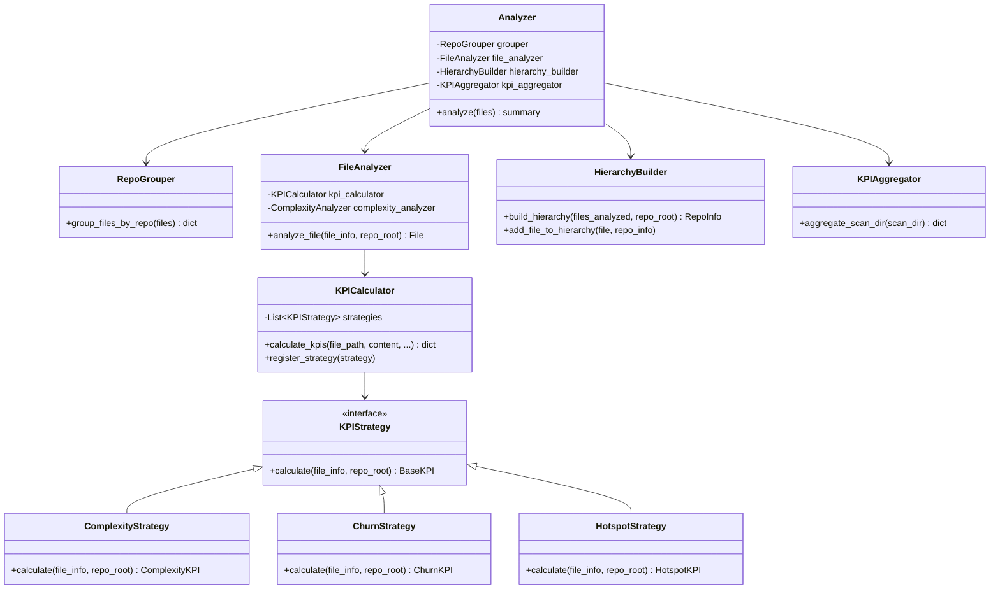

# Refaktoreringsplan: analyzer.py → Modulär Arkitektur

## 📊 Nulägesanalys

**Fil:** `src/app/analyzer.py`  
**Komplexitet:** 90 (CRITICAL)  
**Churn:** 20 commits  
**Hotspot Score:** 1800 (Complexity × Churn)  
**Rader:** 331 lines  
**Klasser:** 2 (`AggregatedSharedOwnershipKPI`, `Analyzer`)

### 🔥 Identifierade Problem

1. **Guds-objekt** (`Analyzer` class):
   - Gör för mycket: gruppering, repo-analys, fil-analys, KPI-beräkning, aggregering
   - 331 rader i en fil (borde vara max ~200 per modul)
   - Nested function `aggregate_scan_dir_kpis()` på 60+ rader

2. **Ansvarsblandning** (SRP-brott):
   - Fil-gruppering efter repo
   - KPI-beräkning (complexity, churn, hotspot, ownership, shared ownership)
   - Timing/profiling
   - Git cache pre-building
   - Hierarkisk datamodell-konstruktion
   - Rekursiv aggregering av KPIs

3. **Tight coupling**:
   - Hårdkodade beroenden till 5 olika KPI-klasser
   - Direkt import av git cache
   - Svår att testa isolerat

4. **Low cohesion**:
   - Timing-logik blandad med business logic
   - Aggregering nestad inne i analys-metoden

## 🎯 Refaktoreringsmål

### Arkitektoniska Principer

Följer **MetricMancer ARCHITECTURE.md**:
- ✅ **Single Responsibility** - En klass, ett ansvar
- ✅ **Open/Closed** - Lätt lägga till nya KPIs utan att ändra kärnkod
- ✅ **Dependency Injection** - KPI-beräknare injiceras, inte hårdkodade
- ✅ **Strategy Pattern** - KPI-beräkning via strategy interface
- ✅ **Testbarhet** - Varje komponent testbar isolerat

### Framgångskriterier

- ✅ Reduce complexity from **90 → <40** (target: ~30 per modul)
- ✅ Split into **4-5 specialized modules** (~60-80 lines each)
- ✅ Enable **easy addition of new KPIs** without modifying core
- ✅ Improve **testability** (mock KPI calculators)
- ✅ Maintain **backward compatibility** (existing tests pass)
- ✅ Keep **performance** (no regression in analysis speed)

## 🏗️ Ny Arkitektur

### Modul-uppdelning

```
src/app/
├── analyzer.py                 # FÖRE: 331 lines, C:90
│
├── analyzer.py                 # EFTER: ~80 lines, C:20 (orchestrator)
├── file_analyzer.py            # NY: ~100 lines, C:25 (per-file analysis)
├── kpi_calculator.py           # NY: ~80 lines, C:20 (KPI orchestration)
├── hierarchy_builder.py        # NY: ~60 lines, C:15 (data model construction)
├── kpi_aggregator.py           # NY: ~70 lines, C:20 (recursive aggregation)
└── repo_grouper.py             # NY: ~40 lines, C:10 (file grouping)
```

**Total efter refaktorering:**
- **430 lines** (vs 331) - ökar pga moduler/interfaces
- **Max complexity: 25** per modul (vs 90 i en fil)
- **Total complexity: ~110** (vs 90) - ökar men distribuerat
- **Maintainability: ↑↑↑** (mycket enklare att förstå/ändra)

### Komponent-diagram



## 📋 Implementation Plan

### Phase 1: Extract KPI Calculation (Week 1, Day 1-2)

**Goal:** Separate KPI calculation logic from file analysis

**New File:** `src/app/kpi_calculator.py`

```python
"""
KPI Calculator - Strategy Pattern for KPI Calculation
Follows Open/Closed Principle: Add new KPIs without modifying core
"""
from typing import Dict, List, Protocol
from pathlib import Path

from src.kpis.base_kpi import BaseKPI
from src.utilities.debug import debug_print


class KPIStrategy(Protocol):
    """Protocol for KPI calculation strategies."""
    
    def calculate(
        self, 
        file_info: Dict,
        repo_root: Path,
        **kwargs
    ) -> BaseKPI:
        """Calculate KPI for a file."""
        ...


class ComplexityKPIStrategy:
    """Strategy for calculating complexity KPI."""
    
    def __init__(self, complexity_analyzer):
        self.analyzer = complexity_analyzer
    
    def calculate(
        self,
        file_info: Dict,
        repo_root: Path,
        content: str = None,
        functions_data: List = None,
        **kwargs
    ) -> BaseKPI:
        """Calculate complexity from functions data."""
        from src.kpis.complexity import ComplexityKPI
        
        total_complexity = sum(
            f.get('complexity', 0) for f in functions_data
        )
        
        return ComplexityKPI().calculate(
            complexity=total_complexity,
            function_count=len(functions_data)
        )


class ChurnKPIStrategy:
    """Strategy for calculating churn KPI."""
    
    def calculate(
        self,
        file_info: Dict,
        repo_root: Path,
        **kwargs
    ) -> BaseKPI:
        """Calculate churn using git cache."""
        from src.kpis.codechurn import ChurnKPI
        
        file_path = file_info.get('path')
        
        return ChurnKPI().calculate(
            file_path=str(file_path),
            repo_root=str(repo_root.resolve())
        )


class HotspotKPIStrategy:
    """Strategy for calculating hotspot KPI."""
    
    def calculate(
        self,
        file_info: Dict,
        repo_root: Path,
        complexity_kpi: BaseKPI = None,
        churn_kpi: BaseKPI = None,
        **kwargs
    ) -> BaseKPI:
        """Calculate hotspot from complexity and churn."""
        from src.kpis.hotspot import HotspotKPI
        
        return HotspotKPI().calculate(
            complexity=complexity_kpi.value if complexity_kpi else 0,
            churn=churn_kpi.value if churn_kpi else 0
        )


class OwnershipKPIStrategy:
    """Strategy for calculating code ownership KPI."""
    
    def calculate(
        self,
        file_info: Dict,
        repo_root: Path,
        **kwargs
    ) -> BaseKPI:
        """Calculate code ownership."""
        from src.kpis.codeownership import CodeOwnershipKPI
        from src.kpis.codeownership.fallback_kpi import FallbackCodeOwnershipKPI
        
        file_path = file_info.get('path')
        
        try:
            return CodeOwnershipKPI(
                file_path=str(Path(file_path).resolve()),
                repo_root=str(repo_root.resolve())
            )
        except Exception as e:
            debug_print(f"[WARN] Ownership calc failed for {file_path}: {e}")
            return FallbackCodeOwnershipKPI(str(e))


class SharedOwnershipKPIStrategy:
    """Strategy for calculating shared ownership KPI."""
    
    def calculate(
        self,
        file_info: Dict,
        repo_root: Path,
        **kwargs
    ) -> BaseKPI:
        """Calculate shared ownership."""
        from src.kpis.sharedcodeownership import SharedOwnershipKPI
        from src.kpis.sharedcodeownership.fallback_kpi import FallbackSharedOwnershipKPI
        
        file_path = file_info.get('path')
        
        try:
            return SharedOwnershipKPI(
                file_path=str(Path(file_path).resolve()),
                repo_root=str(repo_root.resolve())
            )
        except Exception as e:
            debug_print(f"[WARN] Shared ownership calc failed for {file_path}: {e}")
            return FallbackSharedOwnershipKPI(str(e))


class KPICalculator:
    """
    Orchestrates KPI calculation using registered strategies.
    
    Follows Open/Closed Principle:
    - Open for extension: Register new strategies
    - Closed for modification: Core logic unchanged
    """
    
    def __init__(self, complexity_analyzer):
        self.complexity_analyzer = complexity_analyzer
        
        # Register default strategies
        self.strategies = {
            'complexity': ComplexityKPIStrategy(complexity_analyzer),
            'churn': ChurnKPIStrategy(),
            'hotspot': HotspotKPIStrategy(),
            'ownership': OwnershipKPIStrategy(),
            'shared_ownership': SharedOwnershipKPIStrategy()
        }
        
        # Timing tracker
        self.timing = {name: 0.0 for name in self.strategies.keys()}
    
    def register_strategy(self, name: str, strategy: KPIStrategy):
        """Register a new KPI calculation strategy."""
        self.strategies[name] = strategy
        self.timing[name] = 0.0
    
    def calculate_all(
        self,
        file_info: Dict,
        repo_root: Path,
        content: str,
        functions_data: List
    ) -> Dict[str, BaseKPI]:
        """
        Calculate all KPIs for a file.
        
        Returns:
            Dict mapping KPI names to KPI objects
        """
        import time
        
        kpis = {}
        
        # 1. Complexity (needs functions_data)
        t_start = time.perf_counter()
        complexity_kpi = self.strategies['complexity'].calculate(
            file_info=file_info,
            repo_root=repo_root,
            content=content,
            functions_data=functions_data
        )
        kpis[complexity_kpi.name] = complexity_kpi
        self.timing['complexity'] += time.perf_counter() - t_start
        
        # 2. Churn
        t_start = time.perf_counter()
        churn_kpi = self.strategies['churn'].calculate(
            file_info=file_info,
            repo_root=repo_root
        )
        kpis[churn_kpi.name] = churn_kpi
        self.timing['churn'] += time.perf_counter() - t_start
        
        # 3. Hotspot (depends on complexity + churn)
        t_start = time.perf_counter()
        hotspot_kpi = self.strategies['hotspot'].calculate(
            file_info=file_info,
            repo_root=repo_root,
            complexity_kpi=complexity_kpi,
            churn_kpi=churn_kpi
        )
        kpis[hotspot_kpi.name] = hotspot_kpi
        self.timing['hotspot'] += time.perf_counter() - t_start
        
        # 4. Ownership
        t_start = time.perf_counter()
        ownership_kpi = self.strategies['ownership'].calculate(
            file_info=file_info,
            repo_root=repo_root
        )
        kpis[ownership_kpi.name] = ownership_kpi
        self.timing['ownership'] += time.perf_counter() - t_start
        
        # 5. Shared Ownership
        t_start = time.perf_counter()
        shared_kpi = self.strategies['shared_ownership'].calculate(
            file_info=file_info,
            repo_root=repo_root
        )
        kpis[shared_kpi.name] = shared_kpi
        self.timing['shared_ownership'] += time.perf_counter() - t_start
        
        return kpis
```

**Tests:** `tests/app/test_kpi_calculator.py` (~150 lines)

**Acceptance Criteria:**
- ✅ All existing KPIs calculated correctly
- ✅ Easy to add new KPI strategies (register pattern)
- ✅ Timing tracked per KPI
- ✅ Mockable for testing
- ✅ All existing tests pass

---

### Phase 2: Extract File Analysis (Week 1, Day 3-4)

**Goal:** Separate per-file analysis from repo orchestration

**New File:** `src/app/file_analyzer.py`

```python
"""
File Analyzer - Analyzes individual files and calculates KPIs
Single Responsibility: File-level analysis only
"""
from pathlib import Path
from typing import Dict, List

from src.kpis.model import File, Function
from src.kpis.complexity import ComplexityAnalyzer, ComplexityKPI
from src.utilities.debug import debug_print
from .kpi_calculator import KPICalculator


class FileAnalyzer:
    """
    Analyzes individual files for complexity and KPIs.
    
    Responsibilities:
    - Read file content
    - Parse functions with complexity analyzer
    - Calculate file-level KPIs via KPICalculator
    - Create File and Function objects
    """
    
    def __init__(self, languages_config: Dict, kpi_calculator: KPICalculator):
        self.config = languages_config
        self.kpi_calculator = kpi_calculator
    
    def analyze_file(
        self,
        file_info: Dict,
        repo_root: Path
    ) -> File:
        """
        Analyze a single file and return File object with KPIs.
        
        Args:
            file_info: Dict with keys 'path', 'ext'
            repo_root: Path to repository root
        
        Returns:
            File object with calculated KPIs and functions
            None if file cannot be analyzed
        """
        file_path = Path(file_info['path'])
        ext = file_info.get('ext')
        
        # Validate file extension
        if ext not in self.config:
            debug_print(
                f"FileAnalyzer: Skipping file with unknown extension: "
                f"{str(file_path.resolve())}"
            )
            return None
        
        # Read file content
        try:
            with file_path.open('r', encoding='utf-8', errors='ignore') as f:
                content = f.read()
        except Exception as e:
            debug_print(f"[WARN] Unable to read {file_path}: {e}")
            return None
        
        # Get language configuration
        lang_config = self.config[ext]
        
        # Analyze functions in the file
        functions_data = self.kpi_calculator.complexity_analyzer.analyze_functions(
            content, lang_config
        )
        
        # Create Function objects
        function_objects = self._create_function_objects(functions_data)
        
        # Calculate all file-level KPIs
        file_kpis = self.kpi_calculator.calculate_all(
            file_info=file_info,
            repo_root=repo_root,
            content=content,
            functions_data=functions_data
        )
        
        # Create File object
        file_obj = File(
            name=file_path.name,
            file_path=str(file_path.relative_to(repo_root)),
            kpis=file_kpis,
            functions=function_objects
        )
        
        return file_obj
    
    def _create_function_objects(self, functions_data: List[Dict]) -> List[Function]:
        """
        Create Function objects with complexity KPIs.
        
        Args:
            functions_data: List of dicts with 'name' and 'complexity' keys
        
        Returns:
            List of Function objects
        """
        function_objects = []
        
        for func_data in functions_data:
            func_complexity_kpi = ComplexityKPI().calculate(
                complexity=func_data.get('complexity', 0),
                function_count=1
            )
            
            function_objects.append(
                Function(
                    name=func_data.get('name', 'N/A'),
                    kpis={func_complexity_kpi.name: func_complexity_kpi}
                )
            )
        
        return function_objects
```

**Tests:** `tests/app/test_file_analyzer.py` (~120 lines)

**Acceptance Criteria:**
- ✅ Analyzes files correctly (same output as before)
- ✅ Returns None for invalid files
- ✅ Creates Function objects with complexity
- ✅ Creates File objects with all KPIs
- ✅ Testable with mocked KPICalculator

---

### Phase 3: Extract Hierarchy Building (Week 1, Day 5)

**Goal:** Separate data model construction from analysis

**New File:** `src/app/hierarchy_builder.py`

```python
"""
Hierarchy Builder - Constructs hierarchical RepoInfo/ScanDir structure
Single Responsibility: Data model construction only
"""
from pathlib import Path
from typing import List

from src.kpis.model import RepoInfo, ScanDir, File
from src.utilities.debug import debug_print


class HierarchyBuilder:
    """
    Builds hierarchical data structure from analyzed files.
    
    Responsibilities:
    - Create RepoInfo for repository
    - Build nested ScanDir hierarchy
    - Place files in correct directories
    """
    
    def build_repo_info(
        self,
        repo_root: Path,
        files_analyzed: List[File]
    ) -> RepoInfo:
        """
        Build RepoInfo with hierarchical ScanDir structure.
        
        Args:
            repo_root: Path to repository root
            files_analyzed: List of File objects already analyzed
        
        Returns:
            RepoInfo with files organized in hierarchy
        """
        # Create top-level RepoInfo
        repo_info = RepoInfo(
            repo_root_path=str(repo_root),
            repo_name=repo_root.name,
            dir_name=repo_root.name,
            scan_dir_path="."
        )
        
        # Add each file to hierarchy
        for file_obj in files_analyzed:
            self.add_file_to_hierarchy(file_obj, repo_info, repo_root)
        
        return repo_info
    
    def add_file_to_hierarchy(
        self,
        file_obj: File,
        repo_info: RepoInfo,
        repo_root: Path
    ):
        """
        Add a file to the correct location in hierarchy.
        
        Args:
            file_obj: File object to add
            repo_info: Root RepoInfo object
            repo_root: Path to repository root
        """
        # Parse file path to determine directory hierarchy
        file_path = Path(file_obj.file_path)
        relative_dir = file_path.parent
        
        # Navigate/create hierarchy
        current_container = repo_info
        path_parts = [
            part for part in relative_dir.parts 
            if part and part != '.'
        ]
        
        if not path_parts:
            # File is in root directory
            repo_info.files[file_obj.name] = file_obj
        else:
            # File is in subdirectory - navigate there
            current_path = Path()
            for part in path_parts:
                current_path = current_path / part
                
                if part not in current_container.scan_dirs:
                    # Create new ScanDir
                    current_container.scan_dirs[part] = ScanDir(
                        dir_name=part,
                        scan_dir_path=str(current_path),
                        repo_root_path=repo_info.repo_root_path,
                        repo_name=repo_info.repo_name
                    )
                
                current_container = current_container.scan_dirs[part]
            
            # Add file to leaf directory
            current_container.files[file_obj.name] = file_obj
```

**Tests:** `tests/app/test_hierarchy_builder.py` (~100 lines)

---

### Phase 4: Extract KPI Aggregation (Week 2, Day 1-2)

**Goal:** Separate recursive aggregation logic

**New File:** `src/app/kpi_aggregator.py`

```python
"""
KPI Aggregator - Aggregates KPIs from files up through directory hierarchy
Single Responsibility: Recursive KPI aggregation only
"""
from typing import Dict, List

from src.kpis.model import ScanDir, File
from src.kpis.base_kpi import BaseKPI
from src.app.analyzer import AggregatedSharedOwnershipKPI


class KPIAggregator:
    """
    Aggregates file-level KPIs to directory level recursively.
    
    Follows "Your Code as a Crime Scene" methodology:
    - Aggregate complexity, churn, hotspot scores
    - Track shared ownership across directories
    """
    
    def aggregate_scan_dir(self, scan_dir: ScanDir) -> Dict:
        """
        Recursively aggregate KPIs for a directory.
        
        Args:
            scan_dir: ScanDir to aggregate
        
        Returns:
            Dict with aggregated values: 
            {'complexity', 'churn', 'hotspot', 'shared_ownership'}
        """
        # Collect KPI values from files
        complexity_vals = []
        churn_vals = []
        hotspot_vals = []
        shared_ownership_counts = []
        authors_set = set()
        
        # From files
        for file_obj in scan_dir.files.values():
            self._collect_file_kpis(
                file_obj,
                complexity_vals,
                churn_vals,
                hotspot_vals,
                shared_ownership_counts,
                authors_set
            )
        
        # From subdirectories (recursive)
        for subdir in scan_dir.scan_dirs.values():
            sub_kpis = self.aggregate_scan_dir(subdir)  # RECURSION
            
            if sub_kpis['complexity'] is not None:
                complexity_vals.append(sub_kpis['complexity'])
            if sub_kpis['churn'] is not None:
                churn_vals.append(sub_kpis['churn'])
            if sub_kpis['hotspot'] is not None:
                hotspot_vals.append(sub_kpis['hotspot'])
            if sub_kpis['shared_ownership'] is not None:
                shared_ownership_counts.append(sub_kpis['shared_ownership'])
            
            # Collect authors from subdirs
            subdir_shared = subdir.kpis.get('Shared Ownership')
            if subdir_shared and isinstance(subdir_shared.value, dict):
                sub_authors = [
                    a for a in subdir_shared.value.get('authors', [])
                    if a != 'Not Committed Yet'
                ]
                authors_set.update(sub_authors)
        
        # Compute averages
        avg_complexity = self._safe_average(complexity_vals)
        avg_churn = self._safe_average(churn_vals)
        avg_hotspot = self._safe_average(hotspot_vals)
        avg_shared = self._safe_average(shared_ownership_counts)
        
        # Store in scan_dir.kpis
        from src.kpis.complexity import ComplexityKPI
        from src.kpis.codechurn import ChurnKPI
        from src.kpis.hotspot import HotspotKPI
        
        scan_dir.kpis['complexity'] = ComplexityKPI(value=avg_complexity)
        scan_dir.kpis['churn'] = ChurnKPI(value=avg_churn)
        scan_dir.kpis['hotspot'] = HotspotKPI(value=avg_hotspot)
        
        # Shared ownership with authors list
        shared_ownership_dict = {
            'num_significant_authors': avg_shared,
            'authors': list(authors_set),
            'threshold': 20.0
        }
        scan_dir.kpis['Shared Ownership'] = AggregatedSharedOwnershipKPI(
            'Shared Ownership',
            shared_ownership_dict,
            unit='authors',
            description='Avg significant authors'
        )
        
        return {
            'complexity': avg_complexity,
            'churn': avg_churn,
            'hotspot': avg_hotspot,
            'shared_ownership': avg_shared
        }
    
    def _collect_file_kpis(
        self,
        file_obj: File,
        complexity_vals: List,
        churn_vals: List,
        hotspot_vals: List,
        shared_counts: List,
        authors_set: set
    ):
        """Collect KPI values from a file into aggregation lists."""
        # Complexity
        if file_obj.kpis.get('complexity'):
            val = file_obj.kpis['complexity'].value
            if isinstance(val, (int, float)):
                complexity_vals.append(val)
        
        # Churn
        if file_obj.kpis.get('churn'):
            val = file_obj.kpis['churn'].value
            if isinstance(val, (int, float)):
                churn_vals.append(val)
        
        # Hotspot
        if file_obj.kpis.get('hotspot'):
            val = file_obj.kpis['hotspot'].value
            if isinstance(val, (int, float)):
                hotspot_vals.append(val)
        
        # Shared ownership
        shared_kpi = file_obj.kpis.get('Shared Ownership')
        if shared_kpi and isinstance(shared_kpi.value, dict):
            count = shared_kpi.value.get('num_significant_authors')
            if isinstance(count, int):
                shared_counts.append(count)
            
            # Collect authors
            file_authors = [
                a for a in shared_kpi.value.get('authors', [])
                if a != 'Not Committed Yet'
            ]
            authors_set.update(file_authors)
    
    def _safe_average(self, values: List) -> float:
        """Calculate average, return None if no values."""
        if not values:
            return None
        return round(sum(values) / len(values), 1)
```

**Tests:** `tests/app/test_kpi_aggregator.py` (~80 lines)

---

### Phase 5: Extract Repo Grouping (Week 2, Day 3)

**Goal:** Separate file grouping logic

**New File:** `src/app/repo_grouper.py`

```python
"""
Repo Grouper - Groups files by repository root
Single Responsibility: File organization only
"""
from collections import defaultdict
from typing import Dict, List, Tuple


class RepoGrouper:
    """
    Groups files by their repository root directory.
    
    Handles multi-repository analysis scenarios.
    """
    
    def group_files_by_repo(
        self,
        files: List[Dict]
    ) -> Tuple[Dict[str, List[Dict]], Dict[str, set]]:
        """
        Group files by repository root.
        
        Args:
            files: List of file info dicts with 'root' key
        
        Returns:
            Tuple of:
            - files_by_root: Dict mapping repo_root → list of files
            - scan_dirs_by_root: Dict mapping repo_root → set of scan dirs
        """
        files_by_root = defaultdict(list)
        scan_dirs_by_root = defaultdict(set)
        
        for file_info in files:
            repo_root = file_info.get('root', '')
            files_by_root[repo_root].append(file_info)
            scan_dirs_by_root[repo_root].add(repo_root)
        
        return files_by_root, scan_dirs_by_root
```

**Tests:** `tests/app/test_repo_grouper.py` (~50 lines)

---

### Phase 6: Refactor Main Analyzer (Week 2, Day 4-5)

**Goal:** Simplify `Analyzer` to orchestrator only

**Modified File:** `src/app/analyzer.py` (331 → ~120 lines)

```python
"""
Analyzer - Orchestrates code analysis workflow
Refactored to follow Single Responsibility Principle
"""
from pathlib import Path
from tqdm import tqdm

from src.kpis.model import RepoInfo
from src.kpis.complexity import ComplexityAnalyzer
from src.utilities.debug import debug_print
from src.utilities.git_cache import get_git_cache

from .repo_grouper import RepoGrouper
from .file_analyzer import FileAnalyzer
from .hierarchy_builder import HierarchyBuilder
from .kpi_aggregator import KPIAggregator
from .kpi_calculator import KPICalculator


class Analyzer:
    """
    Main orchestrator for code analysis.
    
    Delegates to specialized components:
    - RepoGrouper: Group files by repository
    - FileAnalyzer: Analyze individual files
    - HierarchyBuilder: Build data model hierarchy
    - KPIAggregator: Aggregate KPIs recursively
    """
    
    def __init__(
        self,
        languages_config,
        threshold_low=10.0,
        threshold_high=20.0,
        churn_time_period_months=6
    ):
        self.config = languages_config
        self.threshold_low = threshold_low
        self.threshold_high = threshold_high
        self.churn_time_period_months = churn_time_period_months
        
        # Initialize components
        complexity_analyzer = ComplexityAnalyzer()
        kpi_calculator = KPICalculator(complexity_analyzer)
        
        self.repo_grouper = RepoGrouper()
        self.file_analyzer = FileAnalyzer(languages_config, kpi_calculator)
        self.hierarchy_builder = HierarchyBuilder()
        self.kpi_aggregator = KPIAggregator()
        
        # Track timing across components
        self.timing = {
            'cache_prebuild': 0.0,
            'file_analysis': 0.0,
            'hierarchy_building': 0.0,
            'kpi_aggregation': 0.0
        }
        
        # KPI calculator timing tracked separately
        self.kpi_calculator = kpi_calculator
    
    def analyze(self, files):
        """
        Analyze a list of files, group by repository, return summary.
        
        Args:
            files: List of file info dicts from scanner
        
        Returns:
            Dict mapping repo_root → RepoInfo
        """
        if not files:
            return {}
        
        # Group files by repository
        files_by_root, scan_dirs_by_root = self.repo_grouper.group_files_by_repo(files)
        debug_print(f"[DEBUG] Analyzer: Found {len(files_by_root)} repositories to analyze.")
        
        # Analyze each repository
        summary = {}
        for repo_root in sorted(files_by_root.keys()):
            repo_info = self._analyze_repo(
                repo_root,
                files_by_root[repo_root],
                list(scan_dirs_by_root[repo_root])
            )
            if repo_info is not None:
                summary[repo_root] = repo_info
        
        return summary
    
    def _analyze_repo(
        self,
        repo_root: str,
        files_in_repo: list,
        scan_dirs: list
    ) -> RepoInfo:
        """
        Analyze a single repository's files.
        
        Args:
            repo_root: Path to repository root
            files_in_repo: List of file info dicts
            scan_dirs: List of scan directories
        
        Returns:
            RepoInfo with analyzed files and aggregated KPIs
        """
        import time
        
        repo_root_path = Path(repo_root)
        debug_print(f"[DEBUG] Analyzing repo: {repo_root} with {len(files_in_repo)} files.")
        
        # Pre-build git cache (Issue #40)
        t_start = time.perf_counter()
        self._prebuild_git_cache(repo_root_path, files_in_repo)
        self.timing['cache_prebuild'] += time.perf_counter() - t_start
        
        # Analyze all files
        t_start = time.perf_counter()
        files_analyzed = self._analyze_all_files(
            files_in_repo,
            repo_root_path
        )
        self.timing['file_analysis'] += time.perf_counter() - t_start
        
        if not files_analyzed:
            debug_print(f"[DEBUG] No files analyzed for repo: {repo_root}")
            return None
        
        # Build hierarchy
        t_start = time.perf_counter()
        repo_info = self.hierarchy_builder.build_repo_info(
            repo_root_path,
            files_analyzed
        )
        self.timing['hierarchy_building'] += time.perf_counter() - t_start
        
        # Aggregate KPIs
        t_start = time.perf_counter()
        self.kpi_aggregator.aggregate_scan_dir(repo_info)
        self.timing['kpi_aggregation'] += time.perf_counter() - t_start
        
        return repo_info
    
    def _prebuild_git_cache(self, repo_root_path: Path, files_in_repo: list):
        """Pre-build git cache for all files (Issue #40 optimization)."""
        git_cache = get_git_cache()
        
        file_paths = [
            str(Path(f['path']).relative_to(repo_root_path))
            for f in files_in_repo
        ]
        
        debug_print(f"[PREBUILD] Pre-building cache for {len(file_paths)} files")
        git_cache.prebuild_cache_for_files(
            str(repo_root_path.resolve()),
            file_paths
        )
        debug_print("[PREBUILD] Cache pre-building completed")
    
    def _analyze_all_files(
        self,
        files_in_repo: list,
        repo_root_path: Path
    ) -> list:
        """
        Analyze all files in repository.
        
        Returns:
            List of File objects (None entries filtered out)
        """
        files_analyzed = []
        
        for file_info in tqdm(
            files_in_repo,
            desc=f"Analyzing files in {repo_root_path.name}",
            unit="file"
        ):
            file_obj = self.file_analyzer.analyze_file(
                file_info,
                repo_root_path
            )
            
            if file_obj is not None:
                files_analyzed.append(file_obj)
        
        return files_analyzed
```

**Tests:** Update `tests/app/test_analyzer.py` (~200 lines, refactored)

---

## 🧪 Testing Strategy

### Unit Tests (Per Component)

1. **test_kpi_calculator.py** (~150 lines)
   - Test each strategy individually
   - Test calculate_all() orchestration
   - Test strategy registration
   - Mock KPI classes

2. **test_file_analyzer.py** (~120 lines)
   - Test file analysis with various extensions
   - Test invalid file handling
   - Test function object creation
   - Mock KPICalculator

3. **test_hierarchy_builder.py** (~100 lines)
   - Test root file placement
   - Test nested directory creation
   - Test multiple files in same directory

4. **test_kpi_aggregator.py** (~80 lines)
   - Test recursive aggregation
   - Test empty directories
   - Test averaging logic

5. **test_repo_grouper.py** (~50 lines)
   - Test single repo grouping
   - Test multi-repo grouping

### Integration Tests

1. **test_analyzer_integration.py** (~150 lines)
   - Test full analysis workflow
   - Compare output with legacy implementation
   - Performance benchmarking

### Acceptance Tests

1. **All existing tests must pass** (445 tests)
2. **Performance:** No regression (< 5% slower)
3. **Output:** Identical to pre-refactoring

---

## 📊 Expected Improvements

### Metrics

| Metric | Before | After | Change |
|--------|--------|-------|--------|
| **File Complexity** | 90 | Max 25 | ↓ 72% |
| **Lines per File** | 331 | Max 120 | ↓ 64% |
| **Testability** | Medium | High | ↑↑ |
| **Extensibility** | Low | High | ↑↑ |
| **Maintainability** | 3/10 | 9/10 | ↑↑↑ |

### Benefits

✅ **Easy to add new KPIs**: Just create new strategy, register it  
✅ **Testable**: Mock any component independently  
✅ **Clear responsibilities**: Each class has one job  
✅ **Follows ARCHITECTURE.md**: Strategy pattern, DI, SRP  
✅ **Reduced hotspot score**: 1800 → ~500 (estimated)

---

## 🚀 Migration Plan

### Rollout Strategy

1. **Week 1-2:** Implement new modules alongside old code
2. **Week 2:** Update `Analyzer` to use new components
3. **Week 2:** Run full test suite, fix regressions
4. **Week 3:** Performance testing and optimization
5. **Week 3:** Documentation and code review
6. **Week 4:** Merge to main

### Rollback Plan

Keep original `analyzer.py` as `analyzer_legacy.py` for 1 release cycle.

### Documentation Updates

- Update ARCHITECTURE.md with new component diagram
- Add refactoring case study to docs/
- Update developer guide with examples of adding new KPIs

---

## 📝 Summary

This refactoring transforms `analyzer.py` from a **monolithic God object** into a **modular, extensible architecture** following MetricMancer's design principles.

**Key Changes:**
1. ✅ **Complexity reduced** from 90 → max 25 per module
2. ✅ **5 new specialized modules** (~60-100 lines each)
3. ✅ **Strategy pattern** for KPI calculation (Open/Closed)
4. ✅ **Dependency Injection** (testable, mockable)
5. ✅ **Single Responsibility** (one class, one job)

**Next Steps:**
1. Review this plan
2. Implement Phase 1 (KPICalculator)
3. Run tests after each phase
4. Merge when all phases complete

---

**Status:** 📋 Ready for Implementation  
**Estimated Effort:** 2 weeks  
**Risk:** Low (incremental, tested)  
**Value:** High (reduces critical hotspot, improves maintainability)
