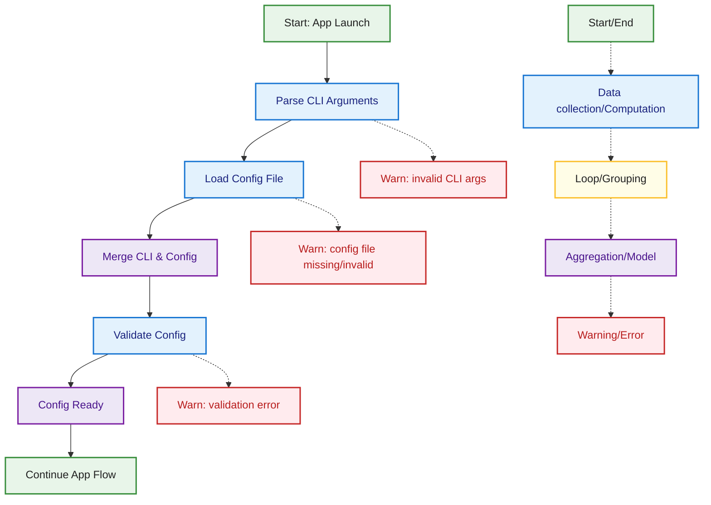

## Config Loading & CLI Argument Flow

This diagram describes how MetricMancer loads configuration and parses CLI arguments. The process starts at application launch, parses CLI arguments, loads the config file, merges both sources, and validates the resulting configuration. Edge cases such as missing config files, invalid CLI arguments, or validation errors are highlighted. The color coding and legend are consistent with the rest of the documentation.

