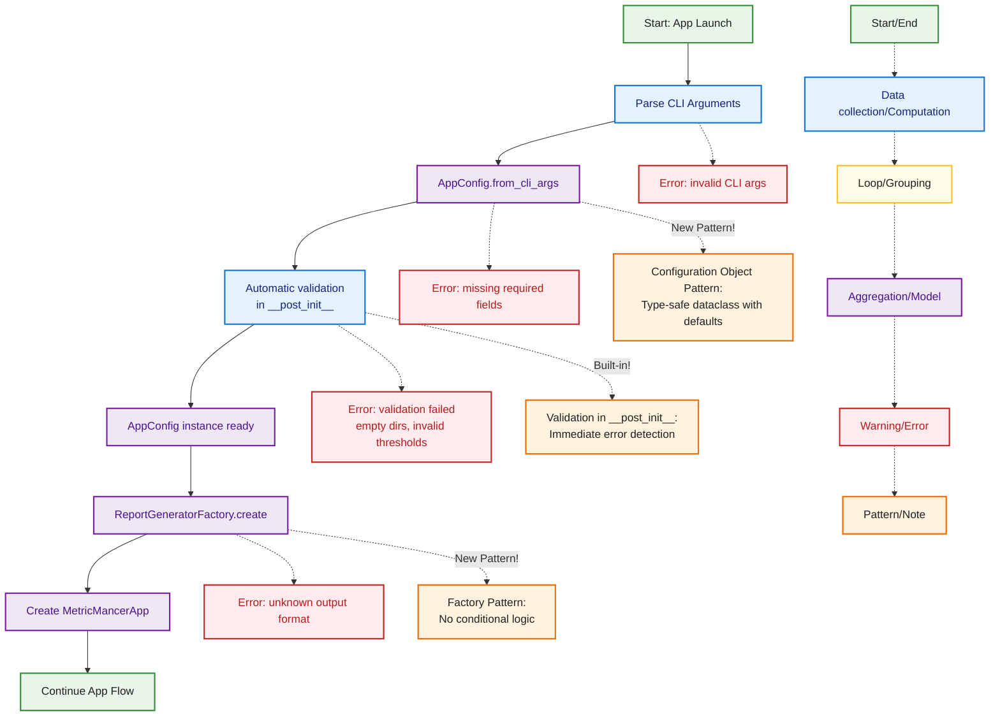

## Config Loading & CLI Argument Flow (Configuration Object Pattern)

This diagram describes how MetricMancer uses the Configuration Object Pattern to handle configuration. The process starts with CLI argument parsing, creates an AppConfig object using a factory method, validates it automatically, and then uses it throughout the application. This new pattern centralizes configuration and reduces code churn.



### Configuration Object Pattern Benefits

1. **Single Source of Truth**
   - All configuration in one `AppConfig` dataclass
   - No parameter passing across 5+ functions
   - Clear, documented fields with defaults

2. **Type Safety**
   - Type hints on all fields
   - IDE autocomplete support
   - Compile-time error detection

3. **Built-in Validation**
   - Validates in `__post_init__` automatically
   - Clear error messages
   - Prevents invalid states

4. **Easy Testing**
   - Create config directly: `AppConfig(directories=['test'])`
   - Easy to mock
   - No complex setup needed

### Example Usage

```python
# From CLI arguments (main.py)
config = AppConfig.from_cli_args(args)

# From dictionary (config files)
config_dict = {'directories': ['src'], 'threshold_low': 10.0}
config = AppConfig(**config_dict)

# Direct instantiation (tests)
config = AppConfig(
    directories=['test_data'],
    threshold_low=5.0,
    output_format='json'
)

# Validation happens automatically
try:
    config = AppConfig(directories=[])  # Invalid!
except ValueError as e:
    print(f"Config error: {e}")
```
