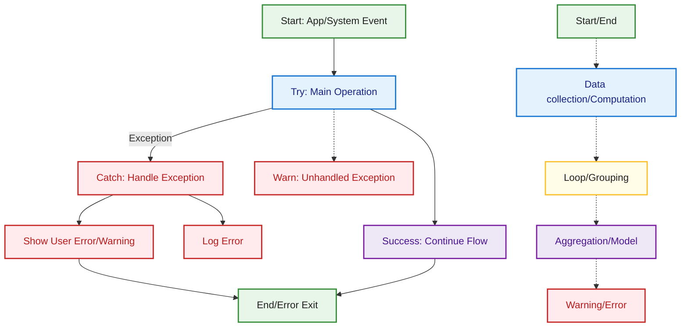

## System Error Handling Flow

This diagram shows the system-level error handling flow in MetricMancer. The main operation is attempted, and on success, the flow continues as normal. If an exception occurs, it is caught, logged, and a user-facing error or warning is shown. Unhandled exceptions are also visualized as edge cases. The color coding and legend are consistent with the rest of the documentation.

