# KPI Dependencies and Implementation Status

This diagram shows the implemented KPIs in MetricMancer, their dependencies, and current implementation status as of the code churn fix branch.

```mermaid
flowchart TD
    %% Raw Data Sources
    GitRepo[Git Repository]:::source
    SourceFiles[Source Code Files]:::source
    
    %% Base KPIs (independent)
    GitRepo --> CodeChurn[Code Churn KPI<br/>⚠️ Needs time-based fix]:::partial
    SourceFiles --> Complexity[Complexity KPI<br/>✅ Implemented]:::implemented
    GitRepo --> CodeOwnership[Code Ownership KPI<br/>✅ Implemented]:::implemented
    
    %% Derived KPIs (dependent)
    Complexity --> Hotspot[Hotspot KPI<br/>✅ Implemented]:::implemented
    CodeChurn --> Hotspot
    CodeOwnership --> SharedOwnership[Shared Ownership KPI<br/>✅ Implemented]:::implemented
    
    %% Planned KPIs
    GitRepo -.-> LogicalCoupling[Logical Coupling<br/>🔄 Planned]:::planned
    GitRepo -.-> TemporalCoupling[Temporal Coupling<br/>🔄 Planned]:::planned
    
    %% Implementation details
    CodeChurn --> ChurnNote[Current: Total commits<br/>Needed: Commits per time period]:::note
    SharedOwnership --> AggNote[Includes aggregation<br/>up directory hierarchy]:::note
    
    %% Legend
    LegendSource[Data Source]:::source
    LegendImplemented[Fully Implemented]:::implemented
    LegendPartial[Needs Fix]:::partial
    LegendPlanned[Planned]:::planned
    LegendNote[Implementation Note]:::note

    classDef source fill:#f3e5f5,stroke:#9c27b0,stroke-width:2px,color:#4a148c;
    classDef implemented fill:#e8f5e9,stroke:#388e3c,stroke-width:2px,color:#1b5e20;
    classDef partial fill:#fff3e0,stroke:#f57c00,stroke-width:2px,color:#e65100;
    classDef planned fill:#e3f2fd,stroke:#1976d2,stroke-width:2px,color:#0d47a1;
    classDef note fill:#fafafa,stroke:#616161,stroke-width:1px,color:#424242;
```

## KPI Implementation Matrix

| KPI Name | Status | Implementation File | Dependencies | Notes |
|----------|--------|-------------------|-------------|--------|
| **Complexity** | ✅ Implemented | `src/kpis/complexity/` | Source files only | McCabe cyclomatic complexity |
| **Code Churn** | ⚠️ Needs Fix | `src/kpis/codechurn/` | Git repository | Currently counts total commits, needs time-based calculation |
| **Hotspot** | ✅ Implemented | `src/kpis/hotspot/` | Complexity + Churn | Composite metric: complexity × churn |
| **Code Ownership** | ✅ Implemented | `src/kpis/codeownership/` | Git repository | Based on git blame analysis |
| **Shared Ownership** | ✅ Implemented | `src/kpis/sharedcodeownership/` | Code Ownership | Includes directory-level aggregation |
| **Logical Coupling** | 🔄 Planned | Not implemented | Git repository | Files that change together |
| **Temporal Coupling** | 🔄 Planned | Not implemented | Git repository | Time-based change patterns |

## Next Implementation Priority

1. **Fix Code Churn** - Implement time-based calculation (commits per month/quarter)
2. **Add Logical Coupling** - Analyze files that frequently change together  
3. **Add Temporal Coupling** - Analyze time-based change patterns
4. **Quality Trends** - Historical tracking of KPI values over time