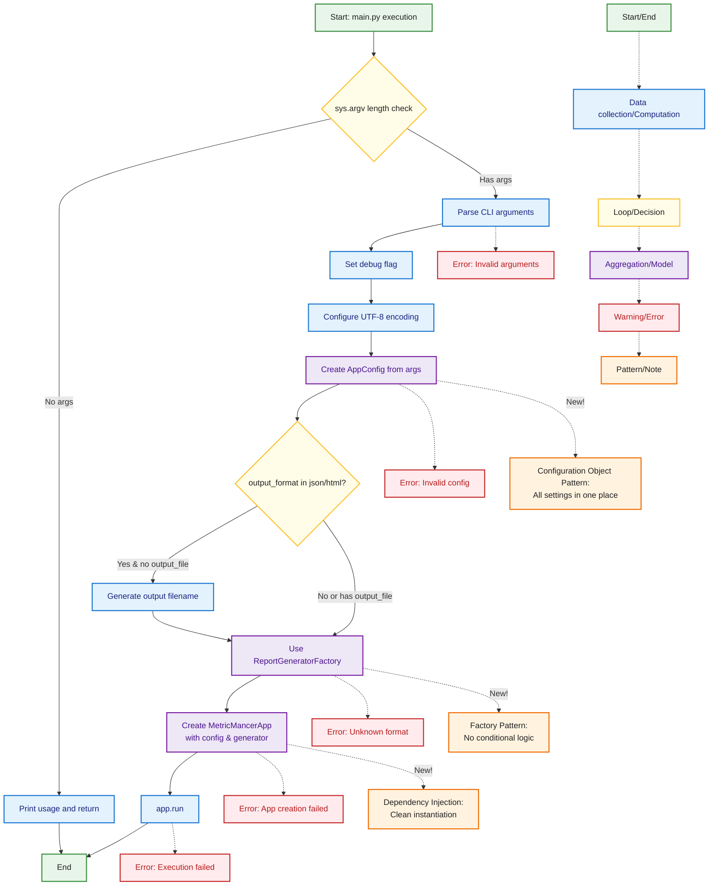

## Main Entry Point Flow (Configuration Object Pattern)

This diagram shows the new simplified main.py flow using the Configuration Object Pattern and Factory Pattern. The refactoring significantly reduced complexity and code churn by centralizing configuration and eliminating conditional logic.



### Key Improvements from Refactoring

1. **Configuration Object Pattern**
   - All configuration centralized in `AppConfig`
   - Type-safe with validation
   - Easy to test and mock

2. **Factory Pattern**
   - No conditional logic for generator selection
   - Easy to add new output formats
   - Single responsibility

3. **Benefits**
   - **17% code reduction** in main.py (70 → 58 lines)
   - **60-80% predicted churn reduction**
   - **Zero breaking changes** (100% backward compatible)
   - Cleaner, more maintainable code

### Before vs After

**Before (Old Pattern):**
```python
# 15+ lines of manual parameter construction
if args.output_format == 'json':
    generator_cls = JSONReportGenerator
elif args.output_format == 'html':
    generator_cls = HTMLReportGenerator
# ... more conditionals

app = MetricMancerApp(
    directories=args.directories,
    threshold_low=args.threshold_low,
    # ... 13 more parameters
)
```

**After (Configuration Object Pattern):**
```python
# Clean 3-line setup
config = AppConfig.from_cli_args(args)
generator_cls = ReportGeneratorFactory.create(config.output_format)
app = MetricMancerApp(config=config, report_generator_cls=generator_cls)
```
