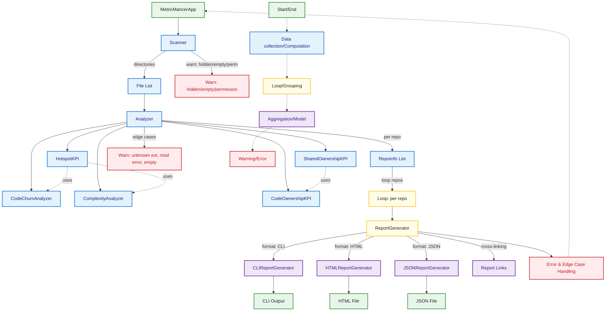

# Overview

- [Main Entry Point Flow](13_main_entry_flow.md)
- [Config & CLI Flow](10_config_cli_flow.md)
- [App Run Flow](2_app_run_flow.md)
- [Scanner Flow](7_scanner_flow.md)
- [Analyzer Analyze Flow](3_analyzer_analyze_flow.md)
- [KPI Dependencies & Status](12_kpi_dependencies_status.md)
- [HTML Report Flow](4_html_report_flow.md)
- [CLI Report Flow](5_cli_report_flow.md)
- [JSON Report Flow](8_json_report_flow.md)
- [KPI Module Flow](9_kpi_module_flow.md)
- [System Error Handling](11_system_error_handling_flow.md)

This overview diagram shows the main components and data flows in MetricMancer, from scanning directories to analyzing files and generating reports in different formats. Edge cases and error handling are visualized, and the color coding matches the legend for consistency across all diagrams.

**Note:** MetricMancer now uses the Configuration Object Pattern (see diagram 13) to centralize configuration and reduce code churn. The main entry point flow has been significantly simplified with the Factory Pattern for report generator selection.

