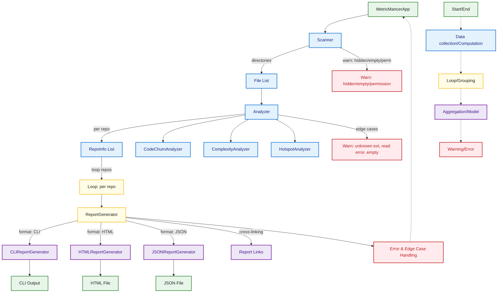

# Overview

- [App Run Flow](2_app_run_flow.md)
- [Scanner Flow](7_scanner_flow.md)
- [Analyzer Analyze Flow](3_analyzer_analyze_flow.md)
- [ReportGenerator Flow](6_report_generator_flow.md)
- [HTML Report Flow](4_html_report_flow.md)
- [CLI Report Flow](5_cli_report_flow.md)

This overview diagram shows the main components and data flows in MetricMancer, from scanning directories to analyzing files and generating reports in different formats. Edge cases and error handling are visualized, and the color coding matches the legend for consistency across all diagrams.

