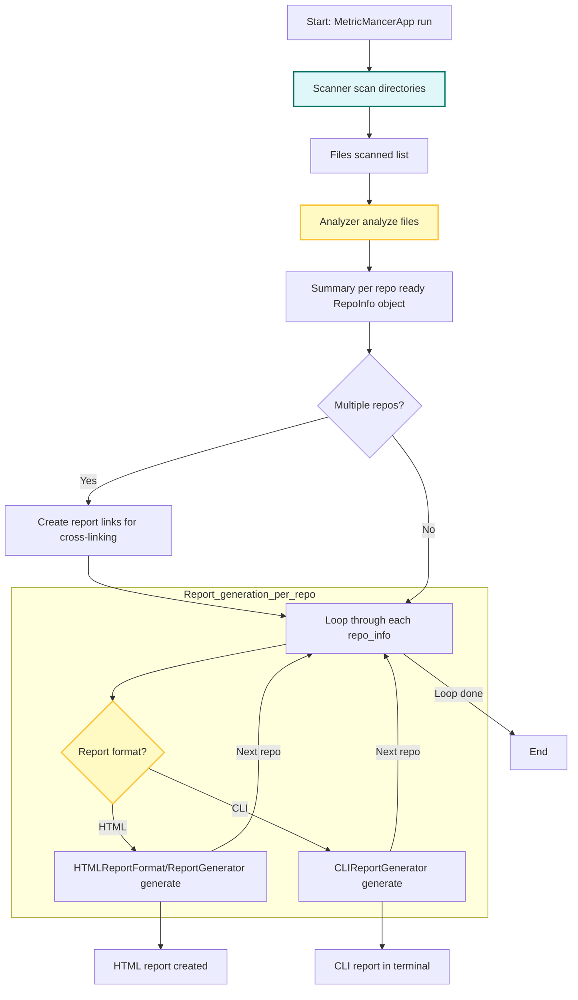

## App Run Flow

[← Back to Overview](1_overview.md)

- [Analyzer Analyze Flow](3_analyzer_analyze_flow.md)
- [HTML Report Flow](4_html_report_flow.md)
- [CLI Report Flow](5_cli_report_flow.md)
- [ReportGenerator Flow](6_report_generator_flow.md)
**Related diagrams:**
- [Scanner Flow](7_scanner_flow.md)
- [Analyzer Analyze Flow](3_analyzer_analyze_flow.md)
- [HTML Report Flow](4_html_report_flow.md)
- [CLI Report Flow](5_cli_report_flow.md)
- [ReportGenerator Flow](6_report_generator_flow.md)
- [Analyzer Analyze Flow](3_analyzer_analyze_flow.md)
- [HTML Report Flow](4_html_report_flow.md)
- [CLI Report Flow](5_cli_report_flow.md)
- [ReportGenerator Flow](6_report_generator_flow.md)

