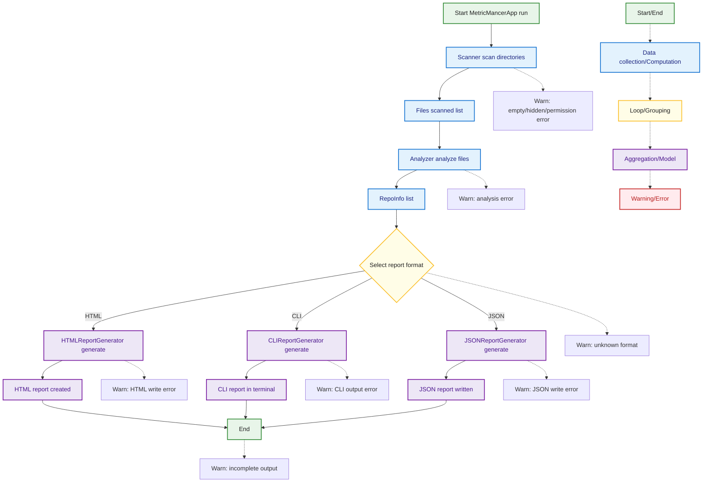

## App Run Flow (Simplified)
This diagram outlines the main application run flow in MetricMancer, from startup through scanning, analysis (including complexity, churn, ownership, and shared ownership KPIs), and report generation in various formats. It also highlights key edge cases and error handling at each stage, using the standard color coding and legend.

