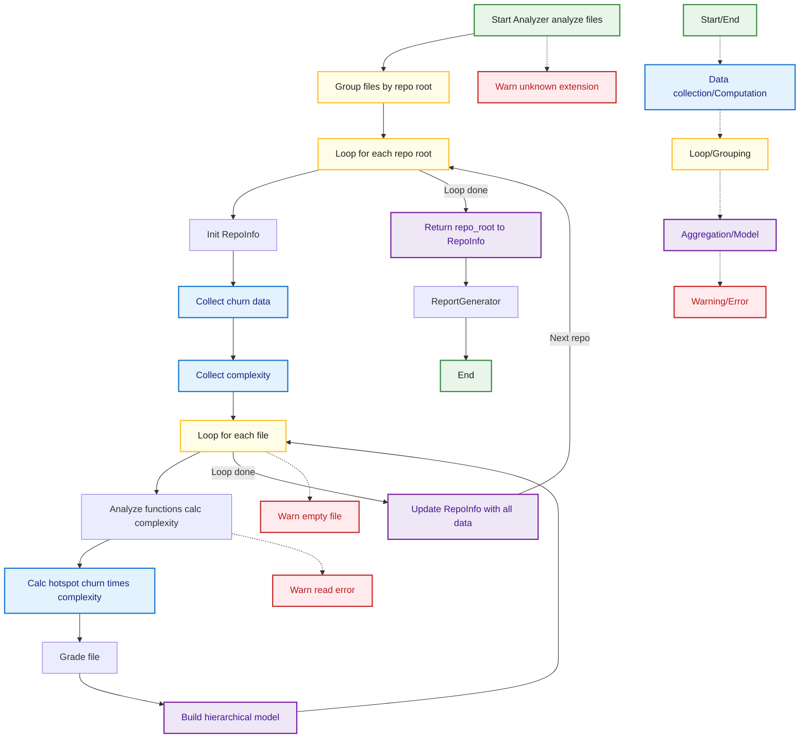

## Analyzer Analyze Flow
This diagram details the flow of the Analyzer component in MetricMancer. It shows how files are grouped, analyzed for churn and complexity, and how results are aggregated per repository. Edge cases such as unknown extensions, read errors, and empty files are visualized, with color coding matching the legend.

