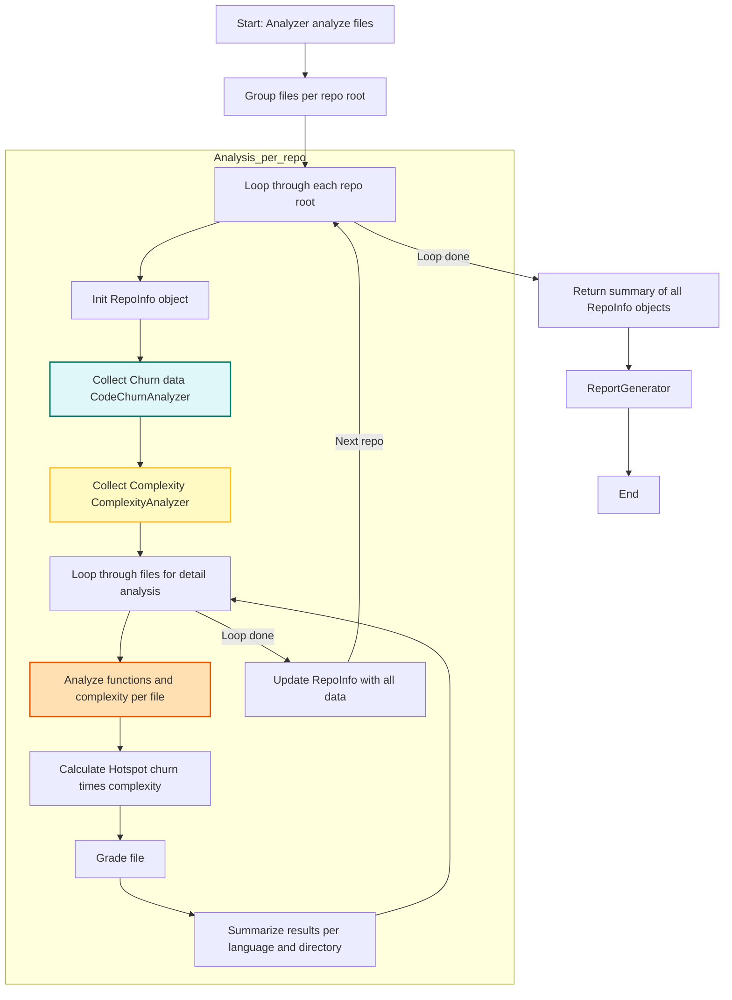

**Related diagrams:**
- [Overview](1_overview.md)
- [App Run Flow](2_app_run_flow.md)
- [ReportGenerator Flow](6_report_generator_flow.md)

```mermaid
graph TD
    A[Start: Analyzer analyze files] --> B[Group files per repo root]
    B --> C[Loop through each repo root]

    subgraph Analysis_per_repo
        C --> D[Init RepoInfo object]
        D --> E[Collect Churn data CodeChurnAnalyzer]
        E --> F[Collect Complexity ComplexityAnalyzer]
        F --> G[Loop through files for detail analysis]
        G --> H[Analyze functions and complexity per file]
        H --> I[Calculate Hotspot churn times complexity]
        I --> J[Grade file]
        J --> K[Summarize results per language and directory]
        K --> G
        G -- Loop done --> L[Update RepoInfo with all data]
    end

    L -- Next repo --> C
    C -- Loop done --> M[Return summary of all RepoInfo objects]
    M --> RG[ReportGenerator]
    RG --> N[End]

    %% Edge cases
    style E fill:#e0f7fa,stroke:#00796b,stroke-width:2px
    style F fill:#fff9c4,stroke:#fbc02d,stroke-width:2px
    style H fill:#ffe0b2,stroke:#e65100,stroke-width:2px
    %% Error handling: empty files, missing attributes, exceptions in KPI analyzers
```