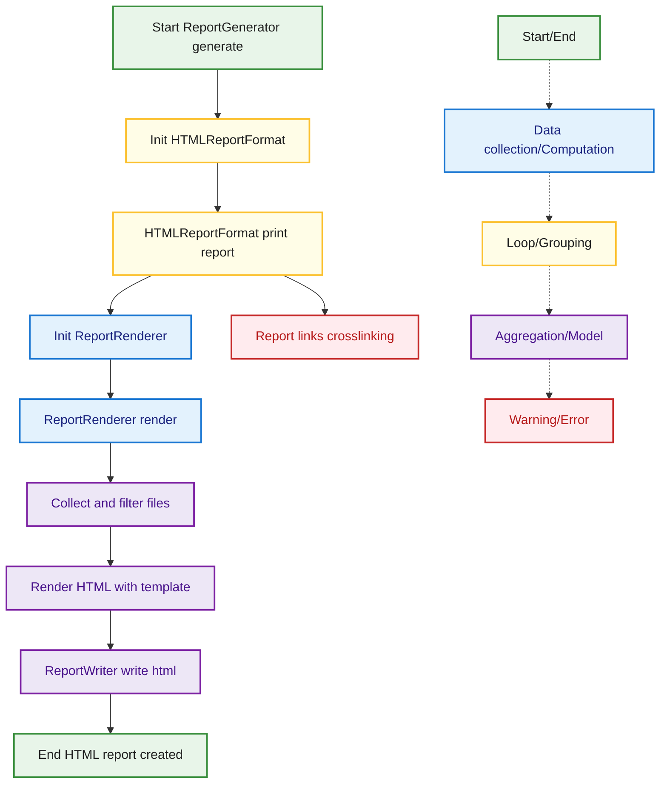

## HTML Report Flow
This diagram shows the flow for generating an HTML report in MetricMancer. It covers initialization, rendering, filtering, and writing the HTML file, as well as cross-linking and potential edge cases. The color coding and legend are consistent with the rest of the documentation.

