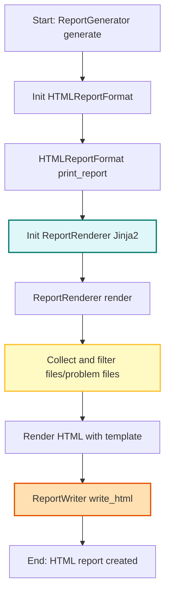

**Related diagrams:**
- [Overview](1_overview.md)
- [ReportGenerator Flow](6_report_generator_flow.md)

```mermaid
graph TD
    A[Start: ReportGenerator generate] --> B[Init HTMLReportFormat]
    B --> C[HTMLReportFormat print_report]
    C --> D[Init ReportRenderer Jinja2]
    D --> E[ReportRenderer render]
    E --> F[Collect and filter files/problem files]
    F --> G[Render HTML with template]
    G --> H[ReportWriter write_html]
    H --> I[End: HTML report created]

    %% Edge cases
    style D fill:#e0f7fa,stroke:#00796b,stroke-width:2px
    style F fill:#fff9c4,stroke:#fbc02d,stroke-width:2px
    style H fill:#ffe0b2,stroke:#e65100,stroke-width:2px
    %% Error handling: missing template, write error, empty repo_info/problem files
```