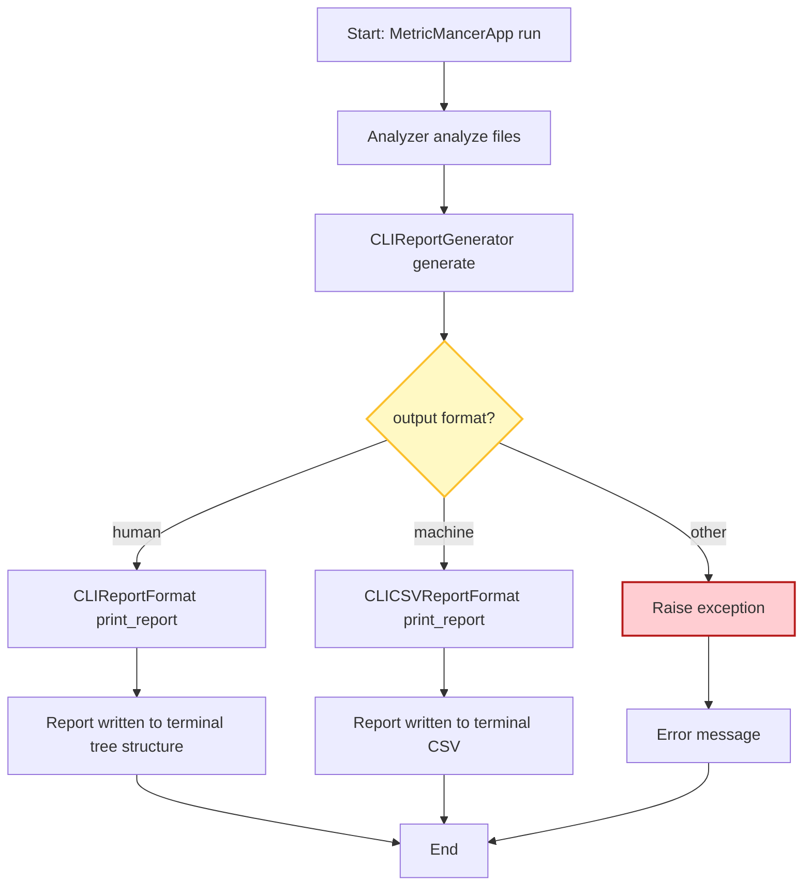

**Related diagrams:**
- [Overview](1_overview.md)
- [App Run Flow](2_app_run_flow.md)
- [Analyzer Analyze Flow](3_analyzer_analyze_flow.md)
- [ReportGenerator Flow](6_report_generator_flow.md)

```mermaid
graph TD
    A[Start: MetricMancerApp run] --> B[Analyzer analyze files]
    B --> C[CLIReportGenerator generate]
    C --> D{output format?}
    D -- human --> E[CLIReportFormat print_report]
    D -- machine --> F[CLICSVReportFormat print_report]
    D -- other --> G[Raise exception]
    E --> H[Report written to terminal tree structure]
    F --> I[Report written to terminal CSV]
    G --> J[Error message]
    H --> K[End]
    I --> K
    J --> K

    %% Edge cases
    style D fill:#fff9c4,stroke:#fbc02d,stroke-width:2px
    style G fill:#ffcdd2,stroke:#b71c1c,stroke-width:2px
    %% Error handling: unknown format, empty analysis, terminal error
```
