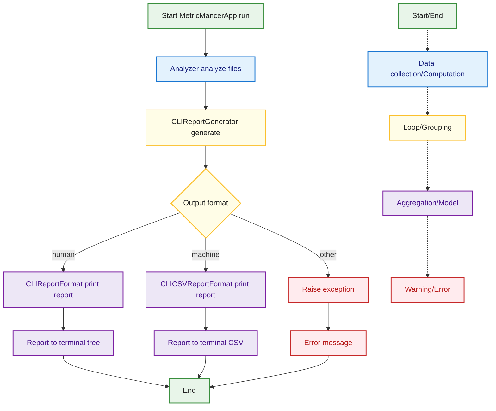

## CLI Report Flow
This diagram illustrates the CLI report generation flow in MetricMancer, including analysis, format selection, and output to terminal or CSV. It also shows error handling for unsupported formats and output errors, using the standard color coding and legend.

