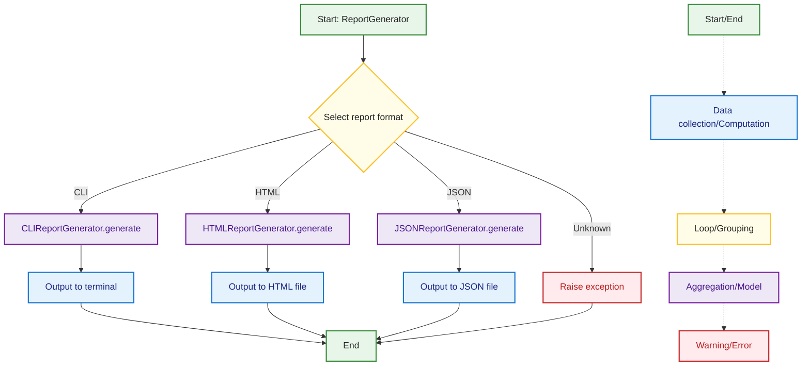

## ReportGenerator Flow
This diagram summarizes the flow of the ReportGenerator component, including format selection, report generation for CLI, HTML, and JSON, and error handling for unknown formats. The color coding and legend are consistent with the rest of the documentation.

