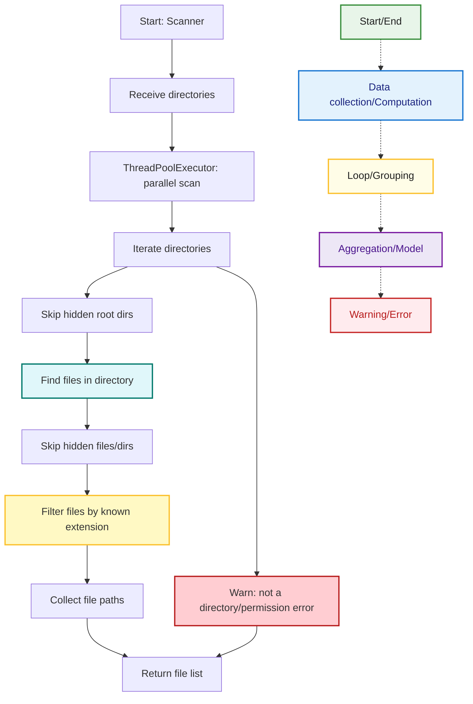

## Scanner Flow
This diagram describes the flow of the Scanner component in MetricMancer. It covers directory traversal, file filtering, and error handling for hidden files, permissions, and invalid directories. The color coding and legend are consistent with the rest of the documentation.

