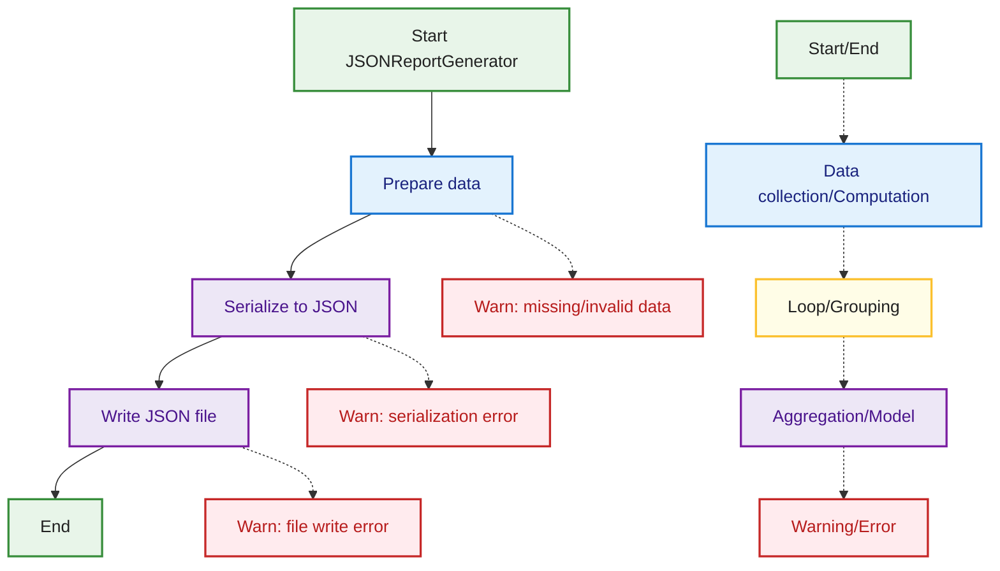

## JSON Report Flow
This diagram shows the flow for generating a JSON report in MetricMancer, from data preparation and serialization to file writing. Edge cases such as serialization and file write errors are visualized, with color coding and legend matching the rest of the documentation.

