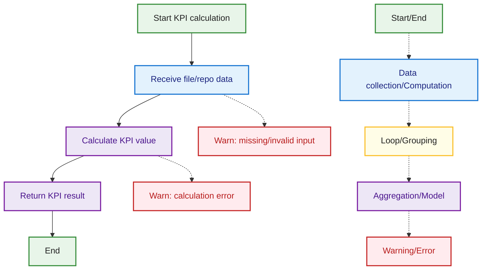

## KPI Module Flow

This diagram illustrates the typical flow of a KPI module in MetricMancer, such as CodeChurnAnalyzer, ComplexityAnalyzer, or HotspotAnalyzer. The process starts with receiving file or repository data, proceeds to KPI calculation, and returns the result. Edge cases like missing input or calculation errors are visualized. The color coding and legend match the conventions used throughout the documentation.

